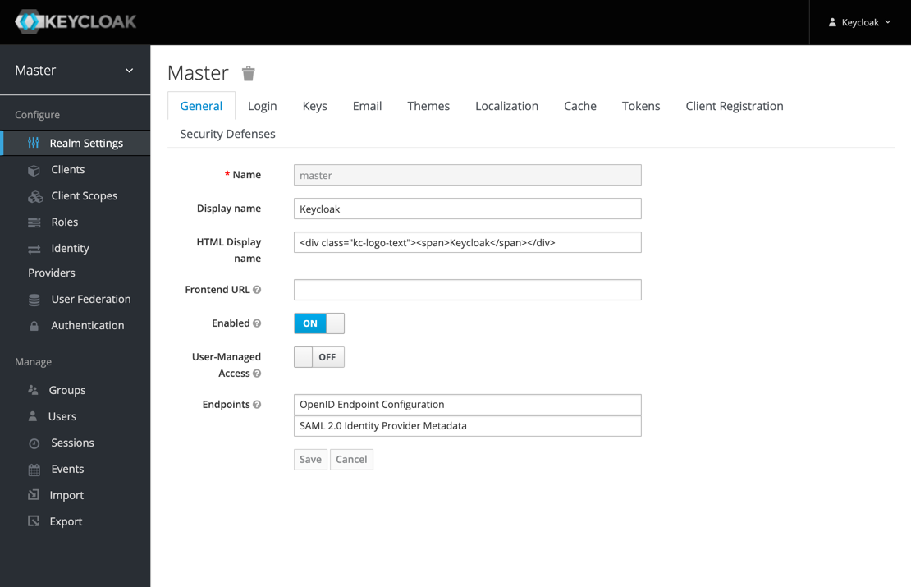

# Keycloak identity and access management <!-- omit in toc -->

## v22-08-21 <!-- omit in toc -->

## Helm charts: `codecentric/keycloakx` v18.3.0 <!-- omit in toc -->

[Keycloak](https://www.keycloak.org) is a high performance Java-based identity and access management solution. It lets developers add an authentication layer to their applications with minimum effort.

  

Configuration files are deployed from template Kubernetes Keycloak namespace version 22-08-21.

- [TL;DR](#tldr)
- [Prerequisites](#prerequisites)
  - [keycloak-theme-provider image](#keycloak-theme-provider-image)
  - [Persistent Volumes](#persistent-volumes)
  - [LVM Data Services](#lvm-data-services)
    - [Backup & data protection](#backup--data-protection)
- [How-to guides](#how-to-guides)
  - [Pull Charts](#pull-charts)
  - [Install](#install)
  - [Update](#update)
  - [Uninstall](#uninstall)
  - [Remove](#remove)
  - [Display status](#display-status)
  - [Customize Keycloak Themes](#customize-keycloak-themes)
    - [Create the Theme Provider Image](#create-the-theme-provider-image)
    - [Build and deploy Theme Provider Image](#build-and-deploy-theme-provider-image)
    - [Configure the new themes in Keycloak](#configure-the-new-themes-in-keycloak)
  - [Utilities](#utilities)
    - [Passwords and secrets](#passwords-and-secrets)
- [Reference](#reference)
  - [Helm charts and values](#helm-charts-and-values)
  - [Scripts](#scripts)
    - [cs-deploy](#cs-deploy)
  - [Template values](#template-values)
- [License](#license)

---

## TL;DR

Prepare LVM Data services for PV's:

- [LVM Data Services](#lvm-data-services)

Install namespace and charts:

```bash
# Pull charts to './charts/' directory
./csdeploy.sh -m pull-charts
# Install  
./csdeploy.sh -m install
# Check status
./csdeploy.sh -l

```

Run:

- Published at: `keycloak.mod.cskylab.net`
- Username: `keycloak`
- Password: `NoFear21`

## Prerequisites

- Administrative access to Kubernetes cluster.
- Helm v3.

### keycloak-theme-provider image

Keycloak-theme-provider image must exist on your private registry `harbor.cskylab.net/cskylab`.

To build and push the image, docker must be installed on your local machine and your private registry URL must be published with a trusted certificate. Install certificate and restart docker before pushing the image to the registry.

- Open console in `keycloak-theme-provider` directory and run:

```bash
# cSkyLab docker image build script
./csbuild.sh -b  # To build the image
./csbuild.sh -p  # To build and push the image
```

### Persistent Volumes

Review values in all Persistent volume manifests with the name format `./pv-*.yaml`.

The following PersistentVolume & StorageClass manifests are applied:

```bash
# PV manifests
pv-postgresql.yaml
```

The node assigned in `nodeAffinity` section of the PV manifest, will be used when scheduling the pod that holds the service.

### LVM Data Services

Data services are supported by the following nodes:

| Data service                 | Kubernetes PV node           | Kubernetes RSync node           |
| ---------------------------- | ---------------------------- | ------------------------------- |
| `/srv/keycloak` | `k8s-mod-n1` | `k8s-mod-n2` |

To **create** the corresponding LVM data services, execute inside the appropriate node in your cluster the following commands:

```bash
# Create LVM data service (Execute inside the node(s) that holds the local storage)
sudo cs-lvmserv.sh -m create -qd "/srv/keycloak" \
&& mkdir "/srv/keycloak/data/postgresql"

```

To **delete** the corresponding LVM data services, execute inside the appropriate node in your cluster the following commands:

```bash
# Delete LVM data service (Execute inside the node(s) that holds the local storage)
sudo cs-lvmserv.sh -m delete -qd "/srv/keycloak" 
```

#### Backup & data protection

Backup & data protection must be configured in file `cs-cron_scripts` of the node that holds the local storage.

**RSync:**

When more than one kubernetes node is present in the cluster, rsync cronjobs are used to achieve service HA for LVM data services that supports the persistent volumes.

To perform RSync manual copies on demand, connecto to the node that holds the local storage and execute:

```bash
## RSync path:  /srv/keycloak
## To Node:     k8s-mod-n2
sudo cs-rsync.sh -q -m rsync-to -d /srv/keycloak  -t k8s-mod-n2.cskylab.net
```

**RSync cronjobs:**

The following cron jobs should be added to file `cs-cron-scripts` of the appropriate node (Change time schedule as needed):

```bash
################################################################################
# keycloak - RSync LVM data services
################################################################################
##
## RSync path:  /srv/keycloak
## To Node:     k8s-mod-n2
## At minute 0 past every hour from 8 through 23.
# 0 8-23 * * *     root run-one cs-lvmserv.sh -q -m snap-remove -d /srv/keycloak >> /var/log/cs-rsync.log 2>&1 ; run-one cs-rsync.sh -q -m rsync-to -d /srv/keycloak  -t k8s-mod-n2.cskylab.net  >> /var/log/cs-rsync.log 2>&1
```

**Restic:**

Restic is configured to perform data backups to local USB disks, remote disk via sftp or remote S3 storage.

To perform on-demand restic backups:

```bash
## Data service:  /srv/keycloak
## Restic repo:   sftp:kos@kvm-main.cskylab.net:/media/data/restic/keycloak
sudo cs-restic.sh -q -m restic-bck -d  /srv/keycloak -r sftp:kos@kvm-main.cskylab.net:/media/data/restic/keycloak  -t keycloak
```

To view available backups:

```bash
## Specific tag
## Data service: /srv/keycloak
## Restic repo:   sftp:kos@kvm-main.cskylab.net:/media/data/restic/keycloak
sudo cs-restic.sh -q -m restic-list -r sftp:kos@kvm-main.cskylab.net:/media/data/restic/keycloak  -t keycloak

## All snapshots
## Remote restic repo
sudo cs-restic.sh -q -m restic-list -r sftp:kos@kvm-main.cskylab.net:/media/data/restic/keycloak 
```

**Restic cronjobs:**

The following cron jobs should be added to file `cs-cron-scripts` of the appropriate node (Change time schedule as needed):

```bash
################################################################################
# keycloak - Restic backups
################################################################################
##
## Data service:  /srv/keycloak
## At minute 30 past every hour from 8 through 23.
## Restic repo:   sftp:kos@kvm-main.cskylab.net:/media/data/restic/keycloak
# 30 8-23 * * *   root run-one cs-lvmserv.sh -q -m snap-remove -d /srv/keycloak >> /var/log/cs-restic.log 2>&1 ; run-one cs-restic.sh -q -m restic-bck -d  /srv/keycloak -r sftp:kos@kvm-main.cskylab.net:/media/data/restic/keycloak  -t keycloak  >> /var/log/cs-restic.log 2>&1 && run-one cs-restic.sh -q -m restic-forget -r sftp:kos@kvm-main.cskylab.net:/media/data/restic/keycloak  -t keycloak  -f "--keep-hourly 6 --keep-daily 31 --keep-weekly 5 --keep-monthly 13 --keep-yearly 10" >> /var/log/cs-restic.log 2>&1
```

## How-to guides

### Pull Charts

To pull charts, change the repositories and charts needed in variable `source_charts` inside the script `csdeploy.sh`  and run:

```bash
# Pull charts to './charts/' directory
  ./csdeploy.sh -m pull-charts
```

When pulling new charts, all the content of `./charts` directory will be removed, and replaced by the new pulled charts.

After pulling new charts redeploy the new versions with: `./csdeploy -m update`.

### Install

To create namespace, persistent volumes and install charts:

```bash
  # Create namespace, PV's and install charts
    ./csdeploy.sh -m install
```

Notice that PV's are not namespaced. They are deployed at cluster scope.

### Update

To update charts settings, change values in files `values-chart.yaml`.

Redeploy or upgrade charts by running:

```bash
  # Redeploy or upgrade charts
    ./csdeploy.sh -m update
```

### Uninstall

To uninstall charts, remove namespace and PV's run:

```bash
  # Uninstall charts, remove PV's and namespace
    ./csdeploy.sh -m uninstall
```

### Remove

This option is intended to be used only to remove the namespace when chart deployment is failed. Otherwise, you must run `./csdeploy.sh -m uninstall`.

To remove PV's, namespace and all its contents run:

```bash
  # Remove PV's namespace and all its contents
    ./csdeploy.sh -m remove
```

### Display status

To display namespace, persistence and chart status run:

```bash
  # Display namespace, persistence and charts status:
    ./csdeploy.sh -l
```

### Customize Keycloak Themes

You should personalize the provided customization themes with your own branding for each keycloak application client (keycloak, gitlab, nextcloud... etc).

The themes provided in the model environment are:

- /themes/bootstrap-mod-keycloak
- /themes/bootstrap-mod-gitlab
- /themes/bootstrap-mod-nextcloud

The customizable themes provided for your own publishing environment are:

- /themes/bootstrap-pub-keycloak
- /themes/bootstrap-pub-gitlab
- /themes/bootstrap-pub-nextcloud

Under the each theme login resource folder, the customized keycloak templates/functionalities are:

- login-page-expired.ftl
- login-reset-password.ftl
- login-update-profile.ftl
- login-verify-email.ftl
- login.ftl
- register.ftl

To customize a theme you should follow this procedure:

**Customize login and account creation pages**:

- Change the images files at `/themes/bootstrap-pub-keycloak/login/resources/img/`
  - `brand.svg` : Brand image
  - `logo.png` : Brand logo (96 x 96 pixels)
  - `favicon.ico` : Icon for browser tabs  (48 x 48 pixels)
  - If required, ajust `brand.svg` image propeties by editing the `#brand-logo` class in the `/themes/bootstrap-pub-keycloak/login/resources/css/login.css` file.

- Change labels and description in resources messages files at `/themes/bootstrap-pub-keycloak/login/messages`.
  - `usernameOrEmail` label: How you named the username label depending if you enable "login with email" options at the Keycloak realm configuration.
  - `applicationName`: The name of the application you whant to customize the login page for.
  - `applicationDescription`: A short description or notice for your users.
  - `loginIntroText`: Subtitle or notice to your brand logo.
  - `resetPasswordLabel`: Label to reset password action.
  - `emailVerifyTitle`: Requiered "email verification" notice.
  - `doCreateAccount`: Create account action button label.
  - `registerTitle`: Registering window title.
  - `registerAccountSectionTitle`: Account fields group title
  - `updateProfileTitle`: Requiered "update profile action" notice.
  - `isRequieredField`: Requiered field error message.
  - `minLengthField`: Minimun length in characters a field should have to be valid.
  - `maxLengthField`: Maximun length in charactes a field must have to be valid.
  - `minLengthFieldMessage`: Error message to show when field value does not have the minimum field length defined in `minLengthField` variable. The asterisk symbol will be dinamically replaced with the `minLengthField` defined value.
  - `maxLengthFieldMessage`: Error message to show when field value has more characters thant the value defined at `maxLengthField` variable. The asterisk symbol will be dinamically replaced with the `maxLengthField` defined value.

> **Note:**  There are two resource language files predefined. If you add or delete language resource files, you need to modify accordingly the `locales` property on the `/themes/bootstrap-pub-keycloak/login/theme.properties` file. See more at <https://www.keycloak.org/docs/latest/server_development/#_themes>.
> >
> All validation values are for __client validation only__ and should match the __realm password policy__ defined in Keycloak.
> >
> >
- If needed by your branding requierements, you can change color schemes:
  - Choose a color scheme from <https://bootstrapcolor.net/>
  - Push `Dowload CSS (bootstrap.css + boostrap.min.css)`
  - Extract the zip file and look for file `boostrap.min.css`.
  - Replace the `/themes/bootstrap-pub-keycloak/login/resources/css/bootstrap.min.css` file with the downloaded version.
  
To learn more about keycloak themes customization:

- <https://www.keycloak.org/docs/latest/server_development/#_themes>
- <https://github.com/keycloak/keycloak/tree/master/themes/src/main/resources/theme>

#### Create the Theme Provider Image

- Edit the file `values-keycloak.yaml` to map themes folders to the Keycloak instance container under the `extraInitContainers`, `extraVolumeMounts` and `extraVolumes` values sections.

```yaml
# file: values-keycloak.yaml 

# Additional init containers, e. g. for providing custom themes
extraInitContainers: |
  - name: keycloak-theme-provider
    image: harbor.cskylab.net/cskylab/keycloak-theme-provider:stable
    imagePullPolicy: Always
    command:
      - sh
    args:
      - -c
      - |
        echo "Copying themes..."
        cp -R /themes/bootstrap-mod-keycloak theme1  
        cp -R /themes/bootstrap-mod-nextcloud theme2 
        cp -R /themes/bootstrap-mod-gitlab theme3
        cp -R /themes/bootstrap-pub-keycloak theme4  
        cp -R /themes/bootstrap-pub-nextcloud theme5 
        cp -R /themes/bootstrap-pub-gitlab theme6     
    volumeMounts:
      - name: theme1
        mountPath: /theme1/bootstrap-mod-keycloak
      - name: theme2
        mountPath: /theme2/bootstrap-mod-nextcloud
      - name: theme3
        mountPath: /theme3/bootstrap-mod-gitlab
      - name: theme4
        mountPath: /theme4/bootstrap-pub-keycloak
      - name: theme5
        mountPath: /theme5/bootstrap-pub-nextcloud
      - name: theme6
        mountPath: /theme6/bootstrap-pub-gitlab        

extraVolumeMounts: |
  - name: theme1
    mountPath: /opt/jboss/keycloak/themes/bootstrap-mod-keycloak
  - name: theme2
    mountPath: /opt/jboss/keycloak/themes/bootstrap-mod-nextcloud
  - name: theme3
    mountPath: /opt/jboss/keycloak/themes/bootstrap-mod-gitlab
  - name: theme4
    mountPath: /opt/jboss/keycloak/themes/bootstrap-pub-keycloak
  - name: theme5
    mountPath: /opt/jboss/keycloak/themes/bootstrap-pub-nextcloud
  - name: theme6
    mountPath: /opt/jboss/keycloak/themes/bootstrap-pub-gitlab    

extraVolumes: |
  - name: theme1
    emptyDir: {}
  - name: theme2
    emptyDir: {}
  - name: theme3
    emptyDir: {}
  - name: theme4
    emptyDir: {}
  - name: theme5
    emptyDir: {}
  - name: theme6
    emptyDir: {}    
```

#### Build and deploy Theme Provider Image

- To build the keycloak-theme-provider image, open a terminal in `keycloak-theme-provider` directory and run:

```bash
# Build and push to repository
./csbuild.sh -p
```

- After the image is pushed to your private registry, redeploy keycloak namespace by running:

```bash
  # Redeploy keycloak namespace
    ./csdeploy.sh -m update
```

#### Configure the new themes in Keycloak

Theme configuration can take place at **Realm** scope (all clients) or for each **Client** application.

- Login to keycloak
- For **Realm** scope configuration
  - Choose the realm
  - Go to **Realm Settings**
  - Go to **Themes** tab
  - Choose the appropiate theme in  **Login Theme** box
- For **Client** scope configuration
  - Go to **Clients** and choose the client application
  - Choose the appropiate theme in **Login Theme** box
  - Save changes


> **Note:** Some login actions like "user registration" or "reset password", are available accordingly with the realm configuration choosen at **Login** tab of the **Realm Settings** window.

### Utilities

#### Passwords and secrets

Generate passwords and secrets with:

```bash
# Screen
echo $(head -c 512 /dev/urandom | LC_ALL=C tr -cd 'a-zA-Z0-9' | head -c 16)

# File (without newline)
printf $(head -c 512 /dev/urandom | LC_ALL=C tr -cd 'a-zA-Z0-9' | head -c 16) > RESTIC-PASS.txt
```

Change the parameter `head -c 16` according with the desired length of the secret.

## Reference

To learn more see:

- <https://www.keycloak.org/>
- <https://github.com/codecentric/helm-charts/tree/master/charts/keycloak>

### Helm charts and values

| Chart                | Values                 |
| -------------------- | ---------------------- |
| codecentric/keycloakx | `values-keycloakx.yaml` |

### Scripts

#### cs-deploy

```console
Purpose:
  Kubernetes Keycloak identity and access management.

Usage:
  sudo csdeploy.sh [-l] [-m <execution_mode>] [-h] [-q]

Execution modes:
  -l  [list-status]     - List current status.
  -m  <execution_mode>  - Valid modes are:

      [pull-charts]     - Pull charts to './charts/' directory.
      [install]         - Create namespace, PV's and install charts.
      [update]          - Redeploy or upgrade charts.
      [uninstall]       - Uninstall charts, remove PV's and namespace.
      [remove]          - Remove PV's namespace and all its contents.

Options and arguments:  
  -h  Help
  -q  Quiet (Nonstop) execution.

Examples:
  # Pull charts to './charts/' directory
    ./csdeploy.sh -m pull-charts

  # Create namespace, PV's and install charts
    ./csdeploy.sh -m install

  # Redeploy or upgrade charts
    ./csdeploy.sh -m update

  # Uninstall charts, remove PV's and namespace
    ./csdeploy.sh -m uninstall

  # Remove PV's namespace and all its contents
    ./csdeploy.sh -m remove

  # Display namespace, persistence and charts status:
    ./csdeploy.sh -l
```

**Tasks performed:**

| ${execution_mode}                | Tasks                      | Block / Description                                                         |
| -------------------------------- | -------------------------- | --------------------------------------------------------------------------- |
| [pull-charts]                    |                            | **Pull helm charts from repositories**                                      |
|                                  | Clean `./charts` directory | Remove all contents in `./charts` directory.                                |
|                                  | Pull helm charts           | Pull new charts according to sourced script in variable `source_charts`.    |
|                                  | Show charts                | Show Helm charts pulled into `./charts` directory.                          |
| [install]                        |                            | **Create namespace, certificate, secrets and PV's**                         |
|                                  | Create namespace           | Namespace must be unique in cluster.                                        |
|                                  | Create PV's                | Apply all persistent volume manifests in the form `pv-*.yaml`.              |
| [update] [install]               |                            | **Deploy charts**                                                           |
|                                  | Deploy charts              | Deploy all charts in `./charts` directory with `upgrade --install` options. |
| [uninstall]                      |                            | **Uninstall charts**                                                        |
|                                  | Uninstall charts           | Uninstall all charts in `./charts` directory.                               |
| [uninstall] [remove]             |                            | **Remove namespace and PV's**                                               |
|                                  | Remove namespace           | Remove namespace and all its objects.                                       |
|                                  | Delete PV's                | Delete all persistent volume manifests in the form `pv-*.yaml`.             |
| [install] [update] [list-status] |                            | **Display status information**                                              |
|                                  | Display namespace          | Namespace and object status.                                                |
|                                  | Display certificates       | Certificate status information.                                             |
|                                  | Display secrets            | Secret status information.                                                  |
|                                  | Display persistence        | Persistence status information.                                             |
|                                  | Display charts             | Charts releases history information.                                        |
|                                  |                            |                                                                             |

### Template values

The following table lists template configuration parameters and their specified values, when machine configuration files were created from the template:

| Parameter                   | Description                                      | Values                             |
| --------------------------- | ------------------------------------------------ | ---------------------------------- |
| `_tplname`                  | template name                                    | `k8s-keycloak`                  |
| `_tpldescription`           | template description                             | `Kubernetes Keycloak namespace`           |
| `_tplversion`               | template version                                 | `22-08-21`               |
| `kubeconfig`                | kubeconfig file                                  | `/Users/grenes/.kube//Users/grenes/.kube//Users/grenes/.kube//Users/grenes/.kube//Users/grenes/.kube//Users/grenes/.kube/config-k8s-pro`                |
| `namespace.name`            | namespace name                                   | `keycloak`            |
| `namespace.domain`          | domain name                                      | `cskylab.net`          |
| `publishing.url`            | external URL                                     | `keycloak.mod.cskylab.net`            |
| `publishing.password`       | password                                         | `NoFear21`       |
| `certificate.clusterissuer` | cert-manager clusterissuer                       | `trantortech` |
| `registry.private`          | private registry URL                             | `harbor.cskylab.net/cskylab`          |
| `registry.proxy`            | docker private proxy URL                         | `harbor.cskylab.net/dockerhub`            |
| `registry.username`         | private registry username                        | `admin`         |
| `registry.password`         | private registry password                        | `NoFear21`         |
| `restic.password`           | password to access restic repository (mandatory) | `NoFear21`           |
| `restic.repo`               | restic repository (mandatory)                    | `sftp:kos@kvm-main.cskylab.net:/media/data/restic/keycloak`               |
| `restic.aws_access`         | S3 bucket access key (if used)                   | `restic_rw`         |
| `restic.aws_secret`         | S3 bucket secret key (if used)                   | `iZ6Qpx1WiqmXXoXKxBxhiCMKWCsYOrgZKr`         |
| `localpvnodes.all_pv`       | dataservice node                                 | `k8s-mod-n1`       |
| `localrsyncnodes.all_pv`    | rsync node                                       | `k8s-mod-n2`    |

## License

Copyright © 2021 cSkyLab.com ™

Licensed under the Apache License, Version 2.0 (the "License");
you may not use this file except in compliance with the License.
You may obtain a copy of the License at

http://www.apache.org/licenses/LICENSE-2.0

Unless required by applicable law or agreed to in writing, software
distributed under the License is distributed on an "AS IS" BASIS,
WITHOUT WARRANTIES OR CONDITIONS OF ANY KIND, either express or implied.
See the License for the specific language governing permissions and
limitations under the License.
