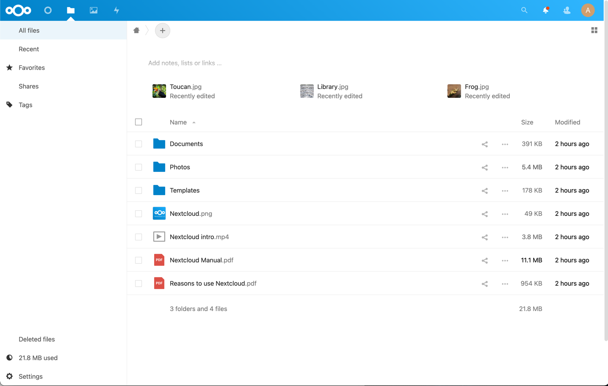

# [Nextcloud](https://nextcloud.com/) file sharing server <!-- omit in toc -->

## v23-11-24 <!-- omit in toc -->

## Helm charts: nextcloud/nextcloud v4.5.2 bitnami/mariadb v14.1.4 <!-- omit in toc -->

[Nextcloud](https://nextcloud.com/) is a file sharing server that puts the control and security of your own data back into your hands.

Configuration files are deployed from template Kubernetes nextcloud namespace version 23-11-24.

  

- [TL;DR](#tldr)
- [Prerequisites](#prerequisites)
  - [LVM Data Services](#lvm-data-services)
    - [Persistent Volumes](#persistent-volumes)
- [How-to guides](#how-to-guides)
  - [Pull Charts](#pull-charts)
  - [Install](#install)
  - [Update](#update)
  - [Uninstall](#uninstall)
  - [Remove](#remove)
  - [Display status](#display-status)
  - [Backup \& data protection](#backup--data-protection)
    - [RSync HA copies](#rsync-ha-copies)
    - [Restic backup](#restic-backup)
  - [Keycloak Client Configuration](#keycloak-client-configuration)
  - [Nextcloud OIDC Configuration](#nextcloud-oidc-configuration)
  - [Nextcloud occ commands](#nextcloud-occ-commands)
    - [Add missing indexes](#add-missing-indexes)
    - [List custom certificates](#list-custom-certificates)
  - [Utilities](#utilities)
    - [Passwords and secrets](#passwords-and-secrets)
- [Reference](#reference)
  - [Helm charts and values](#helm-charts-and-values)
  - [Scripts](#scripts)
    - [cs-deploy](#cs-deploy)
- [License](#license)

---

## TL;DR

Prepare LVM Data services for PV's:

- [LVM Data Services](#lvm-data-services)

Install:

```bash
# Pull charts to './charts/' directory
./csdeploy.sh -m pull-charts
# Install
./csdeploy.sh -m install
# Check status
./csdeploy.sh -l

```

Run:

- Published at: `nextcloud.pro.cskylab.net`
- Username: `admin`
- Password: `NoFear21`

## Prerequisites

- Administrative access to Kubernetes cluster.
- Helm v3.

### LVM Data Services

Data services are supported by the following nodes:

| Data service                 | Kubernetes PV node           | Kubernetes RSync node           |
| ---------------------------- | ---------------------------- | ------------------------------- |
| `/srv/nextcloud` | `k8s-mod-n1` | `k8s-mod-n2` |

`PV node` is the node that supports the data service in normal operation.

`RSync node` is the node that receives data service copies synchronized by cron-jobs for HA.

To **create** the corresponding LVM data services, execute from your **mcc** management machine the following commands:

```bash
#
# Create LVM data services in PV node
#
echo \
&& echo "******** START of snippet execution ********" \
&& echo \
&& ssh kos@k8s-mod-n1.cskylab.net \
  'sudo cs-lvmserv.sh -m create -qd "/srv/nextcloud" \
&& mkdir "/srv/nextcloud/data/ncdata" \
&& mkdir "/srv/nextcloud/data/mariadb" \
&& mkdir "/srv/nextcloud/data/redis-master"' \
&& echo \
&& echo "******** END of snippet execution ********" \
&& echo
```

```bash
#
# Create LVM data services in RSync node
#
echo \
&& echo "******** START of snippet execution ********" \
&& echo \
&& ssh kos@k8s-mod-n2.cskylab.net \
  'sudo cs-lvmserv.sh -m create -qd "/srv/nextcloud" \
&& mkdir "/srv/nextcloud/data/ncdata" \
&& mkdir "/srv/nextcloud/data/mariadb" \
&& mkdir "/srv/nextcloud/data/redis-master"' \
&& echo \
&& echo "******** END of snippet execution ********" \
&& echo
```

To **delete** the corresponding LVM data services, execute from your **mcc** management machine the following commands:

```bash
#
# Delete LVM data services in PV node
#
echo \
&& echo "******** START of snippet execution ********" \
&& echo \
&& ssh kos@k8s-mod-n1.cskylab.net \
  'sudo cs-lvmserv.sh -m delete -qd "/srv/nextcloud"' \
&& echo \
&& echo "******** END of snippet execution ********" \
&& echo
```

```bash
#
# Delete LVM data services in RSync node
#
echo \
&& echo "******** START of snippet execution ********" \
&& echo \
&& ssh kos@k8s-mod-n2.cskylab.net \
  'sudo cs-lvmserv.sh -m delete -qd "/srv/nextcloud"' \
&& echo \
&& echo "******** END of snippet execution ********" \
&& echo
```

#### Persistent Volumes

Review values in all Persistent volume manifests with the name format `./pv-*.yaml`.

The following PersistentVolume & StorageClass manifests are applied:

```bash
# PV manifests
pv-ncdata.yaml
pv-mariadb.yaml
pv-redis-master.yaml
```

The node assigned in `nodeAffinity` section of the PV manifest, will be used when scheduling the pod that holds the service.

## How-to guides

### Pull Charts

To pull charts, change the repositories and charts needed in variable `source_charts` inside the script `csdeploy.sh`  and run:

```bash
# Pull charts to './charts/' directory
  ./csdeploy.sh -m pull-charts
```

When pulling new charts, all the content of `./charts` directory will be removed, and replaced by the new pulled charts.

After pulling new charts redeploy the new versions with: `./csdeploy -m update`.

### Install

To create namespace, persistent volumes and install charts:

```bash
  # Create namespace, PV's and install charts
    ./csdeploy.sh -m install
```

Notice that PV's are not namespaced. They are deployed at cluster scope.

### Update

To update charts settings, change values in files `values-chart.yaml`.

Redeploy or upgrade charts by running:

```bash
  # Redeploy or upgrade charts
    ./csdeploy.sh -m update
```

### Uninstall

To uninstall charts, remove namespace and PV's run:

```bash
  # Uninstall charts, remove PV's and namespace
    ./csdeploy.sh -m uninstall
```

### Remove

This option is intended to be used only to remove the namespace when chart deployment is failed. Otherwise, you must run `./csdeploy.sh -m uninstall`.

To remove PV's, namespace and all its contents run:

```bash
  # Remove PV's namespace and all its contents
    ./csdeploy.sh -m remove
```

### Display status

To display namespace, persistence and chart status run:

```bash
  # Display namespace, persistence and charts status:
    ./csdeploy.sh -l
```

### Backup & data protection

Backup & data protection must be configured on file `cs-cron_scripts` of the node that supports the data services.

#### RSync HA copies

Rsync cronjobs are used to achieve service HA for LVM data services that supports the persistent volumes. The script `cs-rsync.sh` perform the following actions:

- Take a snapshot of LVM data service in the node that supports the service (PV node)
- Copy and syncrhonize the data to the mirrored data service in the kubernetes node designed for HA (RSync node)
- Remove snapshot in LVM data service

To perform RSync manual copies on demand, execute from your **mcc** management machine the following commands:

>**Warning:** You should not make two copies at the same time. You must check the scheduled jobs in `cs-cron-scripts` and disable them if necesary, in order to avoid conflicts.

```bash
#
# RSync data services
#
echo \
&& echo "******** START of snippet execution ********" \
&& echo \
&& ssh kos@k8s-mod-n1.cskylab.net \
  'sudo cs-rsync.sh -q -m rsync-to -d /srv/nextcloud \
  -t k8s-mod-n2.cskylab.net' \
&& echo \
&& echo "******** END of snippet execution ********" \
&& echo
```

**RSync cronjobs:**

The following cron jobs should be added to file `cs-cron-scripts` on the node that supports the service (PV node). Change time schedule as needed:

```bash
################################################################################
# /srv/nextcloud - RSync LVM data services
################################################################################
##
## RSync path:  /srv/nextcloud
## To Node:     k8s-mod-n2
## At minute 0 past every hour from 8 through 23.
# 0 8-23 * * *     root run-one cs-lvmserv.sh -q -m snap-remove -d /srv/nextcloud >> /var/log/cs-rsync.log 2>&1 ; run-one cs-rsync.sh -q -m rsync-to -d /srv/nextcloud -t k8s-mod-n2.cskylab.net  >> /var/log/cs-rsync.log 2>&1
```

#### Restic backup

Restic can be configured to perform data backups to local USB disks, remote disk via sftp or cloud S3 storage.

To perform on-demand restic backups execute from your **mcc** management machine the following commands:

>**Warning:** You should not launch two backups at the same time. You must check the scheduled jobs in `cs-cron-scripts` and disable them if necesary, in order to avoid conflicts.

```bash
#
# Restic backup data services
#
echo \
&& echo "******** START of snippet execution ********" \
&& echo \
&& ssh kos@k8s-mod-n1.cskylab.net \
  'sudo cs-restic.sh -q -m restic-bck -d  /srv/nextcloud -t nextcloud' \
&& echo \
&& echo "******** END of snippet execution ********" \
&& echo
```

To view available backups:

```bash
echo \
&& echo "******** START of snippet execution ********" \
&& echo \
&& ssh kos@k8s-mod-n1.cskylab.net \
  'sudo cs-restic.sh -q -m restic-list  -t nextcloud' \
&& echo \
&& echo "******** END of snippet execution ********" \
&& echo
```

**Restic cronjobs:**

The following cron jobs should be added to file `cs-cron-scripts` on the node that supports the service (PV node). Change time schedule as needed:

```bash
################################################################################
# /srv/nextcloud- Restic backups
################################################################################
##
## Data service:  /srv/nextcloud
## At minute 30 past every hour from 8 through 23.
# 30 8-23 * * *   root run-one cs-lvmserv.sh -q -m snap-remove -d /srv/nextcloud >> /var/log/cs-restic.log 2>&1 ; run-one cs-restic.sh -q -m restic-bck -d  /srv/nextcloud  -t nextcloud  >> /var/log/cs-restic.log 2>&1 && run-one cs-restic.sh -q -m restic-forget   -t nextcloud  -f "--keep-hourly 6 --keep-daily 31 --keep-weekly 5 --keep-monthly 13 --keep-yearly 10" >> /var/log/cs-restic.log 2>&1
```

### Keycloak Client Configuration

Login to Keycloak console with an administrator for the realm.

Under Clients, Create a new client:

- Client ID: nextcloud
- Client Protocol: openid-connect
- Root URL: <https://nextcloud.pro.cskylab.net>
- Save

On the client settings page:

- Login Theme: bootstrap-csky-nextcloud
- Access type: confidential
- Root URL: <https://nextcloud.pro.cskylab.net>
- Valid Redirect URIs: *
- Web Origins: <http://nextcloud.pro.cskylab.net/*>
- Save

On the client roles tab, add roles correspongding to Nextcloud groups:

- admin (mandatory)

On the client Mappers tab, create a new Mapper for mapping roles:

- Name: nextcloud-roles-mapping
- Mapper Type: User Client Role
- Client Id: nextcloud
- Token Claim Name: resource_access.${client_id}.roles
- Claim JSON Type: String
- Add to ID token: ON
- Add to access token: ON
- Add to userinfo: ON
- Save

On the client Mappers tab, create a second Mapper for the 'sub' property. (RECOMENDED)

- Name: nextcloud-sub-mapping
- Mapper Type: User Property
- Property: username
- Token Claim Name: sub
- Claim JSON Type: String
- Add to ID token: ON
- Add to access token: ON
- Add to userinfo: ON
- Save

Go to Manage > Users. Select a user and go to Role Mappings tab. On Client Roles, select the nextcloud client and assign the admin role. (Recommended for Nexcloud Administration if value `social_login_auto_redirect=true`)

Verify it was accepted by going back to clients > nextcloud > Client Scopes >  Evaluate, selecting the user, then viewing the Generated Access Token.

Verify it was accepted by going back to clients > nextcloud > Client Scopes >  Evaluate, selecting the user, then viewing the Generated Access Token.

Go to the Installation tab in nextcloud client. In Format Option select Keycloak OIDC JSON format to get the client secret which will be needed to configure Nextcloud for logins.

Go to Realm Settings - General tab. In Endpoints, click **OpenID Endpoint Configuration** and prepare the values to provide later in Nextcloud Custom OpenID Connect:

- <authorization_endpoint>
- <token_endpoint>
- <userinfo_endpoint>
- <end_session_endpoint>

### Nextcloud OIDC Configuration

You must download and enable the **Social Login** app.

In **Administration - Social login** check the following settings:

- Prevent create an account if the email address exists in another account - checked
- Update user profile on every login - check (user changes in Keycloak propogate on next login)
- Automatically create groups if they do not exists - checked
- Save (Be sure to save. There is no warning if you don't)

Add a new Custom OpenID Connect:

- Internal name: keycloak
- Title: Keycloak SSO
- Authorize url: <authorization_endpoint> from the realm OpenID Endpoint Configuration page
- Token URL: <token_endpoint> from the realm OpenID Endpoint Configuration page
- User info URL: <userinfo_endpoint>  from the realm OpenID Endpoint Configuration page
- Logout URL: <end_session_endpoint> from the realm OpenID Endpoint Configuration page
- Client Id: nextcloud
- Client Secret: From the client Credentials page from the Keycloak client Installation tab (Keycloak OIDC JSON)
- Scope: openid
- Groups claim: resource_access.nextcloud.roles

Roles assigned to users in Keycloak are maped to groups in Nextcloud. At least you must manually map the admin role. Other roles should be mapped as needed:

- admin - admin

Save (Be sure to save. There is no warning if you don't)

Automatic login redirection is disabled by default on `values-nextcloud.yaml` file. To enable modify the `social_login_auto_redirect` value as follows:

```yaml
    cskylab.social-login.config.php: |-
      <?php
      $CONFIG = array (
        'social_login_auto_redirect' => true
      ); 
```

### Nextcloud occ commands

Nextcloud’s `occ` command (origins from “ownCloud Console”) is Nextcloud’s command-line interface.

To run occ commands, open a terminal into nextcloud pod and run commands with the following wrapper:

```bash
## Wrapper for occ commands
runuser --user www-data -- php occ <command>
```

#### Add missing indexes

```bash
# Add missing indexes
runuser --user www-data -- php occ db:add-missing-indices
```

#### List custom certificates

```bash
# List custom certificates
runuser --user www-data -- php occ security:certificates
```

### Utilities

#### Passwords and secrets

Generate passwords and secrets with:

```bash
# Screen
echo $(head -c 512 /dev/urandom | LC_ALL=C tr -cd 'a-zA-Z0-9' | head -c 16)

# File (without newline)
printf $(head -c 512 /dev/urandom | LC_ALL=C tr -cd 'a-zA-Z0-9' | head -c 16) > RESTIC-PASS.txt
```

Change the parameter `head -c 16` according with the desired length of the secret.

## Reference

To learn more see:

- <https://docs.nextcloud.com/server/latest/admin_manual/>
- <https://docs.nextcloud.com/server/latest/user_manual/en/>
- <https://github.com/nextcloud/helm/tree/master/charts/nextcloud>

### Helm charts and values

| Chart               | Values                  |
| ------------------- | ----------------------- |
| nextcloud/nextcloud | `values-nextcloud.yaml` |
| bitnami/mariadb     | `values-mariadb.yaml`   |

### Scripts

#### cs-deploy

```console
Purpose:
  Kubernetes Nextcloud file sharing server.

Usage:
  sudo csdeploy.sh [-l] [-m <execution_mode>] [-h] [-q]

Execution modes:
  -l  [list-status]     - List current status.
  -m  <execution_mode>  - Valid modes are:

      [pull-charts]     - Pull charts to './charts/' directory.
      [install]         - Create namespace, PV's and install charts.
      [update]          - Redeploy or upgrade charts.
      [uninstall]       - Uninstall charts, remove PV's and namespace.
      [remove]          - Remove PV's namespace and all its contents.

Options and arguments:  
  -h  Help
  -q  Quiet (Nonstop) execution.

Examples:
  # Pull charts to './charts/' directory
    ./csdeploy.sh -m pull-charts

  # Create namespace, PV's and install charts
    ./csdeploy.sh -m install

  # Redeploy or upgrade charts
    ./csdeploy.sh -m update

  # Uninstall charts, remove PV's and namespace
    ./csdeploy.sh -m uninstall

  # Remove PV's namespace and all its contents
    ./csdeploy.sh -m remove

  # Display namespace, persistence and charts status:
    ./csdeploy.sh -l
```

## License

Copyright © 2021 cSkyLab.com ™

Licensed under the Apache License, Version 2.0 (the "License");
you may not use this file except in compliance with the License.
You may obtain a copy of the License at

http://www.apache.org/licenses/LICENSE-2.0

Unless required by applicable law or agreed to in writing, software
distributed under the License is distributed on an "AS IS" BASIS,
WITHOUT WARRANTIES OR CONDITIONS OF ANY KIND, either express or implied.
See the License for the specific language governing permissions and
limitations under the License.
