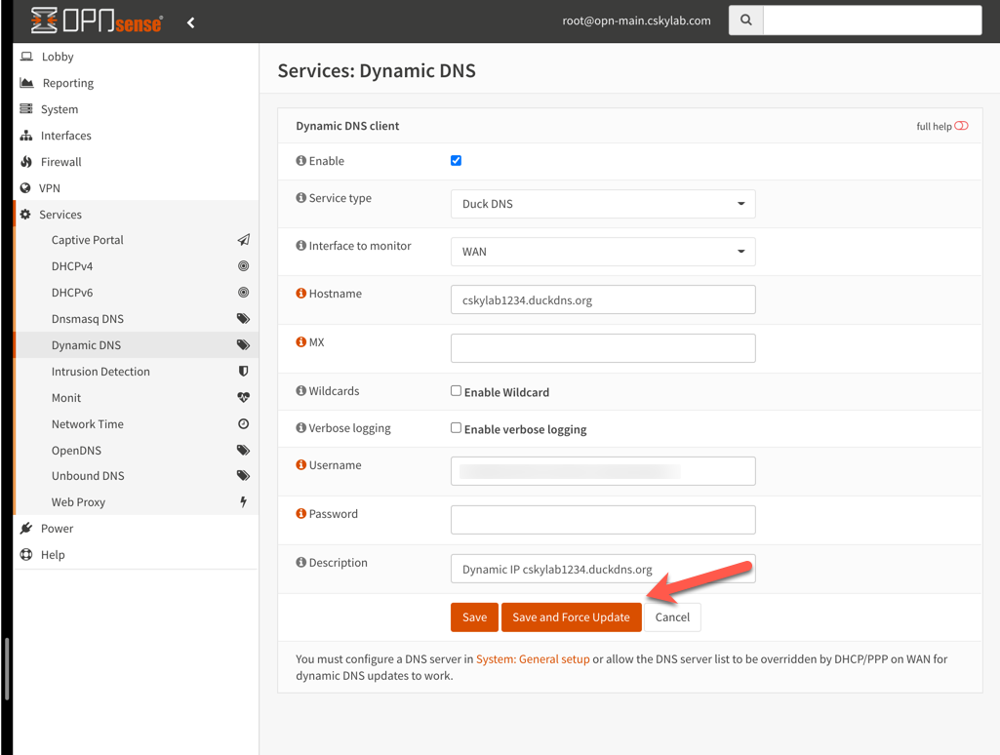
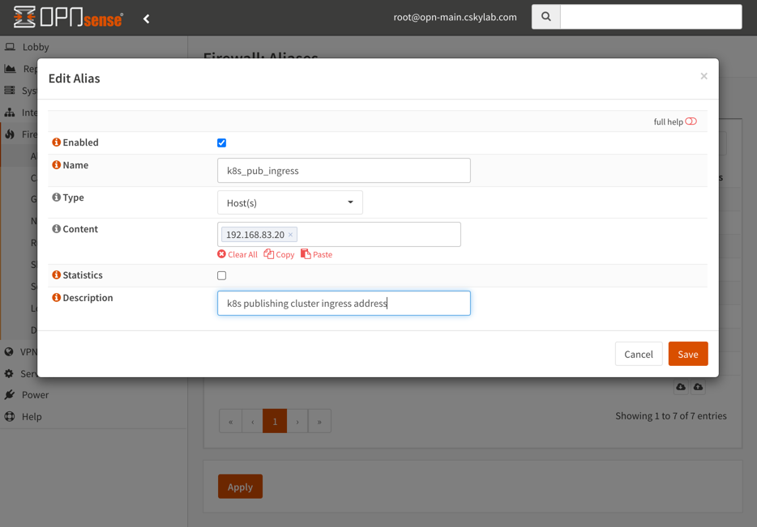

# OPNsense® Firewall & Routing

[OPNsense®](https://opnsense.org/) is an open source HardenedBSD based firewall and routing platform.

Firewall cluster **opn-cluster** gives routing, firewall, DHCP, DNS and VPN services inside cSkyLab.

---

- [OPNsense® Firewall & Routing](#opnsense-firewall--routing)
  - [Prerequisites](#prerequisites)
    - [Interfaces and IP addressing](#interfaces-and-ip-addressing)
    - [System requirements](#system-requirements)
      - [VIP password](#vip-password)
  - [How-to guides](#how-to-guides)
    - [Create cloud image from .iso file](#create-cloud-image-from-iso-file)
    - [Setup OPNSense cluster virtual machines](#setup-opnsense-cluster-virtual-machines)
      - [Cloud-init files](#cloud-init-files)
      - [Create virtual machines](#create-virtual-machines)
      - [Restore genesis configuration](#restore-genesis-configuration)
    - [Set secure specific configuration](#set-secure-specific-configuration)
      - [Set root password](#set-root-password)
      - [Update synchronization password](#update-synchronization-password)
      - [Set General Settings](#set-general-settings)
      - [Virtual IP Settings](#virtual-ip-settings)
      - [Port Forwarding Settings](#port-forwarding-settings)
      - [WAN Rules](#wan-rules)
      - [Import private CA](#import-private-ca)
      - [Generate VPN server certificate](#generate-vpn-server-certificate)
      - [Generate GUI server certificate (optional)](#generate-gui-server-certificate-optional)
      - [OpenVPN Servers](#openvpn-servers)
      - [OpenVPN Users and certificates](#openvpn-users-and-certificates)
      - [Export OpenVPN client profiles](#export-openvpn-client-profiles)
      - [Backup configurations and reboot](#backup-configurations-and-reboot)
    - [Usage procedures](#usage-procedures)
      - [Backup and restore configuration](#backup-and-restore-configuration)
      - [Update cluster](#update-cluster)
    - [Services configuration procedures](#services-configuration-procedures)
      - [CA's & Certificate management](#cas--certificate-management)
        - [Create or import the Root CA](#create-or-import-the-root-ca)
        - [Create and sign certificates](#create-and-sign-certificates)
        - [Assign GUI certificate](#assign-gui-certificate)
      - [Dynamic DNS](#dynamic-dns)
        - [Register a hostname in Duck DNS](#register-a-hostname-in-duck-dns)
        - [Configure master firewall](#configure-master-firewall)
        - [Check dynamic DNS registration](#check-dynamic-dns-registration)
        - [Publish dynamic DNS registration in your own domain](#publish-dynamic-dns-registration-in-your-own-domain)
      - [HA Cluster configuration](#ha-cluster-configuration)
        - [PFSYNC Firewall rules](#pfsync-firewall-rules)
        - [Master Firewall (`opn-main`): Set pfSync and HA synchronization (xmlrpc)](#master-firewall-opn-main-set-pfsync-and-ha-synchronization-xmlrpc)
        - [Slave Firewall (`opn-aux`): Set pfSync](#slave-firewall-opn-aux-set-pfsync)
        - [Configure Dashboard](#configure-dashboard)
        - [Synchronize settings](#synchronize-settings)
      - [Intrusion Prevention System (Optional)](#intrusion-prevention-system-optional)
      - [OpenVPN Service](#openvpn-service)
        - [OpenVPN Server Wizard](#openvpn-server-wizard)
        - [Add VPN Users](#add-vpn-users)
        - [Export OpenVPN User Profile](#export-openvpn-user-profile)
      - [Publishing (Port forwarding) rules](#publishing-port-forwarding-rules)
        - [Kubernetes ingress services](#kubernetes-ingress-services)
      - [RFC1918 static routes (optional)](#rfc1918-static-routes-optional)
      - [Spamhaus (E)DROP configuration](#spamhaus-edrop-configuration)
      - [Virtual IPs](#virtual-ips)
  - [Utilities](#utilities)
    - [Passwords and secrets](#passwords-and-secrets)

---

## Prerequisites

To learn more about OPNsense® check official documentation at <https://docs.opnsense.org/>

### Interfaces and IP addressing

| Interface | Network       | Purpose / Machine                   | Subnet / IP Address     |
| --------- | ------------- | ----------------------------------- | ----------------------- |
| vtnet0    | br_sys        | Base services and management access | 192.168.80.0/24         |
|           |               | opn-cluster VIP                     | 192.168.80.1            |
|           |               | opn-main (Private address)          | 192.168.80.2            |
|           |               | opn-aux (Private address)           | 192.168.80.3            |
| vtnet1    | br_wan        | External network                    | VIP (Static)            |
|           |               | opn-main (Private address)          | DHCP                    |
|           |               | opn-aux (Private address)           | DHCP                    |
| vtnet2    | br_sys_pfsync | cluster synchronization network     | 192.168.81.240/29       |
|           |               | opn-main (pfsync address)           | 192.168.81.241          |
|           |               | opn-aux (pfsync address)            | 192.168.81.242          |
| vtnet3    | br_mod_srv    | cSkyLab model services              | 192.168.82.0/24         |
|           |               | opn-cluster VIP                     | 192.168.82.1            |
|           |               | opn-main (Private address)          | 192.168.82.2            |
|           |               | opn-aux (Private address)           | 192.168.82.3            |
| vtnet4    | br_pro_srv    | Published services                  | 192.168.83.0/24         |
|           |               | opn-cluster VIP                     | 192.168.83.1            |
|           |               | opn-main (Private address)          | 192.168.83.2            |
|           |               | opn-aux (Private address)           | 192.168.83.3            |
| vtne5     | br_usr        | User client access subnet           | 192.168.84.0/23         |
|           |               | opn-cluster VIP                     | 192.168.84.1            |
|           |               | opn-main (Private address)          | 192.168.84.2            |
|           |               | opn-aux (Private address)           | 192.168.84.3            |
| vtnet6    | br_setup      | External LAN                        | (No VIP static address) |
|           |               | opn-main (Private address)          | DHCP                    |
|           |               | opn-aux (Private address)           | DHCP                    |

Machines in the cluster:

- <https://opn-main.cskylab.net> - (Virtual machine on host kvm-main)
- <https://opn-aux.cskylab.net> - (Virtual machine on host kvm-aux) (On kvm-main if kvm-aux not present)

### System requirements

The recommended specification to run all OPNsense standard features, means every feature is functional and fits most use cases.

| Hardware requirements |                        |
| --------------------- | ---------------------- |
| Processor             | 1.5 GHz multi core cpu |
| Memory                | 8GB                    |
| Disk                  | 120 GB SSD             |

#### VIP password

Use the following password to create VIP addresses: `NoFear21`

## How-to guides

### Create cloud image from .iso file

**Prerequisites**:

- kvm-main host setup completed.
- Local Ubuntu Desktop machine with Virtual Machine Manager installed and ssh keys to kvm-main host.

>NOTE: This procedure generates a cloud image with a full installation from an opnsense `.iso` DVD. Once it's created, it will be cloned to generate any opnsense virtual machine installation. Go directly to [VMachines configuration](#vmachines-configuration) if you already have a cloud image ready to be used.

You can find more information about full installation from <https://docs.opnsense.org/manual/install.html>

- Download opnsense .iso file (DVD Installation) from <https://opnsense.org/download/> and copy it to /srv/setup directory in your kvm host.
- Create the opnsense template `opn-tpl` machine:

```bash
sudo cs-kvmserv.sh -m vm-create -i NONE -n opn-tpl \
 -p /srv/vmachines \
 -r /srv/setup/OPNsense-21.7.1-OpenSSL-dvd-amd64.iso
```  

- Connect to the console with `Virtual Machine Manager`.
- Login with user `installer` and password `opnsense`.

  

- Select your Keymap

  

- Select Install (UFS)

  

- Select disk

  

- Accept recommended swap partition

  

- Confirm configuration

  

- Change root password, apply configuration and exit installer

  

- After reboot, login to reassign interface vtnet6 (br_setup) to LAN:
  
  - Select 1) Assign interfaces
  
  - Do not configure VLANs
  
  - In next screens, assign only LAN interface to vtnet6 network
  

- Configure LAN (br_setup) with DHCP
  - Select 2) Set interface IP address
  
  - Configure IPv4 address LAN interface via DHCP
  
  - Reboot the system and check the assigned address for browser access
  

- Update software to latest version:
  - Connect to GUI management interface: `https://<IPAddress>`
  - From the Dashboard click `Click to check for updates`
  - Wait for the package to be proposed and click `Update now`
  - Read the package update messages click `Update now`
  - Accept reboot if required

- Shutdown the machine from kvm host.

```bash
virsh shutdown opn-tpl
virsh list --all
```  

- Copy template disk for future opnsense installations:

```bash
  sudo cp -av /srv/vmachines/opn-tpl-sysdisk.qcow2 /srv/setup/
```

- Delete `opn-tpl` virtual machine (keep configuration directory for future use):

```bash
  sudo cs-kvmserv.sh -m vm-delete -n opn-tpl
```

### Setup OPNSense cluster virtual machines

#### Cloud-init files

KVM host must have in its setup directory a subdirectory for each virtual machine in the cluster `opn-main` and `opn-aux`, with the following configuration files:

- `cloud_init.yaml`: File must exist and must be empty.
- `cloud_netcfg.yaml`: File must exist and must be empty.
- `cloud-virt-install.sh`: File must exist with the following content:

```bash
# This script is designed to be sourced from cs-kvmserv.sh
# No shebang intentionally
# shellcheck disable=SC2148
# Variables not checked intentionally
# shellcheck disable=SC2154
virt-install --name "${vmachine_name}" \
    --virt-type kvm --memory 8192 --vcpus 2 \
    --boot hd,cdrom,menu=on --autostart \
    --disk path="${vmachines_path}/${vmachine_name}-setup.iso",device=cdrom \
    --disk path="${vmachines_path}/${vmachine_name}-sysdisk.qcow2",device=disk \
    --os-variant freebsd12.0 \
    --network network=br_sys \
    --network network=br_wan \
    --network network=br_sys_pfsync \
    --network network=br_mod_srv \
    --network network=br_pro_srv \
    --network network=br_usr \
    --network network=br_setup \
    --console pty,target_type=serial \
    --noautoconsole
```

#### Create virtual machines

- To create virtual machines from qcow2 images, open ssh connections in KVM host and execute:
  
```bash
# opn-main on kvm main host
sudo cs-kvmserv.sh -m vm-create -n opn-main -i /srv/setup/opn-tpl-sysdisk.qcow2 -s NONE -p /srv/vm-main

# opn-aux on kvm-aux if present, otherwise create on kvm-main
sudo cs-kvmserv.sh -m vm-create -n opn-aux -i /srv/setup/opn-tpl-sysdisk.qcow2 -s NONE -p /srv/vm-aux
ux
```

#### Restore genesis configuration

Full OPNSense configuration is stored in a model called **config genesis** for both machines in the cluster.

To restore configuration model:

- Find the assigned dhcp ip addresses for `opn-main` and `opn-aux` machines and connect to both GUI consoles with <https://IPAddress>
- Login with user `root` and password `opnsense`
- Go to **System -> Configuration -> Backups**
  - In `opn-main` machine restore configuration from file `config-opn-main.genesis-xxxxxxxx.xml`
  - In `opn-aux` machine restore configuration from file `config-opn-aux.genesis-xxxxxxxx.xml`
- Wait for reboot and check reconnect at <https://IPAddress:10443>

### Set secure specific configuration

This step updates initial configuration settings with specific security for your installation.

>**SECURITY WARNING:** This step is mandatory to set a secured environment for your firewall and VPN access.

**Prerequisites**:

You must prepare the folder `secrets` in your repository with the specific information for your installation. (Private CA, passwords...)

#### Set root password

- Connect to `opn-main` and `opn-aux` machines GUI consoles with <https://IPAddress:10443>
- Login with user `root` and password `NoFear21`
- Go to **System -> Access -> Users**. Edit `root` user and change password.
- **Save** configuration
- Go to **System -> High Availability -> Status** and click button on `Synchronize` service to synchronize config to backup.

#### Update synchronization password

- Go to **System -> High Availability -> Settings** and update `Remote System password` with the new password given.
- **Save** configuration
- Go to **System -> High Availability -> Status** and check synchronization again by clicking button on `Synchronize` service.

#### Set General Settings

In both machines `opn-main` and `opn-aux` configure general settings:

- Go to **System -> Settings -> General**
- Set **Domain**: Your installation name Ex.: `mpb-1100`
- **Save** configuration
  
#### Virtual IP Settings

>**Note:** You must have previously created in your internet uplink router the static IP Address for your OPNSense with a port forwarding rule for all protocols.

In `opn-main` configure virtual IP settings:

- Go to **Interfaces -> Virtual IPs -> Settings**
- Edit interface `WAN`
- Set **Address** to your WAN VIP address
- Set **VHID Group** to your assigned VHID group
- **Apply changes** to save configuration
- Go to **System -> High Availability -> Status** and click button on `Synchronize` service to synchronize config to backup.

>**WARNING**: Both VIP address and VHID group must be unique among other OPNSense firewalls operating in the same WAN. The virtual MAC address of a CARP interface is `00:00:5e:00:01:XX`, where the last two digits will be populated by its vhid.

- Go to **Firewall -> Aliases**
- Edit alias `WAN_VIP`
- Set **Content** to your WAN VIP address
- **Apply changes** to save configuration
- Go to **System -> High Availability -> Status** and click button on `Synchronize` service to synchronize config to backup.

#### Port Forwarding Settings

In `opn-main` configure port forwarding settings:

- Go to **Firewall -> NAT -> Port Forward**
- Edit rule in `Forward SSH to mcc` in `WAN` interface
- Set **Destination port range** to your assigned port (Ex. 22-22 or another specific for your installation)
- **Save** configuration
- Go to **System -> High Availability -> Status** and click button on `Synchronize` service to synchronize config to backup.

#### WAN Rules

In `opn-main` configure WAN rules settings:

- Go to **Firewall -> Rules -> WAN**
- Edit rule in `Allow OpenVPN traffic from WAN`
- Set **Destination port range** to your assigned port range (Default is 49152-49156 for 5 VLAN's)
- **Apply changes** to save configuration
- Go to **System -> High Availability -> Status** and click button on `Synchronize` service to synchronize config to backup.

#### Import private CA

- Go to **System -> Trust -> Authorities** and add a Certificate Authority
- In **Descriptive name** set the name of your CA
- In **Method** select `Import an existing Certificate Authority`
- Paste **Certificate data** and **Certificate Private Key** from your keys
- **Save** configuration
- Go to **System -> High Availability -> Status** and click button on `Synchronize` service to synchronize config to backup.

#### Generate VPN server certificate

You must create a certificate signed by your private CA

To create and sign a VPN server certificate go to **System -> Trust -> Certificates** and add a new certificate with the following settings:

- Method: `Create an internal Certificate`
- Descriptive name: `opn-cluster-VPN`
- Certificate authority: `Your private CA`
- Type: `Combined Client/Server Certificate`
- Key Type: `RSA`
- Key length (bits): `2048`
- Digest Algorithm: `SHA256`
- Lifetime (days): `3650`
- Private key location: `Save on this firewall`
- Country Code: Your country code Ex.: `ES (Spain)`
- State or Province: Your State or Province Ex.: `Madrid`
- City: Your city Ex.: `Madrid`
- Organization: Your organization Ex.:`cSkyLab`
- Email Address: Your email address Ex.: `admin@cskylab.net`
- Common Name: `opn-cluster-VPN`
- Alternative names: Create wildcard SAN's for your domain (Or specific FQDN for the registered cluster DNS CNAME or address)
  - Type: `DNS` Value: `opn-cluster-VPN`
  - Type: `DNS` Value: `*.cskylab.net`
  - Type: `DNS` Value: `*.cskylab.com` (Used in FastStart hosted services)
- **Save** configuration

#### Generate GUI server certificate (optional)

You can create a certificate signed by your private CA

To create and sign a VPN server certificate go to **System -> Trust -> Certificates** and add a new certificate with the following settings:

- Method: `Create an internal Certificate`
- Descriptive name: `opn-cluster-GUI`
- Certificate authority: `Your private CA`
- Type: `Server Certificate`
- Key Type: `RSA`
- Key length (bits): `2048`
- Digest Algorithm: `SHA256`
- Lifetime (days): `397`
- Private key location: `Save on this firewall`
- Country Code: Your country code Ex.: `ES (Spain)`
- State or Province: Your State or Province Ex.: `Madrid`
- City: Your city Ex.: `Madrid`
- Organization: Your organization Ex.:`cSkyLab`
- Email Address: Your email address Ex.: `admin@cskylab.net`
- Common Name: `opn-cluster-GUI`
- Alternative names:
  - Type: `DNS` Value: `opn-cluster-GUI`
  - Type: `DNS` Value: `opn-main.cskylab.net`
  - Type: `DNS` Value: `opn-aux.cskylab.net`
- **Save** configuration

**Configure GUI certificate:**

- Configure GUI Certificate from **System -> Settings -> Administration**
  - Select **SSL Certificate** and choose `opn-cluster-GUI`
- Go to **System -> High Availability -> Status** and click button on `Synchronize` service to synchronize config to backup.

#### OpenVPN Servers

Initial configuration comes with two preconfigured VPN servers:

- `mpb-genesis-mgt` for management access
- `mpb-genesis-usr` for general user access

To modify and secure VPN servers, connect to `opn-main` and configure the following settings:

- Go to **VPN -> OpenVPN -> SERVERS**
- Edit `mpb-genesis-mgt` server:
  - Set **Description** to Your installation name-mgt Ex.: `mpb-1100-mgt`
  - Set **Local Port** to your assigned port for management vpn Ex.: `49152`
  - Set **TLS Authentication** to `Disabled` to delete existing TLS Shared Key
  - Set **Peer Certificate Authority** to `Your private CA`
  - **Save** configuration
  - Edit the configuration again and set  **TLS Authentication** to `Enabled - Authentication only`
  - Leave checked **Automatically generate a shared TLS authentication key** to generate a new TLS Shared Key.
  - **Save** configuration

- Edit `mpb-genesis-usr` server:
  - Set **Description** to Your installation name-mgt Ex.: `mpb-1100-usr`
  - Set **Local Port** to your assigned port for management vpn Ex.: `49153`
  - Set **TLS Authentication** to `Disabled` to delete existing TLS Shared Key
  - Set **Peer Certificate Authority** to `Your private CA`
  - **Save** configuration
  - Edit the configuration again and set  **TLS Authentication** to `Enabled - Authentication only`
  - Leave checked **Automatically generate a shared TLS authentication key** to generate a new TLS Shared Key.
  - **Save** configuration

- Go to **System -> High Availability -> Status** and click button on `Synchronize` service to synchronize config to backup.

#### OpenVPN Users and certificates

Initial configuration comes with two preconfigured VPN users:

- `vpnmgt`: Access to "management VPN"
- `vpnusr`: Access to "users VPN"

You can use directly these two generic users, or you can add personal users (and their specific access configuration files) if you want.

- Set passwords for users `vpnmgt` and `vpnusr` (Repeate these steps for each one):
  - Go to **System -> Access -> Users**
  - Edit user
  - Set **Password** and confirmation to your desired new password
  - **Save** user configuration
  - Go to **System -> Access -> Tester**
  - Test **Username** and **Password**

- Set User Certificate for users `vpnmgt` and `vpnusr` (Repeate these steps for each one):
  - Go to **System -> Access -> Users**
  - Edit user
  - Delete previous User Certificate
  - Add User Certificate with the following values (Leave the other values by default):
    - Method: `Create an internal Certificate`
    - Certificate authority: `Your private CA`
    - Lifetime (days): `3650`
    - Private key location: `Save on this firewall`
    - Country Code: Your country code Ex.: `ES (Spain)`
    - State or Province: Your State or Province Ex.: `Madrid`
    - City: Your city Ex.: `Madrid`
    - Organization: Your organization Ex.:`cSkyLab`
    - Email Address: Your email address Ex.: `admin@cskylab.net`
    - **Save** certificate configuration
  - **Save** user configuration

- Go to **System -> High Availability -> Status** and click button on `Synchronize` service to synchronize config to backup.

#### Export OpenVPN client profiles

You must export a profile for each user and server combination. Repeat the following steps for `mgt` and `usr` servers:

- Go to **VPN -> OpenVPN -> Client Export**
- In **Remote Access Server** Select your server (`mgt` or `usr`)
- Set **Export type** Choose `File Only` for OpenVPN Connect client or `Viscosity (visz)` for Viscosity client.
- Change **Hostname** to FQDN registered DNS CNAME or address (Ex.: Duck DNS registered name)
- Change **Port** to the apropriate server port (Ex.:`49152`)
- Check **Use random local port**
- Check **Validate server subject**
- Click the **download button** for the user profile to download.
- Save the downloaded profiles into your `opn-cluster` configuration folder in your installation repository.
  
>**Note:** You can send the downloaded profile file as an attachment, in an email message to the user. The user must import the profile with the client application (OpenVPN Connect or Viscosity) and test the connection from mobile and desktop environments.


#### Backup configurations and reboot

- Go to **System -> High Availability -> Status** and click button on `Synchronize` service to synchronize config to backup.
- Go to **System -> Configuration -> Backups** and backup configurations of both `opn-main` and `opn-aux`
- Save the downloaded backup xml files into your `opn-cluster` configuration folder in your installation repository.
- Go to **Power -> Reboot** and reboot both `opn-main` and `opn-aux`
- Check access for `mgt` and `usr` VPN profiles
  
### Usage procedures

#### Backup and restore configuration

You can find complete information about backup alternatives in <https://docs.opnsense.org/manual/backups.html#backup>

To backup or restore configuration:

- Go to **System -> Configuration -> Backups**
- Click `Download configuration` to download configuration in XML format.
- Click `Choose file` & `Restore configuration` to restore configuration from XML file.

  

#### Update cluster

Updates should be performed on slave firewall, and once stable, perform the update of master firewall

For more information about updates see <https://docs.opnsense.org/manual/updates.html>

To perform updates on `opn-aux`:

- Go to **System -> Firmware -> Updates** and click `Check for updates`
- Wait for the package to be proposed and click `Update now`
- Read the package update messages click `Update now`
- Accept reboot if required

Once `opn-aux` is updated and running, perform the same update procedure on `opn-main`.

### Services configuration procedures

#### CA's & Certificate management

Follow these procedures to create a private CA and issue private certificates. (For more information see <https://docs.opnsense.org/manual/how-tos/self-signed-chain.html>)

##### Create or import the Root CA

The following procedure is an example with a provided internal test CA `ca-test-internal`

>NOTE: You should prepare your own private CA for internal purposes. It is recommended to delete the `ca-test-internal` because its private key is not confidential, and therefore it is not secure. You shoud create a new one, with your own data and preserve the security of its private key.

To create a root CA go to **System -> Trust -> Authorities** and add a new CA with the following settings:

- Descriptive name: `ca-test-internal`
- Method: `Create an internal Certificate Authority`
- Key Type: `RSA`
- Key length (bits): `2048`
- Digest Algorithm: `SHA256`
- Lifetime (days): `7300`
- Country Code: `ES (Spain)`
- State or Province: `Madrid`
- City: `Madrid`
- Organization: `Not secure. Internal test purposes`
- Email Address: `admin@cskylab.net`
- Common Name: `ca-test-internal`
- `Save`
- Export and save CA cert file: `Export CA cert button`
- Export and save CA private Key file: `Export CA private Key button`

To import a root CA go to **System -> Trust -> Authorities** and add a new CA with the following settings:

- Descriptive name: `ca-test-internal`
- Method: `Import an existing Certificate Authority`
- Certificate data: Paste the content of `.crt` certificate file
- Certificate Private Key: Paste the content of `.key` private key file
- Serial for next certificate: Leave blank

##### Create and sign certificates

To create and sign a certificate go to **System -> Trust -> Certificates** and add a new certificate with the following settings (example):

- Method: `Create an internal Certificate`
- Descriptive name: `Wilcard-cskylab`
- Certificate authority: `ca-test-internal`
- Type: `Combined Client/Server Certificate`
- Key Type: `RSA`
- Key length (bits): `2048`
- Digest Algorithm: `SHA256`
- Lifetime (days): `397`
- Private key location: `Save on this firewall`
- Country Code: `ES (Spain)`
- State or Province: `Madrid`
- City: `Madrid`
- Organization: `Not secure. Internal test purposes`
- Email Address: `admin@cskylab.net`
- Common Name: `Wilcard-cskylab`
- Alternative names:
  - Type: `DNS`
  - Value: `*.cskylab.net`
- `Save`
  
Export certificate `.crt` file, private key `.key` file, or combined ca+cert+key `.p12` file as needed.

##### Assign GUI certificate

>NOTE: You should prepare your own GUI certificate from your private and secure CA for internal purposes. It is recommended to delete the `Wilcard-cskylab` certificate provided only as an example, because its private key is not confidential, and therefore it is not secure. You shoud create a new one, with your own data and preserve the security of its private key.

- Configure GUI Certificate from **System -> Settings -> Administration**
  - Select **SSL Certificate** and choose `Wilcard-cskylab`
  - Select **Listen interfaces** and choose `All (recommended)`

- After configuration, go to **System -> High Availability -> Status** and click button `Synchronize` to synchronize config to backup.

#### Dynamic DNS

This procedure covers opnsense configuration with `Duck DNS` dynamic DNS provider. To learn more about opnsense dynamic DNS configuration with other providers see <https://docs.opnsense.org/manual/dynamic_dns.html#setting-up-a-dynamic-ip-address>

##### Register a hostname in Duck DNS

- Login with an external account of any of the supported types to <https://www.duckdns.org/>
  
  

- Choose a unique name not registered before. Ex `cskylab1234`. This will register a hostname `cskylab1234.duckdns.org`.

  

- Update current IP address manually to a fake value, to check afterwards how dynamic IP is registered. Ex `8.8.8.8`

  

##### Configure master firewall

- On `opn-main` master firewall go to **Services -> Dynamic DNS** and perform the following configuration:

  >NOTE: Enter your Duck DNS token in Username field and leave Password empty

  
  
- After configuration, go to **System -> High Availability -> Status** and click button `Synchronize` to synchronize config to backup.

##### Check dynamic DNS registration

- On `opn-main` master firewall go to **Services -> Dynamic DNS**. Edit the service to save and force an update. Check the cached IP address.

  

- Login to  <https://www.duckdns.org/> and check how the IP address has been updated:

  

##### Publish dynamic DNS registration in your own domain

To publish services in your own domain, you must point a CNAME record to the registered Duck DNS host. 

Example: If you want to publish `gitlab.mydomain.com`, you should add the following record in `mydomain.com` zone

```dns
gitlab IN CNAME cskylab1234.duckdns.org.
```

#### HA Cluster configuration

>**Note:** This service is configured in `opn.genesis` configuration according to the described procedures. You can use them to change the default configuration if needed.

One of the most powerful features of OPNsense is to set-up a redundant firewall with automatic fail-over option. This procedure describes how to create a cluster with `opn-main` and `opn-aux` virtual machines.

For a more complete guide on HA configuration see:

- <https://www.thomas-krenn.com/en/wiki/OPNsense_HA_Cluster_configuration>.
- <https://docs.opnsense.org/manual/how-tos/carp.html>

##### PFSYNC Firewall rules

- Create firewall allow rules for PFSYNC on both machines.

  - Go to **Firewall -> Rules -> PFSYNC**
  - Add allow rule: Since it is a direct cable connection, set it to allow any network traffic. (Category: HA_Cluster)

  

##### Master Firewall (`opn-main`): Set pfSync and HA synchronization (xmlrpc)
  
- HA Settings: Go to **System -> High Availability -> Settings** and configure the following settings:
  - Synchronize States: Checked ✔
  - Disable preempt: Unchecked. **WARNING: Do NOT check this option on Master Firewall**
  - Synchronize Interface: PFSYNC
  - Synchronize Peer IP: 192.168.81.242 (Use here the IP address of PFSYNC interface of `opn-aux`)
  - Synchronize Config to IP: 192.168.81.242 (Use here the IP address of PFSYNC interface of `opn-aux`)
  - Remote System Username: root
  - Remote System Password: (password on `opn-aux`)
  - Select all services to be synchronized
  - Restart firewall after saving

    

##### Slave Firewall (`opn-aux`): Set pfSync
  
- HA Settings: Go to **System -> High Availability -> Settings** and configure the following settings:
  - Synchronize States: Checked ✔
  - Disable preempt: Checked ✔. **WARNING: Always check this option on Slave Firewall**
  - Synchronize Interface: PFSYNC
  - Synchronize Peer IP: 192.168.81.241 (Use here the IP address of PFSYNC interface of `opn-main`)
  - Synchronize Config to IP: Leave empty (Slave does not perform any synchronization)
  - Remote System Username: root
  - Remote System Password: (password on `opn-main`)
  - Restart firewall after saving

    

##### Configure Dashboard

On Master Firewall (`opn-main`) goto **Lobby -> Dashboard**

- Add the CARP widget by clicking on **+ Add Widget**, select CARP and then clicking on `Save Settings`.

##### Synchronize settings

To test synchronization between master and slave:

- Connect to master (`opn-main`)
- Go to **System -> High Availability -> Status**
- Push button to synchronize config to backup
- Verify Ok Status
  
  

#### Intrusion Prevention System (Optional)

This deep packet inspection system is very powerful and can be used to mitigate security threats at wire speed.

For additional information see: <https://docs.opnsense.org/manual/ips.html>

To perform a basic configuration of Intrusion Prevention System:

- Download Rulesets: Go to **Services -> Intrusion Detection -> Administration -> Download**. Select all rulesets, click `Enable selected` and `Download & Update Rules`

  

- General Settings: Go to **Services -> Intrusion Detection -> Administration -> Settings** and enable service and IPS mode. (You can enable or disable all service as required from this window)

  

- Schedule: Go to **Services -> Intrusion Detection -> Administration -> Schedule** and set the following configuration to update intrusion detection rules every day at 7:00 am.

  

- Policy: If required, you chan change the `Alert` default policy to `Drop` for any or all of the rulesets. To do so, go to **Services -> Intrusion Detection -> Policy**, select the rulesets and set the appropriate policy.

- After configuration, go to **System -> High Availability -> Status** and click button `Synchronize` to synchronize config to backup.

#### OpenVPN Service

OPNsense supports VPN connections for branch offices as well as remote users. This section covers procedures for both types of connections using OpenVPN (SSL VPN). For more information about OPNsense VPN options see:

- <https://homenetworkguy.com/how-to/configure-openvpn-opnsense/>
- <https://www.sparklabs.com/support/kb/article/setting-up-an-openvpn-server-with-opnsense-and-viscosity/>
- <https://docs.opnsense.org/manual/vpnet.html#>

**Prerequisites**:

- **Assign a static IP in your uplink router**: In your uplink router, you must assign a static IP for your opnsense router. (Select an address out of the scope of DHCP).
- **Create a full forward rule in your uplink router**: In your uplink router, you must create a full forward rule to the static IP address previously assigned for your opnsense router.
- **Create a VIP in your opnsense**: In your opnsense, you must create a VIP address in your WAN interface, with the static IP address previously assigned in the full forward rule at your uplink router. For creating a VIP address see [Set up virtual IPs](#setupvirtualips) section on this document.
- **Create a Certificate Authority (CA)**: You must have previously created your own private and secure CA. For creating your own CA see [Create or import the Root CA](#create-or-import-the-root-ca) section on this document.
- **Create a Certificate for OpenVPN Server**: You must create a secure private certificate for OpenVPN. For creating a private certificate see [Create and sign certificates](#create-and-sign-certificates) section on this document.

##### OpenVPN Server Wizard

- Launch the VPN Wizard: Go to **VPN -> OpenVPN -> Servers** and click `Use a wizard to setup a new server`
- Select an Authentication Backend Type: `Local User Access`.
- Choose a Certificate Authority (CA): Select your private and secured CA
- Choose a Server Certificate: Select your private and secured certificate
- Set the following server settings:
  - Interface: `any`
  - Protocol `UDP`
  - Local Port: `1194`
  - Description: `sys_vpn`
  - Encryption Algorithm: `AES-256-CBC (256 bit key, 128 bit block)`
  - Auth Digest Algorithm: `SHA256 (256-bit)`
  - IPv4 Tunnel Network: `192.168.81.0/25`
  - IPv4 Local Network: `192.168.80.0/21`
  - Duplicate Connections: `Checked` Check Allow multiple concurrent connections
  - DNS Server 1:	`192.168.81.1`

  

- Firewall Rule Configuration: Check boxes to add `Firewall Rule` & `OpenVPN rule`.

  

- After configuration, go to **System -> High Availability -> Status** and click button `Synchronize` to synchronize config to backup.

##### Add VPN Users

Connecting to an OPNsense OpenVPN server requires both a user certificate and username and password. You need to create a user account for each person you want to allow access to your server.

To create a new user, go to **System -> Access -> Users** and set the following settings:

- Enter the unique username and password for the account as well as other basic user information. Tick the box `Click to create a user certificate` further down.
  
    

- Create a user certificate with the following settings:

    

- After configuration, go to **System -> High Availability -> Status** and click button `Synchronize` to synchronize config to backup.

##### Export OpenVPN User Profile

OPNsense makes client configuration extremely easy by providing ready to go connections for various devices, including connections specifically prepared for OpenVPN Connect and Viscosity.

To export OpenVPN user profile, go to **VPN -> OpenVPN -> Client Export**

- Check aproppriate hostname (VIP WAN IP or FQDN) and port values (The local port used by the OpenVPN server).
- Choose VPN Client type: In **Export Type** choose `File Only` for OpenVPN Connect or `Viscosity (visz)` for Viscosity.
- Click the download button for the user profile to download.

    

>Note: You can send the downloaded profile file as an attachment, in an email message to the user. The user must import the profile with the client application (OpenVPN Connect or Viscosity) and test the connection from mobile and desktop environments.

#### Publishing (Port forwarding) rules

>**Note:** This service is configured in `opn.genesis` configuration according to the described procedures. You can use them to change the default configuration if needed.

**Prerequisites**:

- **Public Address**: WAN interface on your opnsense firewall must have a public IP address assigned. If not, a previous port forwarding rule must have been configured in your uplink router, in order to redirect the traffic to opnsense firewall. It is recommended to set a global rule for all protocols / all ports in your uplink router and perform further publishing configuration in your opnsense firewall.
- **DNS Record**: The service must have an appropriate host record or a CNAME published on its domain zone. If DDNS is needed see procedures in: [Dynamic DNS](#dynamic-dns)
  
  You can check if DNS resolution is working with `dig myservice.mydomain.com`.

##### Kubernetes ingress services

All kubernetes ingress services are published with a single rule.

To publish kubernetes ingress `k8s_pub_ingress`:

- Alias k8s_pub_ingress: Go to **Firewall -> Aliases** and create an alias if needed with the ingress service internal address (192.168.83.20)

  

- Port forward rule: Go to **Firewall -> NAT -> Port Forward** and add the following rules.
  >NOTE: `Destination` is VIP WAN and `Redirect target IP` is internal k8s_pub_ingress address.
  >Associated firewall rules are automatically generated and maintained in WAN interface.
  
  - HTTP:
    
  - HTTPS:
    

#### RFC1918 static routes (optional)

When using an internal gateway to connect with internal corporate networks, you must add a gateway and configure routes for RFC1918 addresses or other specific internal CIDR's.

Internal corporate router must be connected with an interface to `base` network (192.168.80.0/24).

- To add a Gateway for internal networks (Gateway may exist if configured previously from console):
  - Go to **System -> Gateways -> Single**
    - Add `LAN_GW`gateway in `LAN`interface with IP address `192.168.80.4` (example address)
- To add routes for RFC1918 addresses:
  - Go to **System -> Routes -> Configuration**
    - Add route for network address `10.0.0.0/8` via gateway `LAN_GW - 192.168.80.4`
    - Add route for network address `172.16.0.0/12` via gateway `LAN_GW - 192.168.80.4`
    - Add route for network address `192.168.0.0/16` via gateway `LAN_GW - 192.168.80.4`
    - Apply configuration

- Be sure the only upstream gateway is WAN in **System -> Gateways -> Single**

  

  

  

At this point, the GUI administration tool should be accessible from all internal networks.

#### Spamhaus (E)DROP configuration

>**Note:** This service is configured in `opn.genesis` configuration according to the described procedures. You can use them to change the default configuration if needed.

DROP (Don’t Route Or Peer) and EDROP are advisory “drop all traffic” lists, consisting of netblocks that are “hijacked” or leased by professional spam or cyber-crime operations (used for dissemination of malware, trojan downloaders, botnet controllers).

For more information to configure Spamhaus lists see: <https://docs.opnsense.org/manual/how-tos/edrop.html>

>Note: These rules are located in **Floating** section, to be applied always before regular interface rules.

You should define the following aliases:

   

   

To set rules, go to **Firewall -> Rules -> Floating** and set the following:

- Inbound rule for `spamhaus_drop` list:

   

- Inbound rule for `spamhaus_edrop` list:

   

- Outbound rule for `spamhaus_drop` list::

   

- Outbound rule for `spamhaus_edrop` list::

   
  
#### Virtual IPs

On Master Firewall, go to **Interfaces -> Virtual IPs -> Settings** and create the following virtual IPs with the following parameters:

- Mode: CARP
- Interface: `xxxx`
- Address: X.X.X.X/X
- VHID Group: Select an unassigned VHID
- Virtual password: Use [VIP password](#vip-password) (Random password of 30 characters).

## Utilities

### Passwords and secrets

Generate passwords and secrets with:

```bash
# Screen
echo $(head -c 512 /dev/urandom | LC_ALL=C tr -cd 'a-zA-Z0-9' | head -c 16)

# File (without newline)
printf $(head -c 512 /dev/urandom | LC_ALL=C tr -cd 'a-zA-Z0-9' | head -c 16) > RESTIC-PASS.txt
```

Change the parameter `head -c 16` according with the desired length of the secret.
