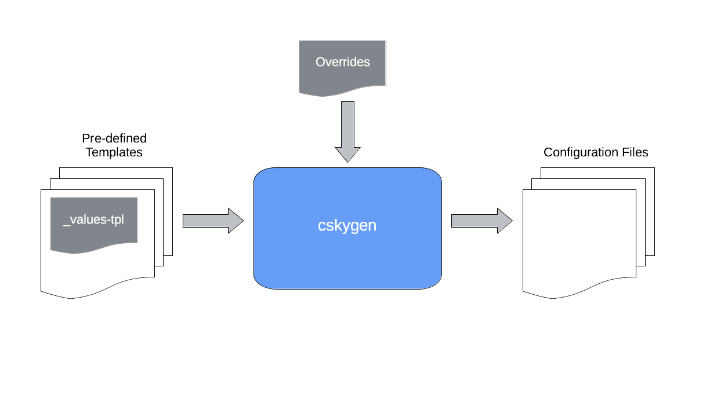

# cskygen - cSkyLab Configuration Genesis <!-- omit in toc -->

## v1.0.2 <!-- omit in toc -->

`cskygen` is a CLI application that generates configuration files from pre-configured templates.

It is widely used in cSkyLab project to create configuration files for machines, services and applications.

cskygen is developed using [Go templates](https://godoc.org/text/template) specifications.

It is compatible and integrates the use of [Helm Charts](https://helm.sh/) in kubernetes services deployment.

- [Background](#background)
  - [Template Libraries](#template-libraries)
- [How-to guides](#how-to-guides)
  - [Build & install cskygen](#build--install-cskygen)
  - [Using cskygen with configuration runbooks](#using-cskygen-with-configuration-runbooks)
  - [Using cskygen manually](#using-cskygen-manually)
- [License](#license)

---

## Background

When creating customized configuration files from the template, cskygen uses a customization process based on 2 layers applied in the following order:

1. Template default values file: `_values-tpl.yaml`. It contains default customizable values. It must exist with that name inside the template directory.

2. Overriding file : User generated `.yaml` file. It contains overriding values that define the service according to the customizations you made.

Values from the overriding file take precedence over the template default values file.

cskygen uses [Viper](https://github.com/spf13/viper) to read and merge `.yaml` configuration files.



> **NOTE**: To avoid parsing images and [Helm Charts](https://helm.sh/), files below directories named `images` or `charts` will not be considered by cskygen.

### Template Libraries

Template libraries contains configuration models used to generate customized configuration files for machines, applications and services with the `cskygen` utility.

cSkyLab project template library is located at directory `tp-cskylab` in your repository. You can create your own library either by forking cSkyLab templates or by creating it from scratch.

Template resource files must be developed according to [Go templates](https://godoc.org/text/template) specifications.

> **NOTE**: All keys in overriding and template values files must be in lowercase. Files cannot have empty keys configured.

To learn more about cSkylab template library see documentation at [cSkyLab Templates Library](../tpl-cskylab/README.md)

## How-to guides

### Build & install cskygen

Building & installing `cskygen` is necessary to generate application and service configurations from template libraries.

**Prerequisites**:

- cSkyLab git repository cloned
- Go language 1.16 or later installed

**Build binary file**:

`cskygen` uses go modules `go.mod` and can be installed directly from the git repository.

To build and install cskygen binary file in $GOPATH/bin, open a terminal in the `cskygen` directory, and execute:

``` console
go install .
```

### Using cskygen with configuration runbooks

cSkyLab Templates provide runbook models with snipets and yaml override values to make easier the creation of any application configuration directory from its template. These runbook models can be imported to a working directory `_cfg-fabric` to be customized with the appropriate contents for each application or service you need to deploy.

It is reccomended to have a `_cfg-fabric` directory for each zone of your installation (cs-mod, cs-pro... etc.)

To create configuration files from templates with runbooks:

- Go to the zone `_cfg-fabric` directory. (e.g., `/YourRepo/cs-mod/_cfg-fabric/`)
- Open terminal and follow instructions in `README.md` and `*.md` runbooks.

### Using cskygen manually

To manually use cskygen to create application configuration files from templates you must follow two steps:

1. Prepare the overriding file
2. Execute cskygen

**1.- Prepare the overriding file:**

- Select the template you want to use
- Copy the template default values file: `_values-tpl.yaml` to your `$HOME` directory with your overriding file name (Ex.: `app_xxx.yaml`)
- In your overriding file at your `$HOME` directory, change the desired values for your installation.
- Save the file

**2.- Execute cskygen:**

- Open a terminal in your `$HOME` directory
- Execute the `cskygen create` command with the following flags:

  | flag |                                                                        |
  | ---- | ---------------------------------------------------------------------- |
  | `-d` | Destination app configuration repository directory (Must not exist)    |
  | `-t` | Template directory                                                     |
  | `-f` | Overriding file (.yaml extension required on filename but not in flag) |

- Check the created configuration directory

If you need to repeat the process with different overriding values, simply delete the configuration directory, change the overriding values, and execute again the `cskygen create` command to generate the new configuration directory.

## License

Copyright © 2021 cSkyLab.com ™

Licensed under the Apache License, Version 2.0 (the "License");
you may not use this file except in compliance with the License.
You may obtain a copy of the License at

http://www.apache.org/licenses/LICENSE-2.0

Unless required by applicable law or agreed to in writing, software
distributed under the License is distributed on an "AS IS" BASIS,
WITHOUT WARRANTIES OR CONDITIONS OF ANY KIND, either express or implied.
See the License for the specific language governing permissions and
limitations under the License.
