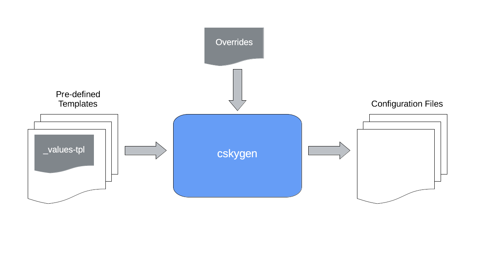

# cskygen - cSkyLab Configuration Genesis <!-- omit in toc -->

## v1.0.1 <!-- omit in toc -->

cskygen is a CLI application that generates configuration files from pre-configured templates.

It is widely used in cSkyLab project to create configuration files for machines, services and applications.

cskygen is developed using [Go templates](https://godoc.org/text/template) specifications.

It is compatible and integrates the use of [Helm Charts](https://helm.sh/) in kubernetes services deployment.

- [Background](#background)
- [How-to guides](#how-to-guides)
  - [Build & install cskygen](#build--install-cskygen)
    - [Build binary file](#build-binary-file)
  - [Create configuration files for a new deployment](#create-configuration-files-for-a-new-deployment)
    - [Prepare the overrides file](#prepare-the-overrides-file)
    - [Create configuration files](#create-configuration-files)
- [License](#license)

---

## Background

At cSkyLab project, machine services and applications are based on pre-configured templates files (models of applications and services).

When creating a new deployment, cskygen uses a configuration process based on 2 layers that are applied with the following order:

1. Pre-configured Template default values file: `_values-tpl.yaml`. It contains default customizable values. It must exist with that name inside the template directory.

2. Overrides file : `service_name.yaml` contains overrided values that define the instance of the service according to the customizations you made.

Values from the `service_name.yaml` file take precedence over the  `_values-tpl.yaml`.

cskygen uses [Viper](https://github.com/spf13/viper) to read and merge `.yaml` configuration files.



> **NOTE**: All config keys must be in lowercase. To avoid parsing images and [Helm Charts](https://helm.sh/), files below directories named `images` or `charts` will not be considered by cskygen.

## How-to guides

### Build & install cskygen

**Prerequisites**:

- cSkyLab git repository cloned
- Go language installed

#### Build binary file

cskygen uses go modules `go.mod` and can be installed directly from the git repository.

To build and install cskygen binary file in $GOPATH/bin, open a terminal in the cskygen directory, and execute:

``` console
go install .
```

### Create configuration files for a new deployment

#### Prepare the overrides file

- Go to `tpl-override-files` directory in your installation, and create the `service_name.yaml` overrides file by copying contents from `_model.yaml` file.
  
>**NOTE**: It is highly recommended to name the `service_name.yaml` overrides file, according to the service and destination directory names (Ex. `k8s-mod-n1.yaml`, `k8s-mod-metallb.yaml`...)

- Go to the directory of the template you're working with, and open the values file `_values-tpl`
- Copy the `values to override` section from the file `_values-tpl` into the same section in your `service_name.yaml` overrides file.
- Override the desired values.
- Modify the code commented command `cskygen create` with the appropriate flags:
  - Destination directory `-d`
  - Template directory `-t`
  - Overrides file `-f` (.yaml extension required on filename but not in flag).
- Save the file.

#### Create configuration files

- Open terminal in `_tpl-config-files` directory.
- Copy the code commented command "cskygen create" and execute it in the console.
- Check the configuration files created on destination directory.

## License

Copyright © 2021 cSkyLab.com ™

Licensed under the Apache License, Version 2.0 (the "License");
you may not use this file except in compliance with the License.
You may obtain a copy of the License at

http://www.apache.org/licenses/LICENSE-2.0

Unless required by applicable law or agreed to in writing, software
distributed under the License is distributed on an "AS IS" BASIS,
WITHOUT WARRANTIES OR CONDITIONS OF ANY KIND, either express or implied.
See the License for the specific language governing permissions and
limitations under the License.
