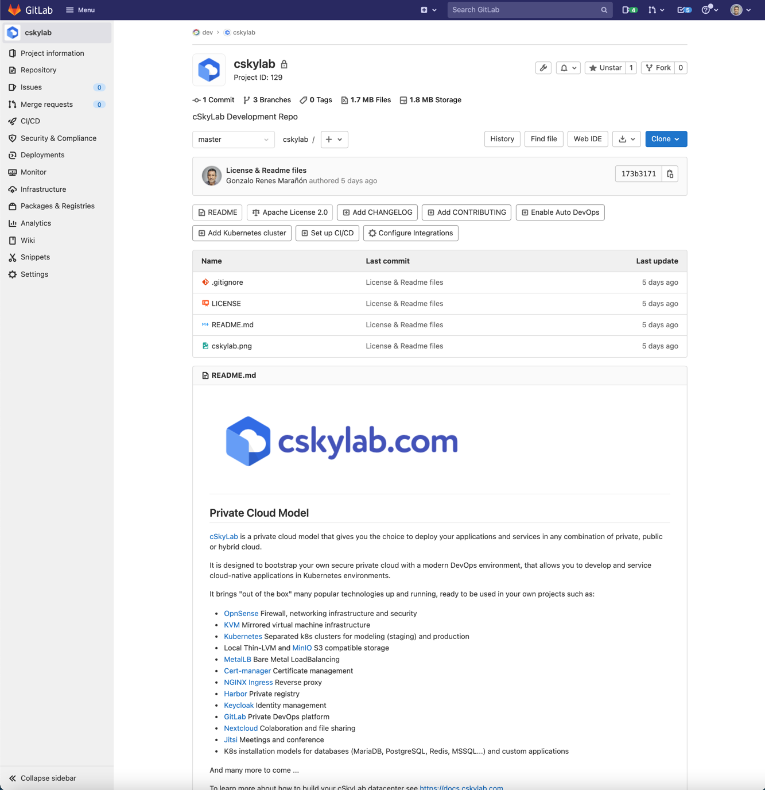

# Gitlab open DevOps platform <!-- omit in toc -->

## v99-99-99 <!-- omit in toc -->

## Helm charts<!-- omit in toc -->

- **GitLab** chart v8.5.1 with appVersion 17.5.1. Following Gitlab recommendations, updates to a new release must be made from the latest minor version of the previous release.

- **Postgresql** chart v16.0.6, with application version 16.4.0


[Gitlab](https://about.gitlab.com/what-is-gitlab/) is the open DevOps platform, delivered as a single application. GitLab is a web-based DevOps lifecycle tool that provides a Git repository manager providing wiki, issue-tracking and continuous integration and deployment pipeline features, using an open-source license, developed by GitLab Inc.

Configuration files are deployed from template {{ ._tpldescription }} version {{ ._tplversion }}.

  

- [TL;DR](#tldr)
- [Prerequisites](#prerequisites)
  - [LVM Data Services](#lvm-data-services)
    - [Persistent Volumes](#persistent-volumes)
  - [Custom CA certificate](#custom-ca-certificate)
- [How-to guides](#how-to-guides)
  - [Pull Charts](#pull-charts)
  - [Install](#install)
  - [Update](#update)
  - [Uninstall](#uninstall)
  - [Remove](#remove)
  - [Display status](#display-status)
  - [Backup \& data protection](#backup--data-protection)
    - [RSync HA copies](#rsync-ha-copies)
    - [Restic backup](#restic-backup)
  - [Upgrade PostgreSQL database version](#upgrade-postgresql-database-version)
  - [Gitlab Application Backup \& Restore](#gitlab-application-backup--restore)
    - [Rails-Secret Backup](#rails-secret-backup)
    - [Cron based backups](#cron-based-backups)
    - [Manual Backup](#manual-backup)
    - [Access to backup tar files](#access-to-backup-tar-files)
    - [Restore from GitLab rails-secret and backup tar files](#restore-from-gitlab-rails-secret-and-backup-tar-files)
      - [Restore the rail secrets](#restore-the-rail-secrets)
  - [GitLab - Keycloak OpenID Connect OmniAuth provider](#gitlab---keycloak-openid-connect-omniauth-provider)
    - [Step 1 - Create an OIDC Client in Keycloak](#step-1---create-an-oidc-client-in-keycloak)
    - [Step 2 - Configure OIDC Client in Keycloak](#step-2---configure-oidc-client-in-keycloak)
    - [Step 3 - Verify Configuration Endpoint](#step-3---verify-configuration-endpoint)
    - [Step 4 - Configure Gitlab](#step-4---configure-gitlab)
    - [Step 5 - Deploy and Login to Gitlab](#step-5---deploy-and-login-to-gitlab)
  - [Utilities](#utilities)
    - [Passwords and secrets](#passwords-and-secrets)
- [Reference](#reference)
  - [Helm charts and values](#helm-charts-and-values)
  - [Scripts](#scripts)
    - [cs-deploy](#cs-deploy)
- [License](#license)

---

## TL;DR

Prepare LVM Data services for PV's:

- [LVM Data Services](#lvm-data-services)

Install namespace and charts:

```bash
# Pull charts to './charts/' directory
./csdeploy.sh -m pull-charts
# Install  
./csdeploy.sh -m install
# Check status
./csdeploy.sh -l
# Save rail secrets to rail-secrets.yaml
kubectl -n={{ .namespace.name }} get secret gitlab-rails-secret -o jsonpath="{.data['secrets\.yml']}" | base64 --decode > rail-secrets.yaml
```

Run:

- Published at: `{{ .publishing.url }}`
- Username: `root`
- Password: `{{ .publishing.password }}`

## Prerequisites

- Administrative access to Kubernetes cluster.
- Helm v3.

### LVM Data Services

Data services are supported by the following nodes:

| Data service                 | Kubernetes PV node           | Kubernetes RSync node           |
| ---------------------------- | ---------------------------- | ------------------------------- |
| `/srv/{{ .namespace.name }}` | `{{ .localpvnodes.all_pv }}` | `{{ .localrsyncnodes.all_pv }}` |

`PV node` is the node that supports the data service in normal operation.

`RSync node` is the node that receives data service copies synchronized by cron-jobs for HA.

To **create** the corresponding LVM data services, execute from your **mcc** management machine the following commands:

```bash
#
# Create LVM data services in PV node
#
echo \
&& echo "******** START of snippet execution ********" \
&& echo \
&& ssh {{ .localpvnodes.localadminusername }}@{{ .localpvnodes.all_pv }}.{{ .localpvnodes.domain }} \
  'sudo cs-lvmserv.sh -m create -qd "/srv/{{ .namespace.name }}" \
&& mkdir "/srv/{{ .namespace.name }}/data/postgresql" \
&& mkdir "/srv/{{ .namespace.name }}/data/minio" \
&& mkdir "/srv/{{ .namespace.name }}/data/redis-master" \
&& mkdir "/srv/{{ .namespace.name }}/data/gitaly" \
&& mkdir "/srv/{{ .namespace.name }}/data/task-runner"' \
&& echo \
&& echo "******** END of snippet execution ********" \
&& echo
```

```bash
#
# Create LVM data services in RSync node
#
echo \
&& echo "******** START of snippet execution ********" \
&& echo \
&& ssh {{ .localrsyncnodes.localadminusername }}@{{ .localrsyncnodes.all_pv }}.{{ .localrsyncnodes.domain }} \
  'sudo cs-lvmserv.sh -m create -qd "/srv/{{ .namespace.name }}" \
&& mkdir "/srv/{{ .namespace.name }}/data/postgresql" \
&& mkdir "/srv/{{ .namespace.name }}/data/minio" \
&& mkdir "/srv/{{ .namespace.name }}/data/redis-master" \
&& mkdir "/srv/{{ .namespace.name }}/data/gitaly" \
&& mkdir "/srv/{{ .namespace.name }}/data/task-runner"' \
&& echo \
&& echo "******** END of snippet execution ********" \
&& echo
```

To **delete** the corresponding LVM data services, execute from your **mcc** management machine the following commands:

```bash
#
# Delete LVM data services in PV node
#
echo \
&& echo "******** START of snippet execution ********" \
&& echo \
&& ssh {{ .localpvnodes.localadminusername }}@{{ .localpvnodes.all_pv }}.{{ .localpvnodes.domain }} \
  'sudo cs-lvmserv.sh -m delete -qd "/srv/{{ .namespace.name }}"' \
&& echo \
&& echo "******** END of snippet execution ********" \
&& echo
```

```bash
#
# Delete LVM data services in RSync node
#
echo \
&& echo "******** START of snippet execution ********" \
&& echo \
&& ssh {{ .localrsyncnodes.localadminusername }}@{{ .localrsyncnodes.all_pv }}.{{ .localrsyncnodes.domain }} \
  'sudo cs-lvmserv.sh -m delete -qd "/srv/{{ .namespace.name }}"' \
&& echo \
&& echo "******** END of snippet execution ********" \
&& echo
```

#### Persistent Volumes

The following PersistentVolume & StorageClass manifests are applied:

```bash
# PV manifests
pv-gitaly.yaml
pv-minio.yaml
pv-postgresql.yaml
pv-redis-master.yaml
pv-task-runner.yaml
```

The node assigned in `nodeAffinity` section of the PV manifest, will be used when scheduling the pod that holds the service.

### Custom CA certificate

A custom private CA certificate is injected in pods. 

To change the CA certificate, you must add the appropriate pem certificate file, edit script `csdeploy.sh` and change the following variable as needed:

```bash
# Custom CA file.pem
custom_ca_file="ca-test-internal.pem"
```

## How-to guides

### Pull Charts

To pull charts, change the repositories and charts needed in variable `source_charts` inside the script `csdeploy.sh`  and run:

```bash
# Pull charts to './charts/' directory
  ./csdeploy.sh -m pull-charts
```

When pulling new charts, all the content of `./charts` directory will be removed, and replaced by the new pulled charts.

After pulling new charts redeploy the new versions with: `./csdeploy -m update`.

### Install

To create namespace, persistent volumes and install charts:

```bash
  # Create namespace, PV's and install charts
    ./csdeploy.sh -m install
```

Notice that PV's are not namespaced. They are deployed at cluster scope.

After installation you must save a copy of the rail secrets.

### Update

To update charts settings, change values in files `values-chart.yaml`.

Redeploy or upgrade charts by running:

```bash
  # Redeploy or upgrade charts
    ./csdeploy.sh -m update
```

### Uninstall

To uninstall charts, remove namespace and PV's run:

```bash
  # Uninstall charts, remove PV's and namespace
    ./csdeploy.sh -m uninstall
```

### Remove

This option is intended to be used only to remove the namespace when chart deployment is failed. Otherwise, you must run `./csdeploy.sh -m uninstall`.

To remove PV's, namespace and all its contents run:

```bash
  # Remove PV's namespace and all its contents
    ./csdeploy.sh -m remove
```

### Display status

To display namespace, persistence and chart status run:

```bash
  # Display namespace, persistence and charts status:
    ./csdeploy.sh -l
```

### Backup & data protection

Backup & data protection must be configured on file `cs-cron_scripts` of the node that supports the data services.

#### RSync HA copies

Rsync cronjobs are used to achieve service HA for LVM data services that supports the persistent volumes. The script `cs-rsync.sh` perform the following actions:

- Take a snapshot of LVM data service in the node that supports the service (PV node)
- Copy and syncrhonize the data to the mirrored data service in the kubernetes node designed for HA (RSync node)
- Remove snapshot in LVM data service

To perform RSync manual copies on demand, execute from your **mcc** management machine the following commands:

>**Warning:** You should not make two copies at the same time. You must check the scheduled jobs in `cs-cron-scripts` and disable them if necesary, in order to avoid conflicts.

```bash
#
# RSync data services
#
echo \
&& echo "******** START of snippet execution ********" \
&& echo \
&& ssh {{ .localpvnodes.localadminusername }}@{{ .localpvnodes.all_pv }}.{{ .localpvnodes.domain }} \
  'sudo cs-rsync.sh -q -m rsync-to -d /srv/{{ .namespace.name }} \
  -t {{ .localrsyncnodes.all_pv }}.{{ .namespace.domain }}' \
&& echo \
&& echo "******** END of snippet execution ********" \
&& echo
```

**RSync cronjobs:**

The following cron jobs should be added to file `cs-cron-scripts` on the node that supports the service (PV node). Change time schedule as needed:

```bash
################################################################################
# /srv/{{ .namespace.name }} - RSync LVM data services
################################################################################
##
## RSync path:  /srv/{{ .namespace.name }}
## To Node:     {{ .localrsyncnodes.all_pv }}
## At minute 0 past every hour from 8 through 23.
# 0 8-23 * * *     root run-one cs-lvmserv.sh -q -m snap-remove -d /srv/{{ .namespace.name }} >> /var/log/cs-rsync.log 2>&1 ; run-one cs-rsync.sh -q -m rsync-to -d /srv/{{ .namespace.name }} -t {{ .localrsyncnodes.all_pv }}.{{ .namespace.domain }}  >> /var/log/cs-rsync.log 2>&1
```

#### Restic backup

Restic can be configured to perform data backups to local USB disks, remote disk via sftp or cloud S3 storage.

To perform on-demand restic backups execute from your **mcc** management machine the following commands:

>**Warning:** You should not launch two backups at the same time. You must check the scheduled jobs in `cs-cron-scripts` and disable them if necesary, in order to avoid conflicts.

```bash
#
# Restic backup data services
#
echo \
&& echo "******** START of snippet execution ********" \
&& echo \
&& ssh {{ .localpvnodes.localadminusername }}@{{ .localpvnodes.all_pv }}.{{ .localpvnodes.domain }} \
  'sudo cs-restic.sh -q -m restic-bck -d  /srv/{{ .namespace.name }} -t {{ .namespace.name }}' \
&& echo \
&& echo "******** END of snippet execution ********" \
&& echo
```

To view available backups:

```bash
echo \
&& echo "******** START of snippet execution ********" \
&& echo \
&& ssh {{ .localpvnodes.localadminusername }}@{{ .localpvnodes.all_pv }}.{{ .localpvnodes.domain }} \
  'sudo cs-restic.sh -q -m restic-list  -t {{ .namespace.name }}' \
&& echo \
&& echo "******** END of snippet execution ********" \
&& echo
```

**Restic cronjobs:**

The following cron jobs should be added to file `cs-cron-scripts` on the node that supports the service (PV node). Change time schedule as needed:

```bash
################################################################################
# /srv/{{ .namespace.name }}- Restic backups
################################################################################
##
## Data service:  /srv/{{ .namespace.name }}
## At minute 30 past every hour from 8 through 23.
# 30 8-23 * * *   root run-one cs-lvmserv.sh -q -m snap-remove -d /srv/{{ .namespace.name }} >> /var/log/cs-restic.log 2>&1 ; run-one cs-restic.sh -q -m restic-bck -d  /srv/{{ .namespace.name }}  -t {{ .namespace.name }}  >> /var/log/cs-restic.log 2>&1 && run-one cs-restic.sh -q -m restic-forget   -t {{ .namespace.name }}  -f "--keep-hourly 6 --keep-daily 31 --keep-weekly 5 --keep-monthly 13 --keep-yearly 10" >> /var/log/cs-restic.log 2>&1
```

### Upgrade PostgreSQL database version

1. **Backup Running Container**

The `pg_dumpall` utility is used for writing out (dumping) all of your PostgreSQL databases of a cluster. It accomplishes this by calling the pg_dump command for each database in a cluster, while also dumping global objects that are common to all databases, such as database roles and tablespaces.

The official PostgreSQL Docker image come bundled with all of the standard utilities, such as pg_dumpall, and it is what we will use in this tutorial to perform a complete backup of our database server.

If your Postgres server is running as a Kubernetes Pod, you will execute the following command:

```bash
kubectl -n {{ .namespace.name }} exec -i postgresql-0 -- /bin/bash -c "PGPASSWORD='{{ .publishing.password }}' pg_dumpall -U postgres" > postgresql.dump
```

2. **Deploy New Postgres Image in a limited namespace**

The second step is to deploy a new Postgress container using the updated image version. This container MUST NOT mount the same volume from the older Postgress container. It will need to mount a new volume for the database.

>**Note**: If you mount to a previous volume used by the older Postgres server, the new Postgres server will fail. Postgres requires the data to be migrated before it can load it.

To deploy the new version on an empty volume:

- Uninstall the namespace containing the PostgreSQL service (GitLab)
- Delete the PostgreSQL data service
- Re-Create the PostgreSQL data service
- Change `csdeploy.sh` file commenting all helm pull deploying charts lines except `helm pull bitnami/postgresql`
- Remove all charts and pull only `bitnami/postgresql` chart by running `csdeploy.sh - m pull-charts`
- Edit `values-postgresql.yaml` file to download the appropriate image of postgresql:
```yaml
## Bitnami PostgreSQL image version
## ref: https://hub.docker.com/r/bitnami/postgresql/tags/
## @param image.tag PostgreSQL image tag (immutable tags are recommended)
##
image:
  tag: XX.xx
```
- Deploy the namespace by running `csdeploy.sh -m install`

3. **Import PostgreSQL Dump into New Pod**
With the new Postgres container running with a new volume mount for the data directory, you will use the psql command to import the database dump file. During the import process Postgres will migrate the databases to the latest system schema.

```bash
kubectl -n {{ .namespace.name }} exec -i postgresql-0 -- /bin/bash -c "PGPASSWORD='{{ .publishing.password }}' psql -U postgres" < postgresql.dump
```

4. **Deploy the namespace with all charts**

Once the PosgreSQL container is running with the new version and dumped data successfully restored, the namespace can be re-started with all its charts:

- Uninstall the namespace
- Change `csdeploy.sh` file un-commenting all helm pull deploying charts lines
- Re-Import all charts by running `csdeploy.sh - m pull-charts`
- Deploy the namespace by running `csdeploy.sh -m install`

### Gitlab Application Backup & Restore

#### Rails-Secret Backup

After installation you must save a copy of the rail secrets:

```bash
# Save rail secrets to rail-secrets.yaml
kubectl -n={{ .namespace.name }} get secret gitlab-rails-secret -o jsonpath="{.data['secrets\.yml']}" | base64 --decode > rail-secrets.yaml
```

> IMPORTANT: The file `rail-secrets.yaml` must to be stored in a secure location. It is needed to fully restore your backups into another GitLab namespace.

#### Cron based backups

GitLab provides a pod from the Task Runner sub-chart that is equipped with a backup-utility executable which interacts with other necessary pods for this task.

The chart has enabled the backup-utility by default, and it can be configured and cron scheduled from file `values-gitlab.yaml` in the following section:

```yaml
## Settings for individual sub-charts under GitLab
## Note: Many of these settings are configurable via globals
gitlab:
  ## doc/charts/gitlab/task-runner
  task-runner:
    replicas: 1
    antiAffinityLabels:
      matchLabels:
        app: 'gitaly'
    backups:
      cron:
        enabled: true
        concurrencyPolicy: Replace
        failedJobsHistoryLimit: 1
        # Backup every day at 23:55
        schedule: "55 23 * * *"
        successfulJobsHistoryLimit: 3
        extraArgs: "-t daily"
        persistence:
          enabled: true
          storageClass: {{ .namespace.name }}-task-runner
          accessMode: ReadWriteOnce
          size: 8Gi
```

#### Manual Backup

Ensure the task runner pod is running, by executing the following command:

```bash
# Get task-runner running pods
kubectl -n={{ .namespace.name }} get pods --field-selector=status.phase=Running -lapp=task-runner -o=json | jq -r .items[0].metadata.name
```

To run GitLab backup utility and create a backup named `manual-backup`:

```bash
# GitLab manual-backup
kubectl -n={{ .namespace.name }} exec $(kubectl -n={{ .namespace.name }} get pods --field-selector=status.phase=Running -lapp=task-runner -o=json | jq -r .items[0].metadata.name) -it -- backup-utility -t manual-backup
```

#### Access to backup tar files

To access the backup `*.tar` files, log in to the minio service in <https://minio-{{ .publishing.url }}> and navigate to `gitlab-backups` bucket.

You can obtain `Access Key` and `Secret Key` by running:

```bash
## Get secret for Access Key:
kubectl -n={{ .namespace.name }} get secret gitlab-minio-secret -ojsonpath='{.data.accesskey}' | base64 --decode ; echo

## Get secret for Access Key:
kubectl -n={{ .namespace.name }} get secret gitlab-minio-secret -ojsonpath='{.data.secretkey}' | base64 --decode ; echo
```

#### Restore from GitLab rails-secret and backup tar files

To restore a GitLab installation from rails-secrets and backup tar files, follow instructions in: <https://docs.gitlab.com/charts/backup-restore/restore.html>

##### Restore the rail secrets

To restore rail secrets from a previous backup file `rail-secrets.yaml`:

```bash
# Find the object name for the rails secrets (gitlab-rails-secret)
kubectl -n={{ .namespace.name }} get secrets | grep rails-secret

# Delete the existing secret
kubectl -n={{ .namespace.name }} delete secret gitlab-rails-secret

# Create the new secret with the same name from backup file
kubectl -n={{ .namespace.name }} create secret generic gitlab-rails-secret --from-file=secrets.yml=rail-secrets.yaml

# Restart the pods
kubectl -n={{ .namespace.name }} delete pods -lapp=sidekiq \
&& kubectl -n={{ .namespace.name }} delete pods -lapp=webservice \
&& kubectl -n={{ .namespace.name }} delete pods -lapp=toolbox \
&& kubectl -n={{ .namespace.name }} delete pods -lapp=migrations

```

### GitLab - Keycloak OpenID Connect OmniAuth provider

This procedure creates an OpenID connection that allows SSO to GitLab from Keycloak. You can find documentation about OmniAuth provider in:

- Ref. omniauth: <https://gitlab.com/gitlab-org/charts/gitlab/-/blob/master/doc/charts/globals.md#omniauth>

- Ref. provider: <https://docs.gitlab.com/ee/administration/auth/oidc.html>

#### Step 1 - Create an OIDC Client in Keycloak

Log in to Keycloak with a realm administrator.

Go to **Clients page** and **Create** a new client with the following settings:

- Client ID: {{ .namespace.name }}
- Client Protocol: openid-connect
- Root URL: https://{{ .publishing.url }}
- Save
  
#### Step 2 - Configure OIDC Client in Keycloak

Configure the new client with the following settings (use the appropriate url and domain name):

- Login Theme: bootstrap-csky-gitlab
- Client Protocol: openid-connect
- Access Type: confidential
- Standard Flow Enabled: ON
- Implicit Flow Enabled: OFF
- Direct Access Grants Enabled: ON
- Service Accounts Enabled: OFF
- Authorization Enabled: OFF
- Root URL: https://{{ .publishing.url }}
- Valid Redirect URIs: *
- Web Origins: https://{{ .publishing.url }}/*
- Save

Save and go to **Credentials** tab. Copy the **Secret** field to use later.

#### Step 3 - Verify Configuration Endpoint

From GitLab application point of view, Keycloak is the OIDC provider and the realm is the issuer of the authorization.

Before proceding to GitLab configuration, ensure that the autentication Endpoint is working as expected. (Check the appropiate host and realm)

- {{ .keycloak.issuer }}/.well-known/openid-configuration

Verify and keep the issuer url, to later use on GitLab configuration.

#### Step 4 - Configure Gitlab

Verify the file `keycloak-provider.yaml` with the obtained values in previous steps:

```yaml
# File keycloak-provider.yaml
name: 'openid_connect'
label: 'Keycloak'
icon: 'https://external-content.duckduckgo.com/ip3/www.keycloak.org.ico'
args:
  name: 'openid_connect'
  uid_field: sub
  scope: ['openid']
  response_type: 'code'
  issuer: {{ .keycloak.issuer }}
  discovery: true
  client_auth_method: 'query'
  send_scope_to_token_endpoint: true
  client_options: {
    identifier: '{{ .namespace.name }}',
    secret: {{ .keycloak.secret }},
    redirect_uri: 'https://{{ .publishing.url }}/users/auth/openid_connect/callback'
  }
```

Activate **OmniAuth Provider** in file `values-gitlab.yaml` updating the following section:

```yaml
  appConfig:
    ## doc/charts/globals.md#omniauth
    omniauth:
      ## OIDC
      enabled: true
      allowSingleSignOn: ['openid_connect']
      autoSignInWithProvider: 
      syncProfileFromProvider: ['openid_connect']
      syncProfileAttributes: ['email']
      blockAutoCreatedUsers: false
      autoLinkLdapUser: false
      autoLinkSamlUser: false
      autoLinkUser: ['openid_connect']
      externalProviders: []
      allowBypassTwoFactor: true
      providers:
      - secret: gitlab-keycloak-secret
        key: provider
```

#### Step 5 - Deploy and Login to Gitlab

When login via Keycloak works, you can automatically redirect to your login provider.

Before activate automatic redirection, verify you have an administrator user in GitLab mapped to a Keycloak user to be able to administer GitLab after redirection.

To do so, set `autoSignInWithProvider: openid_connect` in file `values-gitlab.yaml` and update
the configuration by running `./csdeploy.sh -m update`.

Now when login into GitLab, you should automatically get redirected to Keycloak.

### Utilities

#### Passwords and secrets

Generate passwords and secrets with:

```bash
# Screen
echo $(head -c 512 /dev/urandom | LC_ALL=C tr -cd 'a-zA-Z0-9' | head -c 16)

# File (without newline)
printf $(head -c 512 /dev/urandom | LC_ALL=C tr -cd 'a-zA-Z0-9' | head -c 16) > RESTIC-PASS.txt
```

Change the parameter `head -c 16` according with the desired length of the secret.

## Reference

To learn more see:

- <https://docs.gitlab.com/charts/>
- <https://docs.gitlab.com/ee/administration/package_information/postgresql_versions.html>

### Helm charts and values

| Chart              | Values                   |
| ------------------ | ------------------------ |
| gitlab/gitlab      | `values-gitlab.yaml`     |
| bitnami/postgresql | `values-postgresql.yaml` |

### Scripts

#### cs-deploy

```console
Purpose:
  GitLab {{ .namespace.name }}.

Usage:
  sudo csdeploy.sh [-l] [-m <execution_mode>] [-h] [-q]

Execution modes:
  -l  [list-status]     - List current status.
  -m  <execution_mode>  - Valid modes are:

      [pull-charts]     - Pull charts to './charts/' directory.
      [install]         - Create namespace, PV's and install charts.
      [update]          - Redeploy or upgrade charts.
      [uninstall]       - Uninstall charts, remove PV's and namespace.
      [remove]          - Remove PV's namespace and all its contents.

Options and arguments:  
  -h  Help
  -q  Quiet (Nonstop) execution.

Examples:
  # Pull charts to './charts/' directory
    ./csdeploy.sh -m pull-charts

  # Create namespace, PV's and install charts
    ./csdeploy.sh -m install

  # Redeploy or upgrade charts
    ./csdeploy.sh -m update

  # Uninstall charts, remove PV's and namespace
    ./csdeploy.sh -m uninstall

  # Remove PV's namespace and all its contents
    ./csdeploy.sh -m remove

  # Display namespace, persistence and charts status:
    ./csdeploy.sh -l
```

## License

Copyright © 2021 cSkyLab.com ™

Licensed under the Apache License, Version 2.0 (the "License");
you may not use this file except in compliance with the License.
You may obtain a copy of the License at

http://www.apache.org/licenses/LICENSE-2.0

Unless required by applicable law or agreed to in writing, software
distributed under the License is distributed on an "AS IS" BASIS,
WITHOUT WARRANTIES OR CONDITIONS OF ANY KIND, either express or implied.
See the License for the specific language governing permissions and
limitations under the License.
