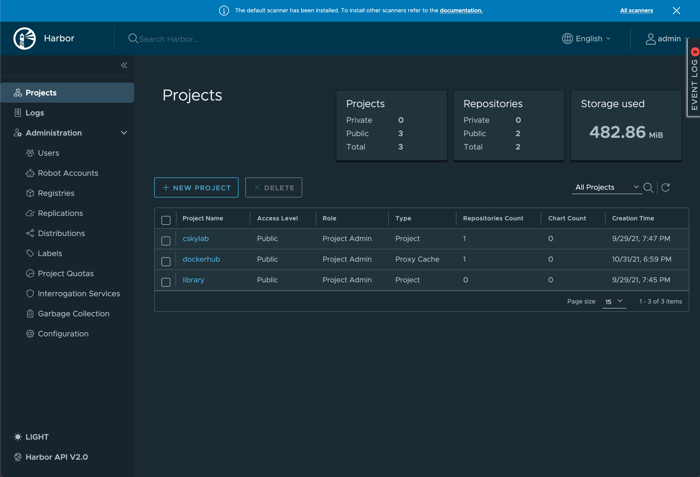
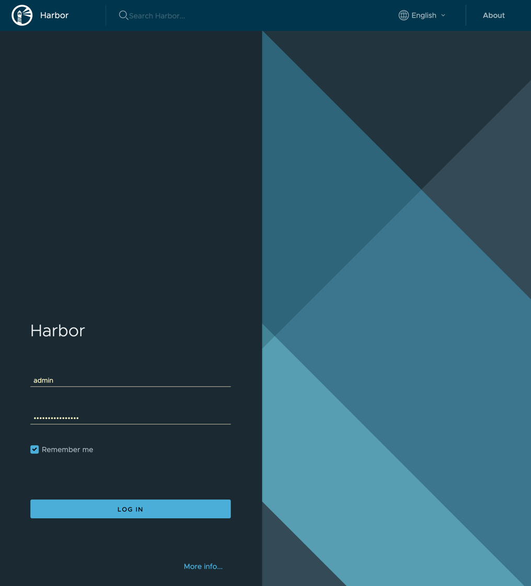
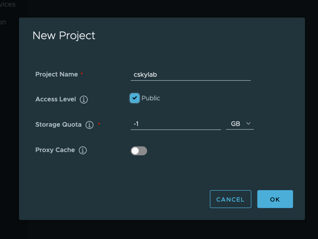
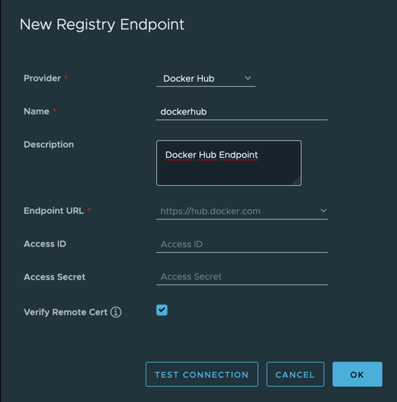
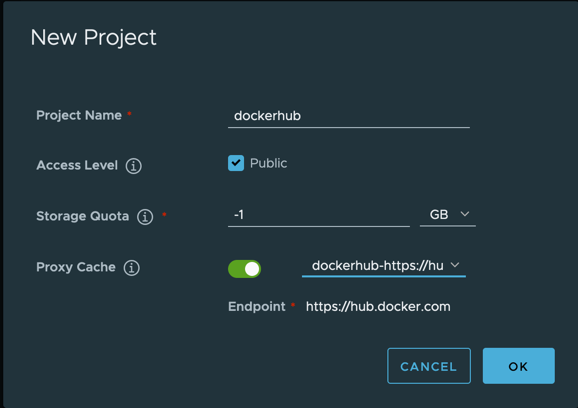

# [Harbor](https://goharbor.io/) registry <!-- omit in toc -->

## v23-04-27 <!-- omit in toc -->

## Helm charts: bitnami/harbor v16.4.10 <!-- omit in toc -->

[Harbor](https://goharbor.io/) is an open source registry that secures artifacts with policies and role-based access control, ensures images are scanned and free from vulnerabilities, and signs images as trusted. Harbor, a CNCF Graduated project, delivers compliance, performance, and interoperability to help you consistently and securely manage artifacts across cloud native compute platforms like Kubernetes and Docker.

Configuration files are deployed from template {{ ._tpldescription }} version {{ ._tplversion }}.

  

- [TL;DR](#tldr)
- [Prerequisites](#prerequisites)
  - [LVM Data Services](#lvm-data-services)
    - [Persistent Volumes](#persistent-volumes)
- [How-to guides](#how-to-guides)
  - [Pull Charts](#pull-charts)
  - [Install](#install)
  - [Update](#update)
  - [Uninstall](#uninstall)
  - [Remove](#remove)
  - [Display status](#display-status)
  - [Backup \& data protection](#backup--data-protection)
    - [RSync HA copies](#rsync-ha-copies)
    - [Restic backup](#restic-backup)
  - [Create private registry](#create-private-registry)
  - [Create dockerhub proxy](#create-dockerhub-proxy)
  - [Utilities](#utilities)
    - [Passwords and secrets](#passwords-and-secrets)
- [Reference](#reference)
  - [Helm charts and values](#helm-charts-and-values)
  - [Scripts](#scripts)
    - [cs-deploy](#cs-deploy)
- [License](#license)

---

## TL;DR

Prepare LVM Data services for PV's:

- [LVM Data Services](#lvm-data-services)

Install namespace and charts:

```bash
# Pull charts to './charts/' directory
./csdeploy.sh -m pull-charts
# Install  
./csdeploy.sh -m install
# Check status
./csdeploy.sh -l

```

Run:

- Published at: `{{ .publishing.url }}`
- Username: `admin`
- Password: `{{ .publishing.password }}`

## Prerequisites

- Administrative access to Kubernetes cluster.
- Helm v3.


### LVM Data Services

Data services are supported by the following nodes:

| Data service                 | Kubernetes PV node           | Kubernetes RSync node           |
| ---------------------------- | ---------------------------- | ------------------------------- |
| `/srv/{{ .namespace.name }}` | `{{ .localpvnodes.all_pv }}` | `{{ .localrsyncnodes.all_pv }}` |

`PV node` is the node that supports the data service in normal operation.

`RSync node` is the node that receives data service copies synchronized by cron-jobs for HA.

To **create** the corresponding LVM data services, execute from your **mcc** management machine the following commands:

```bash
#
# Create LVM data services in PV node
#
echo \
&& echo "******** START of snippet execution ********" \
&& echo \
&& ssh {{ .localpvnodes.localadminusername }}@{{ .localpvnodes.all_pv }}.{{ .localpvnodes.domain }} \
  'sudo cs-lvmserv.sh -m create -qd "/srv/{{ .namespace.name }}" \
&& mkdir "/srv/{{ .namespace.name }}/data/chartmuseum" \
&& mkdir "/srv/{{ .namespace.name }}/data/jobservice" \
&& mkdir "/srv/{{ .namespace.name }}/data/scandata" \
&& mkdir "/srv/{{ .namespace.name }}/data/postgresql" \
&& mkdir "/srv/{{ .namespace.name }}/data/redis" \
&& mkdir "/srv/{{ .namespace.name }}/data/registry" \
&& mkdir "/srv/{{ .namespace.name }}/data/trivy"' \
&& echo \
&& echo "******** END of snippet execution ********" \
&& echo
```

```bash
#
# Create LVM data services in RSync node
#
echo \
&& echo "******** START of snippet execution ********" \
&& echo \
&& ssh {{ .localrsyncnodes.localadminusername }}@{{ .localrsyncnodes.all_pv }}.{{ .localrsyncnodes.domain }} \
  'sudo cs-lvmserv.sh -m create -qd "/srv/{{ .namespace.name }}" \
&& mkdir "/srv/{{ .namespace.name }}/data/chartmuseum" \
&& mkdir "/srv/{{ .namespace.name }}/data/jobservice" \
&& mkdir "/srv/{{ .namespace.name }}/data/scandata" \
&& mkdir "/srv/{{ .namespace.name }}/data/postgresql" \
&& mkdir "/srv/{{ .namespace.name }}/data/redis" \
&& mkdir "/srv/{{ .namespace.name }}/data/registry" \
&& mkdir "/srv/{{ .namespace.name }}/data/trivy"' \
&& echo \
&& echo "******** END of snippet execution ********" \
&& echo
```

To **delete** the corresponding LVM data services, execute from your **mcc** management machine the following commands:

```bash
#
# Delete LVM data services in PV node
#
echo \
&& echo "******** START of snippet execution ********" \
&& echo \
&& ssh {{ .localpvnodes.localadminusername }}@{{ .localpvnodes.all_pv }}.{{ .localpvnodes.domain }} \
  'sudo cs-lvmserv.sh -m delete -qd "/srv/{{ .namespace.name }}"' \
&& echo \
&& echo "******** END of snippet execution ********" \
&& echo
```

```bash
#
# Delete LVM data services in RSync node
#
echo \
&& echo "******** START of snippet execution ********" \
&& echo \
&& ssh {{ .localrsyncnodes.localadminusername }}@{{ .localrsyncnodes.all_pv }}.{{ .localrsyncnodes.domain }} \
  'sudo cs-lvmserv.sh -m delete -qd "/srv/{{ .namespace.name }}"' \
&& echo \
&& echo "******** END of snippet execution ********" \
&& echo
```

#### Persistent Volumes

Review values in all Persistent volume manifests with the name format `./pv-*.yaml`.

The following PersistentVolume & StorageClass manifests are applied:

```bash
# PV manifests
pv-chartmuseum.yaml
pv-jobservice.yaml
pv-postgresql.yaml
pv-redis.yaml
pv-registry.yaml
pv-trivy.yaml
```

The node assigned in `nodeAffinity` section of the PV manifest, will be used when scheduling the pod that holds the service.

## How-to guides

### Pull Charts

To pull charts, change the repositories and charts needed in variable `source_charts` inside the script `csdeploy.sh`  and run:

```bash
# Pull charts to './charts/' directory
  ./csdeploy.sh -m pull-charts
```

When pulling new charts, all the content of `./charts` directory will be removed, and replaced by the new pulled charts.

After pulling new charts redeploy the new versions with: `./csdeploy -m update`.

### Install

To create namespace, persistent volume and install the chart:

```bash
  # Create namespace, PV and install chart
    ./csdeploy.sh -m install
```

Notice that PV's are not namespaced. They are deployed at cluster scope.

### Update

To update chart settings, change values in the file `values-harbor.yaml`.

Redeploy or upgrade the chart by running:

```bash
  # Redeploy or upgrade chart
    ./csdeploy.sh -m update
```

### Uninstall

To uninstall the chart, remove namespace and PV run:

```bash
  # Uninstall chart, remove PV and namespace
    ./csdeploy.sh -m uninstall
```

### Remove

This option is intended to be used only to remove the namespace when chart deployment is failed. Otherwise, you must run `./csdeploy.sh -m uninstall`.

To remove PV, namespace and all its contents run:

```bash
  # Remove PV namespace and all its contents
    ./csdeploy.sh -m remove
```

### Display status

To display namespace, persistence and chart status run:

```bash
  # Display namespace, persistence and chart status:
    ./csdeploy.sh -l
```

### Backup & data protection

Backup & data protection must be configured on file `cs-cron_scripts` of the node that supports the data services.

#### RSync HA copies

Rsync cronjobs are used to achieve service HA for LVM data services that supports the persistent volumes. The script `cs-rsync.sh` perform the following actions:

- Take a snapshot of LVM data service in the node that supports the service (PV node)
- Copy and syncrhonize the data to the mirrored data service in the kubernetes node designed for HA (RSync node)
- Remove snapshot in LVM data service

To perform RSync manual copies on demand, execute from your **mcc** management machine the following commands:

>**Warning:** You should not make two copies at the same time. You must check the scheduled jobs in `cs-cron-scripts` and disable them if necesary, in order to avoid conflicts.

```bash
#
# RSync data services
#
echo \
&& echo "******** START of snippet execution ********" \
&& echo \
&& ssh {{ .localpvnodes.localadminusername }}@{{ .localpvnodes.all_pv }}.{{ .localpvnodes.domain }} \
  'sudo cs-rsync.sh -q -m rsync-to -d /srv/{{ .namespace.name }} \
  -t {{ .localrsyncnodes.all_pv }}.{{ .namespace.domain }}' \
&& echo \
&& echo "******** END of snippet execution ********" \
&& echo
```

**RSync cronjobs:**

The following cron jobs should be added to file `cs-cron-scripts` on the node that supports the service (PV node). Change time schedule as needed:

```bash
################################################################################
# /srv/{{ .namespace.name }} - RSync LVM data services
################################################################################
##
## RSync path:  /srv/{{ .namespace.name }}
## To Node:     {{ .localrsyncnodes.all_pv }}
## At minute 0 past every hour from 8 through 23.
# 0 8-23 * * *     root run-one cs-lvmserv.sh -q -m snap-remove -d /srv/{{ .namespace.name }} >> /var/log/cs-rsync.log 2>&1 ; run-one cs-rsync.sh -q -m rsync-to -d /srv/{{ .namespace.name }} -t {{ .localrsyncnodes.all_pv }}.{{ .namespace.domain }}  >> /var/log/cs-rsync.log 2>&1
```

#### Restic backup

Restic can be configured to perform data backups to local USB disks, remote disk via sftp or cloud S3 storage.

To perform on-demand restic backups execute from your **mcc** management machine the following commands:

>**Warning:** You should not launch two backups at the same time. You must check the scheduled jobs in `cs-cron-scripts` and disable them if necesary, in order to avoid conflicts.

```bash
#
# Restic backup data services
#
echo \
&& echo "******** START of snippet execution ********" \
&& echo \
&& ssh {{ .localpvnodes.localadminusername }}@{{ .localpvnodes.all_pv }}.{{ .localpvnodes.domain }} \
  'sudo cs-restic.sh -q -m restic-bck -d  /srv/{{ .namespace.name }} -t {{ .namespace.name }}' \
&& echo \
&& echo "******** END of snippet execution ********" \
&& echo
```

To view available backups:

```bash
echo \
&& echo "******** START of snippet execution ********" \
&& echo \
&& ssh {{ .localpvnodes.localadminusername }}@{{ .localpvnodes.all_pv }}.{{ .localpvnodes.domain }} \
  'sudo cs-restic.sh -q -m restic-list  -t {{ .namespace.name }}' \
&& echo \
&& echo "******** END of snippet execution ********" \
&& echo
```

**Restic cronjobs:**

The following cron jobs should be added to file `cs-cron-scripts` on the node that supports the service (PV node). Change time schedule as needed:

```bash
################################################################################
# /srv/{{ .namespace.name }}- Restic backups
################################################################################
##
## Data service:  /srv/{{ .namespace.name }}
## At minute 30 past every hour from 8 through 23.
# 30 8-23 * * *   root run-one cs-lvmserv.sh -q -m snap-remove -d /srv/{{ .namespace.name }} >> /var/log/cs-restic.log 2>&1 ; run-one cs-restic.sh -q -m restic-bck -d  /srv/{{ .namespace.name }}  -t {{ .namespace.name }}  >> /var/log/cs-restic.log 2>&1 && run-one cs-restic.sh -q -m restic-forget   -t {{ .namespace.name }}  -f "--keep-hourly 6 --keep-daily 31 --keep-weekly 5 --keep-monthly 13 --keep-yearly 10" >> /var/log/cs-restic.log 2>&1
```

### Create private registry

To create a private registry repository (Ex. cskylab) follow these steps:

- Login to Harbor with admin account:

  

- Go to **Projects** and select **+ NEW PROJECT**
- Enter your private registry information:

  

Your private registry repository is now accesible via '{{ .publishing.url }}/cskylab'

### Create dockerhub proxy

To create the dockerhub registry proxy follow these steps:

- Login to Harbor with admin account:

  

- Before creating a proxy cache project, create a Harbor registry endpoint for the proxy cache project to use.
- Go to **Registries** and select **+ NEW ENDPOINT**

  

- Test connection and create endpoint
  
  After registry endpoint is created you can reference it in the new dockerhub proxy cache repository .

- To create dockerkub proxy cache repository, go to **Projects**, select **+ NEW PROJECT** and enter the following information:

  

Your dockerhub proxy repository is now accesible via '{{ .publishing.url }}/dockerhub'

To start using the proxy cache, configure your docker pull commands or pod manifests to reference the proxy cache project by adding `{{ .publishing.url }}/dockerhub/` as a prefix to the image tag. For example:

```bash
docker pull {{ .publishing.url }}/dockerhub/goharbor/harbor-core:dev
```

To pull official images or from single level repositories, make sure to include the `library` namespace. For example:

```bash
docker pull {{ .publishing.url }}/dockerhub/library/nginx:latest
```

### Utilities

#### Passwords and secrets

Generate passwords and secrets with:

```bash
# Screen
echo $(head -c 512 /dev/urandom | LC_ALL=C tr -cd 'a-zA-Z0-9' | head -c 16)

# File (without newline)
printf $(head -c 512 /dev/urandom | LC_ALL=C tr -cd 'a-zA-Z0-9' | head -c 16) > RESTIC-PASS.txt
```

Change the parameter `head -c 16` according with the desired length of the secret.

## Reference

To learn more see:

- <https://github.com/bitnami/charts/tree/master/bitnami/harbor>

### Helm charts and values

| Chart          | Values               |
| -------------- | -------------------- |
| bitnami/harbor | `values-harbor.yaml` |

### Scripts

#### cs-deploy

```console
Purpose:
  Harbor registry.

Usage:
  sudo csdeploy.sh [-l] [-m <execution_mode>] [-h] [-q]

Execution modes:
  -l  [list-status]     - List current status.
  -m  <execution_mode>  - Valid modes are:

      [pull-charts]     - Pull charts to './charts/' directory.
      [install]         - Create namespace, PV's and install charts.
      [update]          - Redeploy or upgrade charts.
      [uninstall]       - Uninstall charts, remove PV's and namespace.
      [remove]          - Remove PV's namespace and all its contents.

Options and arguments:  
  -h  Help
  -q  Quiet (Nonstop) execution.

Examples:
  # Pull charts to './charts/' directory
    ./csdeploy.sh -m pull-charts

  # Create namespace, PV's and install charts
    ./csdeploy.sh -m install

  # Redeploy or upgrade charts
    ./csdeploy.sh -m update

  # Uninstall charts, remove PV's and namespace
    ./csdeploy.sh -m uninstall

  # Remove PV's namespace and all its contents
    ./csdeploy.sh -m remove

  # Display namespace, persistence and charts status:
    ./csdeploy.sh -l
```

## License

Copyright © 2021 cSkyLab.com ™

Licensed under the Apache License, Version 2.0 (the "License");
you may not use this file except in compliance with the License.
You may obtain a copy of the License at

http://www.apache.org/licenses/LICENSE-2.0

Unless required by applicable law or agreed to in writing, software
distributed under the License is distributed on an "AS IS" BASIS,
WITHOUT WARRANTIES OR CONDITIONS OF ANY KIND, either express or implied.
See the License for the specific language governing permissions and
limitations under the License.
