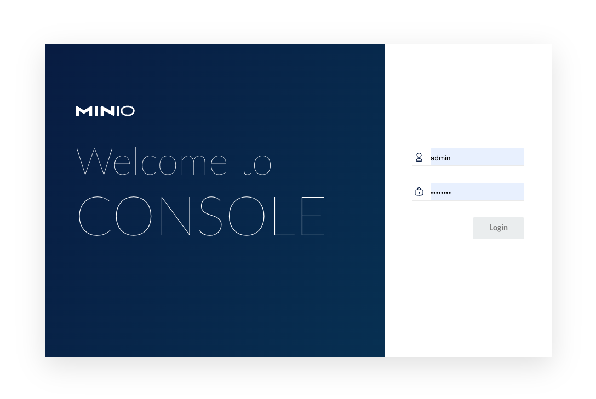

# Kubernetes MinIO Tenant <!-- omit in toc -->

## v22-12-19 <!-- omit in toc -->

## Image: quay.io/minio/minio:RELEASE.2022-12-12T19-27-27Z <!-- omit in toc -->

---

[MinIO](https://min.io/) is a Kubernetes-native high performance object store with an S3-compatible API. The MinIO Kubernetes Operator supports deploying MinIO Tenants onto private and public cloud infrastructures ("Hybrid" Cloud).

This service creates a X-node MinIO Tenant using MinIO for object storage.

Configuration files are deployed from template {{ ._tpldescription }} version {{ ._tplversion }}.

  

- [TL;DR](#tldr)
- [Prerequisites](#prerequisites)
  - [Persistence](#persistence)
    - [MinIO Erasure Code Parity (EC:N)](#minio-erasure-code-parity-ecn)
  - [Persistent Volumes](#persistent-volumes)
    - [LVM Data Services](#lvm-data-services)
- [How-to guides](#how-to-guides)
  - [Install](#install)
  - [Update](#update)
  - [Delete](#delete)
  - [Remove](#remove)
  - [Display status](#display-status)
  - [Bucket maintenance](#bucket-maintenance)
    - [Create bucket, users and policies](#create-bucket-users-and-policies)
    - [Delete bucket, users and policies](#delete-bucket-users-and-policies)
    - [Display bucket, users and policies](#display-bucket-users-and-policies)
  - [MinIO Client](#minio-client)
    - [Console utility](#console-utility)
    - [Command line utility](#command-line-utility)
- [Reference](#reference)
  - [Scripts](#scripts)
    - [cs-deploy](#cs-deploy)
    - [csbucket](#csbucket)
  - [Template values](#template-values)
- [License](#license)

---

## TL;DR

Prepare LVM Data services for PV's:

- [LVM Data Services](#lvm-data-services)

Install namespace and charts:

```bash
# Install  
./csdeploy.sh -m install
# Check status
./csdeploy.sh -l
```

Access:

- Console URL: `{{ .publishing.consoleurl }}`
- MinIO URL: `{{ .publishing.miniourl }}`
- AccessKey: `{{ .credentials.minio_accesskey }}`
- SecretKey: `{{ .credentials.minio_secretkey }}`

## Prerequisites

- MinIO Operator must be installed in K8s Cluster.
- Administrative access to Kubernetes cluster.

### Persistence

#### MinIO Erasure Code Parity (EC:N)

The minimum configuration for a standalone tenant must be 1 server with 4 drives. For a distributed tenant the minimum is 4 servers with 4 drives each one (Total 16 drives).

The reccomended Erasure code is EC:4

| TOTAL DRIVES | DATA DRIVES | PARITY DRIVES (EC:N) | STORAGE USAGE RATIO |
| ------------ | ----------- | -------------------- | ------------------- |
| 16           | 8           | 8                    | 2.00                |
| 16           | 9           | 7                    | 1.79                |
| 16           | 10          | 6                    | 1.60                |
| 16           | 11          | 5                    | 1.45                |
| 16           | 12          | 4 (Recommended)      | 1.33                |
| 16           | 13          | 3                    | 1.23                |
| 16           | 14          | 2                    | 1.14                |

### Persistent Volumes

Review values in all Persistent volume manifests with the name format `./pv-*.yaml`.

The following PersistentVolume & StorageClass manifests are applied:

```bash
# PV manifests
pv-minio.yaml
```

The node assigned in `nodeAffinity` section of the PV manifest, will be used when scheduling the pod that holds the service.

#### LVM Data Services

Data services are supported by the following nodes:

| Data service                         | Kubernetes PV node          |
| ------------------------------------ | --------------------------- |
| `/srv/{{ .namespace.name }}-s00-d00` | `{{ .localpvnodes.srv00 }}` |
| `/srv/{{ .namespace.name }}-s00-d01` | `{{ .localpvnodes.srv00 }}` |
| `/srv/{{ .namespace.name }}-s00-d02` | `{{ .localpvnodes.srv00 }}` |
| `/srv/{{ .namespace.name }}-s00-d03` | `{{ .localpvnodes.srv00 }}` |
| `/srv/{{ .namespace.name }}-s01-d00` | `{{ .localpvnodes.srv01 }}` |
| `/srv/{{ .namespace.name }}-s01-d01` | `{{ .localpvnodes.srv01 }}` |
| `/srv/{{ .namespace.name }}-s01-d02` | `{{ .localpvnodes.srv01 }}` |
| `/srv/{{ .namespace.name }}-s01-d03` | `{{ .localpvnodes.srv01 }}` |
| `/srv/{{ .namespace.name }}-s02-d00` | `{{ .localpvnodes.srv02 }}` |
| `/srv/{{ .namespace.name }}-s02-d01` | `{{ .localpvnodes.srv02 }}` |
| `/srv/{{ .namespace.name }}-s02-d02` | `{{ .localpvnodes.srv02 }}` |
| `/srv/{{ .namespace.name }}-s02-d03` | `{{ .localpvnodes.srv02 }}` |
| `/srv/{{ .namespace.name }}-s03-d00` | `{{ .localpvnodes.srv03 }}` |
| `/srv/{{ .namespace.name }}-s03-d01` | `{{ .localpvnodes.srv03 }}` |
| `/srv/{{ .namespace.name }}-s03-d02` | `{{ .localpvnodes.srv03 }}` |
| `/srv/{{ .namespace.name }}-s03-d03` | `{{ .localpvnodes.srv03 }}` |

To **create** the corresponding LVM data services, execute from your **mcc** management machine the following command:

```bash
#
# Create LVM data services
#
echo && echo "******** SOE - START of execution ********" && echo \
&& ssh {{ .localpvnodes.localadminusername }}@{{ .localpvnodes.srv00 }}.{{ .localpvnodes.domain }} \
  'sudo cs-lvmserv.sh -m create -qd "/srv/{{ .namespace.name }}-s00-d00" \
&& sudo cs-lvmserv.sh -m create -qd "/srv/{{ .namespace.name }}-s00-d01" \
&& sudo cs-lvmserv.sh -m create -qd "/srv/{{ .namespace.name }}-s00-d02" \
&& sudo cs-lvmserv.sh -m create -qd "/srv/{{ .namespace.name }}-s00-d03"' \
&& ssh {{ .localpvnodes.localadminusername }}@{{ .localpvnodes.srv01 }}.{{ .localpvnodes.domain }} \
  'sudo cs-lvmserv.sh -m create -qd "/srv/{{ .namespace.name }}-s01-d00" \
&& sudo cs-lvmserv.sh -m create -qd "/srv/{{ .namespace.name }}-s01-d01" \
&& sudo cs-lvmserv.sh -m create -qd "/srv/{{ .namespace.name }}-s01-d02" \
&& sudo cs-lvmserv.sh -m create -qd "/srv/{{ .namespace.name }}-s01-d03"' \
&& ssh {{ .localpvnodes.localadminusername }}@{{ .localpvnodes.srv02 }}.{{ .localpvnodes.domain }} \
  'sudo cs-lvmserv.sh -m create -qd "/srv/{{ .namespace.name }}-s02-d00" \
&& sudo cs-lvmserv.sh -m create -qd "/srv/{{ .namespace.name }}-s02-d01" \
&& sudo cs-lvmserv.sh -m create -qd "/srv/{{ .namespace.name }}-s02-d02" \
&& sudo cs-lvmserv.sh -m create -qd "/srv/{{ .namespace.name }}-s02-d03"' \
&& ssh {{ .localpvnodes.localadminusername }}@{{ .localpvnodes.srv03 }}.{{ .localpvnodes.domain }} \
  'sudo cs-lvmserv.sh -m create -qd "/srv/{{ .namespace.name }}-s03-d00" \
&& sudo cs-lvmserv.sh -m create -qd "/srv/{{ .namespace.name }}-s03-d01" \
&& sudo cs-lvmserv.sh -m create -qd "/srv/{{ .namespace.name }}-s03-d02" \
&& sudo cs-lvmserv.sh -m create -qd "/srv/{{ .namespace.name }}-s03-d03"' \
&& echo && echo "******** EOE - END of execution ********" && echo
```

To **delete** the corresponding LVM data services, execute from your **mcc** management machine the following command:

```bash
#
# Delete LVM data services
#
echo && echo "******** SOE - START of execution ********" && echo \
&& ssh {{ .localpvnodes.localadminusername }}@{{ .localpvnodes.srv00 }}.{{ .localpvnodes.domain }} \
  'sudo cs-lvmserv.sh -m delete -qd "/srv/{{ .namespace.name }}-s00-d00" \
&& sudo cs-lvmserv.sh -m delete -qd "/srv/{{ .namespace.name }}-s00-d01" \
&& sudo cs-lvmserv.sh -m delete -qd "/srv/{{ .namespace.name }}-s00-d02" \
&& sudo cs-lvmserv.sh -m delete -qd "/srv/{{ .namespace.name }}-s00-d03"' \
&& ssh {{ .localpvnodes.localadminusername }}@{{ .localpvnodes.srv01 }}.{{ .localpvnodes.domain }} \
  'sudo cs-lvmserv.sh -m delete -qd "/srv/{{ .namespace.name }}-s01-d00" \
&& sudo cs-lvmserv.sh -m delete -qd "/srv/{{ .namespace.name }}-s01-d01" \
&& sudo cs-lvmserv.sh -m delete -qd "/srv/{{ .namespace.name }}-s01-d02" \
&& sudo cs-lvmserv.sh -m delete -qd "/srv/{{ .namespace.name }}-s01-d03"' \
&& ssh {{ .localpvnodes.localadminusername }}@{{ .localpvnodes.srv02 }}.{{ .localpvnodes.domain }} \
  'sudo cs-lvmserv.sh -m delete -qd "/srv/{{ .namespace.name }}-s02-d00" \
&& sudo cs-lvmserv.sh -m delete -qd "/srv/{{ .namespace.name }}-s02-d01" \
&& sudo cs-lvmserv.sh -m delete -qd "/srv/{{ .namespace.name }}-s02-d02" \
&& sudo cs-lvmserv.sh -m delete -qd "/srv/{{ .namespace.name }}-s02-d03"' \
&& ssh {{ .localpvnodes.localadminusername }}@{{ .localpvnodes.srv03 }}.{{ .localpvnodes.domain }} \
  'sudo cs-lvmserv.sh -m delete -qd "/srv/{{ .namespace.name }}-s03-d00" \
&& sudo cs-lvmserv.sh -m delete -qd "/srv/{{ .namespace.name }}-s03-d01" \
&& sudo cs-lvmserv.sh -m delete -qd "/srv/{{ .namespace.name }}-s03-d02" \
&& sudo cs-lvmserv.sh -m delete -qd "/srv/{{ .namespace.name }}-s03-d03"' \
&& echo && echo "******** EOE - END of execution ********" && echo
```

## How-to guides

### Install

Check versions and update if necesary, for the following image in `mod-tenant.yaml` file:

```yaml
  ## Registry location and Tag to download MinIO Server image
  image: quay.io/minio/minio:RELEASE.2022-08-13T21-54-44Z
```

To check for the latest image version see:

- <https://quay.io/minio/minio>

To create namespace and install MinIO tenant:

```bash
  # Install namespace and tenant
    ./csdeploy.sh -m install
```

### Update

Check image versions and update if necesary.

To reapply manifests and upgrade images:

```bash
  # Reapply manifests and update images
    ./csdeploy.sh -m update
```

### Delete

> **WARNING**: This action will delete MinIO tenant. All MinIO Storage Data in K8s Cluster will be erased.

To delete MinIO tenant, remove namespace and PV's run:

```bash
  # Delete tenant, PV's and namespace
    ./csdeploy.sh -m delete
```

### Remove

This option is intended to be used only to remove the namespace when tenant deployment is failed. Otherwise, you must run `./csdeploy.sh -m delete`.

To remove PV's, namespace and all its contents run:

```bash
  # Remove PV's namespace and all its contents
    ./csdeploy.sh -m remove
```

### Display status

To display namespace, persistence and tenant status run:

```bash
  # Display namespace, persistence and tenant status
    ./csdeploy.sh -l
```

### Bucket maintenance

Buckets can be created together with users and policies for ReadWrite, ReadOnly and WriteOnly access. 

A record file in configuration management `./buckets` folder will be created for each bucket in the form `bucket_name.config`.

Additionally, a source environment file for MinIO bucket access and restic operations will be created in the form `source-bucket_name.sh`. This file can be used for restic backups operations with the script `csrestic-minio.sh`. It can be sourced also from a management console to initialize the variables needed to access bucket through MinIO client `mc` and restic repository through restic commands.

#### Create bucket, users and policies

To create bucket, users and policies:

```bash
# Create Bucket & Users & Policies
  ./csbucket.sh -c mybucket
```

In this case a file named `./buckets/mybucket.config` will be created with the access and secret keys used for the following users:

- mybucket_rw (ReadWrite user)
- mybucket_ro (ReadOnly user)
- mybucket_wo (Write only user)

You can use these keys for specific access to the bucket from any application or user.

#### Delete bucket, users and policies

To delete bucket, users and policies:

```bash
# Delete Bucket & Users & Policies
  ./csbucket.sh -d mybucket
```

File `./buckets/mybucket.config` will also be deleted with access and secret keys.

#### Display bucket, users and policies

To list current bucket, users and policies:

```bash
# List Bucket & Users & Policies
  ./csbucket.sh -l
```

### MinIO Client

#### Console utility

To acces MinIO console throug web utility:

- Console URL: `{{ .publishing.consoleurl }}`
- AccessKey: `{{ .credentials.console_accesskey }}`
- SecretKey: `{{ .credentials.console_secretkey }}`

#### Command line utility

If you have minio client installed, you can access `mc` command line utiliy from the command line.

File `.envrc` export automatically through "direnv" the environment variable needed to operate `mc` with `minio` as hostname from its directory in git repository:

```bash
# MinIO host environment variable
export MC_HOST_minio="https://{{ .credentials.minio_accesskey }}:{{ .credentials.minio_secretkey }}@{{ .publishing.miniourl }}"
```

You can run `mc` commands to operate from console with buckets and files: Ex `mc tree minio`.

For more information: <https://docs.min.io/docs/minio-client-complete-guide.html>

## Reference

To learn more see:

- <https://github.com/kubernetes/ingress-nginx>

### Scripts

#### cs-deploy

```console
Purpose:
  Kubernetes MinIO Tenant.
  
Usage:
  sudo csdeploy.sh [-l] [-m <execution_mode>] [-h] [-q]

Execution modes:
  -l  [list-status]     - List namespace, persistence and tenant status.
  -m  <execution_mode>  - Valid modes are:

      [install]         - Install namespace and MinIO tenant.
      [update]          - Reapply manifests and update images.
      [delete]          - Delete MinIO tenant, remove PV's and namespace.
      [remove]          - Remove PV's namespace and all its contents.

Options and arguments:  
  -h  Help
  -q  Quiet (Nonstop) execution.

Examples:
  # Install namespace and tenant
    ./csdeploy.sh -m install

  # Reapply manifests and update images
    ./csdeploy.sh -m update

  # Delete tenant, PV's and namespace
    ./csdeploy.sh -m delete

  # Remove PV's namespace and all its contents
    ./csdeploy.sh -m remove

  # Display namespace, persistence and tenant status
    ./csdeploy.sh -l
```

**Tasks performed:**

| ${execution_mode}       | Tasks                | Block / Description                                             |
| ----------------------- | -------------------- | --------------------------------------------------------------- |
| [install]               |                      | **Create namespace, secrets and PV's**                          |
|                         | Create namespace     | Namespace must be unique in cluster.                            |
|                         | Create secrets       | Create secrets containing usernames, passwords... etc.          |
|                         | Create PV's          | Apply all persistent volume manifests in the form `pv-*.yaml`.  |
| [install] [update]      |                      | **Deploy app mod's**                                            |
|                         | Apply manifests      | Apply all app module manifests in the form `mod-*.yaml`.        |
| [delete]                |                      | **Delete tenant**                                               |
|                         | Delete manifests     | Delete all app module manifests in the form `mod-*.yaml`.       |
| [delete] [remove]       |                      | **Remove namespace and PV's**                                   |
|                         | Remove namespace     | Remove namespace and all its objects.                           |
|                         | Delete PV's          | Delete all persistent volume manifests in the form `pv-*.yaml`. |
| [install] [list-status] |                      | **Display namespace status information**                        |
|                         | Display namespace    | Namespace and object status.                                    |
|                         | Display certificates | Certificate status information.                                 |
|                         | Display secrets      | Secret status information.                                      |
|                         | Display persistence  | Persistence status information.                                 |
|                         | Display persistence  | Persistence status information.                                 |
|                         | Display tenant       | Display tenant information.                                     |
|                         |                      |                                                                 |

#### csbucket

```console
Purpose:
  Minio Bucket & User & Policy maintenance.
  Use this script to create or delete together a bucket
  with readwrite, readonly and writeonly users and access policies.
  
Usage:
  sudo csdeploy.sh [-l] [-c <bucket_name>] [-d <bucket_name>] [-h] [-q]

Execution modes:
  -l  [list-status]     - List Buckets & Users & Policies.
  -c  <bucket_name>     - Create Bucket & Users & Policies
  -d  <bucket_name>     - Remove Bucket & Users & Policies

Options and arguments:  
  -h  Help
  -q  Quiet (Nonstop) execution.

Examples:
  # Create Bucket & Users & Policies
    ./csbucket.sh -c mybucket

  # Delete Bucket & Users & Policies
    ./csbucket.sh -d mybucket
```

**Tasks performed:**

| ${execution_mode}                             | Tasks                                 | Block / Description                                                         |
| --------------------------------------------- | ------------------------------------- | --------------------------------------------------------------------------- |
| [create-bucket]                               |                                       | **Create Bucket & User & Policy**                                           |
|                                               | Create bucket configuration file      | Create bucket configuration file `./buckets/${bucket_name}.config`.         |
|                                               | Create bucket source environment file | Create bucket environment source file `./buckets/source-${bucket_name}.sh`. |
|                                               | Create bucket                         | Create bucket from MinIO client with root credentials.                      |
|                                               | Create and set users and policies     | Create users and policies for ReadWrite, ReadOnly and WriteOnly access.     |
| [delete-bucket]                               |                                       | **Delete Bucket & User & Policy**                                           |
|                                               | Delete bucket                         | Delete bucket from MinIO client with root credentials.                      |
|                                               | Delete and set users and policies     | Delete users and policies for ReadWrite, ReadOnly and WriteOnly access.     |
|                                               | Delete bucket configuration file      | Delete bucket configuration file `./buckets/${bucket_name}.config`.         |
|                                               | Delete bucket source environment file | Delete bucket environment source file `./buckets/source-${bucket_name}.sh`. |
| [list-status] [create-bucket] [delete-bucket] |                                       | **Display status information**                                              |
|                                               | MinIO status information              | Display MinIO host information from MinIO client.                           |
|                                               | Display buckets                       | List buckets from MinIO client.                                             |
|                                               | Display users                         | List users from MinIO client.                                               |
|                                               | Display policies                      | List policies from MinIO client.                                            |
|                                               |                                       |                                                                             |

### Template values

The following table lists template configuration parameters and their specified values, when machine configuration files were created from the template:

| Parameter                         | Description                        | Values                                   |
| --------------------------------- | ---------------------------------- | ---------------------------------------- |
| `_tplname`                        | template name                      | `{{ ._tplname }}`                        |
| `_tpldescription`                 | template description               | `{{ ._tpldescription }}`                 |
| `_tplversion`                     | template version                   | `{{ ._tplversion }}`                     |
| `kubeconfig`                      | kubeconfig file                    | `{{ .kubeconfig }}`                      |
| `namespace.name`                  | namespace name                     | `{{ .namespace.name }}`                  |
| `publishing.miniourl`             | publishing url                     | `{{ .publishing.miniourl }}`             |
| `publishing.consoleurl`           | console url                        | `{{ .publishing.consoleurl }}`           |
| `credentials.minio_accesskey`     | access key                         | `{{ .credentials.minio_accesskey }}`     |
| `credentials.minio_secretkey`     | secret key                         | `{{ .credentials.minio_secretkey }}`     |
| `certificate.clusterissuer`       | cert-manager clusterissuer         | `{{ .certificate.clusterissuer }}`       |
| `registry.proxy`                  | docker private proxy URL           | `{{ .registry.proxy }}`                  |
| `localpvnodes.srv00`              | local persistent volume node       | `{{ .localpvnodes.srv00 }}`              |
| `localpvnodes.srv01`              | local persistent volume node       | `{{ .localpvnodes.srv01 }}`              |
| `localpvnodes.srv02`              | local persistent volume node       | `{{ .localpvnodes.srv03 }}`              |
| `localpvnodes.srv03`              | local persistent volume node       | `{{ .localpvnodes.srv03 }}`              |
| `localpvnodes.domain`             | k8s-nodes domain name              | `{{ .localpvnodes.domain }}`             |
| `localpvnodes.localadminusername` | k8s-nodes local administrator name | `{{ .localpvnodes.localadminusername }}` |

## License

Copyright © 2021 cSkyLab.com ™

Licensed under the Apache License, Version 2.0 (the "License");
you may not use this file except in compliance with the License.
You may obtain a copy of the License at

http://www.apache.org/licenses/LICENSE-2.0

Unless required by applicable law or agreed to in writing, software
distributed under the License is distributed on an "AS IS" BASIS,
WITHOUT WARRANTIES OR CONDITIONS OF ANY KIND, either express or implied.
See the License for the specific language governing permissions and
limitations under the License.
