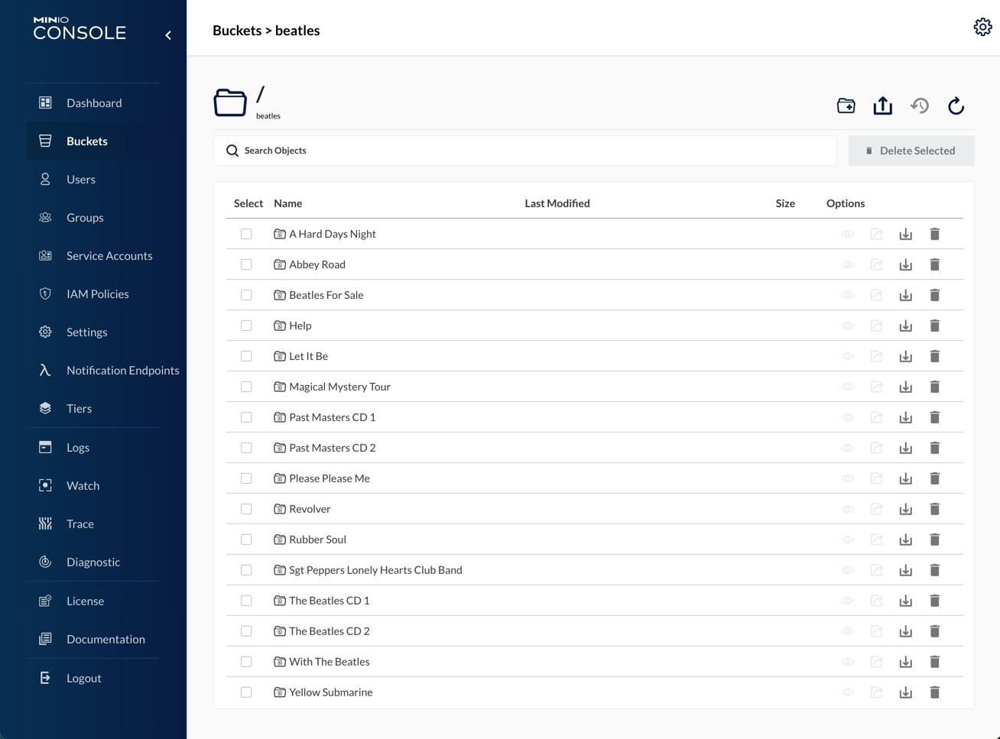

# [MinIO](https://min.io) standalone <!-- omit in toc -->

## v24-12-11 <!-- omit in toc -->

## Helm charts: bitnami/minio v14.8.6<!-- omit in toc -->

[MinIO](https://min.io) is an object storage server, compatible with Amazon S3 cloud storage service, mainly used for storing unstructured data (such as photos, videos, log files, etc.)
Configuration files are deployed from template {{ ._tpldescription }} version {{ ._tplversion }}.

  

- [TL;DR](#tldr)
- [Prerequisites](#prerequisites)
  - [LVM Data Services](#lvm-data-services)
    - [Persistent Volumes](#persistent-volumes)
- [How-to guides](#how-to-guides)
  - [Pull Charts](#pull-charts)
  - [Install](#install)
  - [Update](#update)
  - [Uninstall](#uninstall)
  - [Remove](#remove)
  - [Display status](#display-status)
  - [Backup \& data protection](#backup--data-protection)
    - [RSync HA copies](#rsync-ha-copies)
    - [Restic backup](#restic-backup)
  - [Bucket maintenance](#bucket-maintenance)
    - [Create bucket, users and policies](#create-bucket-users-and-policies)
    - [Delete bucket, users and policies](#delete-bucket-users-and-policies)
    - [Display bucket, users and policies](#display-bucket-users-and-policies)
  - [MinIO Client](#minio-client)
    - [Web utility](#web-utility)
    - [Command line utility](#command-line-utility)
  - [Utilities](#utilities)
    - [Passwords and secrets](#passwords-and-secrets)
- [Reference](#reference)
  - [Helm charts and values](#helm-charts-and-values)
  - [Scripts](#scripts)
    - [csdeploy](#csdeploy)
    - [csbucket](#csbucket)
- [License](#license)

---

## TL;DR

Prepare LVM Data services for PV's:

- [LVM Data Services](#lvm-data-services)

Install namespace and charts:

```bash
# Pull charts to './charts/' directory
./csdeploy.sh -m pull-charts
# Install  
./csdeploy.sh -m install
# Check status
./csdeploy.sh -l

```

Run:

- API URL: `{{ .publishing.url }}`
- Console URL: `{{ .publishing.console_url }}`
- Access Key: `{{ .credentials.minio_accesskey }}`
- Secret Key: `{{ .credentials.minio_secretkey }}`

## Prerequisites

- Administrative access to Kubernetes cluster.
- Helm v3.

### LVM Data Services

Data services are supported by the following nodes:

| Data service                 | Kubernetes PV node           | Kubernetes RSync node           |
| ---------------------------- | ---------------------------- | ------------------------------- |
| `/srv/{{ .namespace.name }}` | `{{ .localpvnodes.all_pv }}` | `{{ .localrsyncnodes.all_pv }}` |

`PV node` is the node that supports the data service in normal operation.

`RSync node` is the node that receives data service copies synchronized by cron-jobs for HA.


To **create** the corresponding LVM data services, execute from your **mcc** management machine the following commands:

```bash
#
# Create LVM data services in PV node
#
echo \
&& echo "******** START of snippet execution ********" \
&& echo \
&& ssh {{ .localpvnodes.localadminusername }}@{{ .localpvnodes.all_pv }}.{{ .localpvnodes.domain }} \
  'sudo cs-lvmserv.sh -m create -qd "/srv/{{ .namespace.name }}" \
&& mkdir "/srv/{{ .namespace.name }}/data/miniostalone"' \
&& echo \
&& echo "******** END of snippet execution ********" \
&& echo
```

```bash
#
# Create LVM data services in RSync node
#
echo \
&& echo "******** START of snippet execution ********" \
&& echo \
&& ssh {{ .localrsyncnodes.localadminusername }}@{{ .localrsyncnodes.all_pv }}.{{ .localrsyncnodes.domain }} \
  'sudo cs-lvmserv.sh -m create -qd "/srv/{{ .namespace.name }}" \
&& mkdir "/srv/{{ .namespace.name }}/data/miniostalone"' \
&& echo \
&& echo "******** END of snippet execution ********" \
&& echo
```

To **delete** the corresponding LVM data services, execute from your **mcc** management machine the following commands:

```bash
#
# Delete LVM data services in PV node
#
echo \
&& echo "******** START of snippet execution ********" \
&& echo \
&& ssh {{ .localpvnodes.localadminusername }}@{{ .localpvnodes.all_pv }}.{{ .localpvnodes.domain }} \
  'sudo cs-lvmserv.sh -m delete -qd "/srv/{{ .namespace.name }}"' \
&& echo \
&& echo "******** END of snippet execution ********" \
&& echo
```

```bash
#
# Delete LVM data services in RSync node
#
echo \
&& echo "******** START of snippet execution ********" \
&& echo \
&& ssh {{ .localrsyncnodes.localadminusername }}@{{ .localrsyncnodes.all_pv }}.{{ .localrsyncnodes.domain }} \
  'sudo cs-lvmserv.sh -m delete -qd "/srv/{{ .namespace.name }}"' \
&& echo \
&& echo "******** END of snippet execution ********" \
&& echo
```

#### Persistent Volumes

Review values in all Persistent volume manifests with the name format `./pv-*.yaml`.

The following PersistentVolume & StorageClass manifests are applied:

```bash
# PV manifests
pv-minio-stalone.yaml
```

The node assigned in `nodeAffinity` section of the PV manifest, will be used when scheduling the pod that holds the service.

## How-to guides

### Pull Charts

To pull charts, change the repositories and charts needed in variable `source_charts` inside the script `csdeploy.sh`  and run:

```bash
# Pull charts to './charts/' directory
  ./csdeploy.sh -m pull-charts
```

When pulling new charts, all the content of `./charts` directory will be removed, and replaced by the new pulled charts.

After pulling new charts redeploy the new versions with: `./csdeploy -m update`.

### Install

To create namespace, persistent volumes and install charts:

```bash
  # Create namespace, PV's and install charts
    ./csdeploy.sh -m install
```

Notice that PV's are not namespaced. They are deployed at cluster scope.

### Update

To update charts settings, change values in files `values-chart.yaml`.

Redeploy or upgrade charts by running:

```bash
  # Redeploy or upgrade charts
    ./csdeploy.sh -m update
```

### Uninstall

To uninstall charts, remove namespace and PV's run:

```bash
  # Uninstall charts, remove PV's and namespace
    ./csdeploy.sh -m uninstall
```

### Remove

This option is intended to be used only to remove the namespace when chart deployment is failed. Otherwise, you must run `./csdeploy.sh -m uninstall`.

To remove PV's, namespace and all its contents run:

```bash
  # Remove PV's namespace and all its contents
    ./csdeploy.sh -m remove
```

### Display status

To display namespace, persistence and chart status run:

```bash
  # Display namespace, persistence and charts status:
    ./csdeploy.sh -l
```

### Backup & data protection

Backup & data protection must be configured on file `cs-cron_scripts` of the node that supports the data services.

#### RSync HA copies

Rsync cronjobs are used to achieve service HA for LVM data services that supports the persistent volumes. The script `cs-rsync.sh` perform the following actions:

- Take a snapshot of LVM data service in the node that supports the service (PV node)
- Copy and syncrhonize the data to the mirrored data service in the kubernetes node designed for HA (RSync node)
- Remove snapshot in LVM data service

To perform RSync manual copies on demand, execute from your **mcc** management machine the following commands:

>**Warning:** You should not make two copies at the same time. You must check the scheduled jobs in `cs-cron-scripts` and disable them if necesary, in order to avoid conflicts.

```bash
#
# RSync data services
#
echo \
&& echo "******** START of snippet execution ********" \
&& echo \
&& ssh {{ .localpvnodes.localadminusername }}@{{ .localpvnodes.all_pv }}.{{ .localpvnodes.domain }} \
  'sudo cs-rsync.sh -q -m rsync-to -d /srv/{{ .namespace.name }} \
  -t {{ .localrsyncnodes.all_pv }}.{{ .namespace.domain }}' \
&& echo \
&& echo "******** END of snippet execution ********" \
&& echo
```

**RSync cronjobs:**

The following cron jobs should be added to file `cs-cron-scripts` on the node that supports the service (PV node). Change time schedule as needed:

```bash
################################################################################
# /srv/{{ .namespace.name }} - RSync LVM data services
################################################################################
##
## RSync path:  /srv/{{ .namespace.name }}
## To Node:     {{ .localrsyncnodes.all_pv }}
## At minute 0 past every hour from 8 through 23.
# 0 8-23 * * *     root run-one cs-lvmserv.sh -q -m snap-remove -d /srv/{{ .namespace.name }} >> /var/log/cs-rsync.log 2>&1 ; run-one cs-rsync.sh -q -m rsync-to -d /srv/{{ .namespace.name }} -t {{ .localrsyncnodes.all_pv }}.{{ .namespace.domain }}  >> /var/log/cs-rsync.log 2>&1
```

#### Restic backup

Restic can be configured to perform data backups to local USB disks, remote disk via sftp or cloud S3 storage.

To perform on-demand restic backups execute from your **mcc** management machine the following commands:

>**Warning:** You should not launch two backups at the same time. You must check the scheduled jobs in `cs-cron-scripts` and disable them if necesary, in order to avoid conflicts.

```bash
#
# Restic backup data services
#
echo \
&& echo "******** START of snippet execution ********" \
&& echo \
&& ssh {{ .localpvnodes.localadminusername }}@{{ .localpvnodes.all_pv }}.{{ .localpvnodes.domain }} \
  'sudo cs-restic.sh -q -m restic-bck -d  /srv/{{ .namespace.name }} -t {{ .namespace.name }}' \
&& echo \
&& echo "******** END of snippet execution ********" \
&& echo
```

To view available backups:

```bash
echo \
&& echo "******** START of snippet execution ********" \
&& echo \
&& ssh {{ .localpvnodes.localadminusername }}@{{ .localpvnodes.all_pv }}.{{ .localpvnodes.domain }} \
  'sudo cs-restic.sh -q -m restic-list  -t {{ .namespace.name }}' \
&& echo \
&& echo "******** END of snippet execution ********" \
&& echo
```

**Restic cronjobs:**

The following cron jobs should be added to file `cs-cron-scripts` on the node that supports the service (PV node). Change time schedule as needed:

```bash
################################################################################
# /srv/{{ .namespace.name }}- Restic backups
################################################################################
##
## Data service:  /srv/{{ .namespace.name }}
## At minute 30 past every hour from 8 through 23.
# 30 8-23 * * *   root run-one cs-lvmserv.sh -q -m snap-remove -d /srv/{{ .namespace.name }} >> /var/log/cs-restic.log 2>&1 ; run-one cs-restic.sh -q -m restic-bck -d  /srv/{{ .namespace.name }}  -t {{ .namespace.name }}  >> /var/log/cs-restic.log 2>&1 && run-one cs-restic.sh -q -m restic-forget   -t {{ .namespace.name }}  -f "--keep-hourly 6 --keep-daily 31 --keep-weekly 5 --keep-monthly 13 --keep-yearly 10" >> /var/log/cs-restic.log 2>&1
```

### Bucket maintenance

Buckets can be created together with users and policies for ReadWrite, ReadOnly and WriteOnly access. 

A record file in configuration management `./buckets` folder will be created for each bucket in the form `bucket_name.config`.

Additionally, a source environment file for MinIO bucket access and restic operations will be created in the form `source-bucket_name.sh`. This file can be used from a management console to initialize the variables needed to access bucket through MinIO client `mc` and restic repository through restic commands.

#### Create bucket, users and policies

To create bucket, users and policies:

```bash
# Create Bucket & Users & Policies
  ./csbucket.sh -c mybucket
```

In this case a file named `./buckets/mybucket.config` will be created with the access and secret keys used for the following users:

- mybucket_rw (ReadWrite user)
- mybucket_ro (ReadOnly user)
- mybucket_wo (Write only user)

You can use these keys for specific access to the bucket from any application or user.

#### Delete bucket, users and policies

To delete bucket, users and policies:

```bash
# Delete Bucket & Users & Policies
  ./csbucket.sh -d mybucket
```

File `./buckets/mybucket.config` will also be deleted with access and secret keys.

#### Display bucket, users and policies

To list current bucket, users and policies:

```bash
# List Bucket & Users & Policies
  ./csbucket.sh -l
```

### MinIO Client

#### Web utility

To access MinIO throug web utility:

- Published at: `{{ .publishing.console_url }}`
- Access Key: `{{ .minio.accesskey }}`
- Secret Key: `{{ .minio.secretkey }}`

#### Command line utility

If you have minio client installed, you can access `mc` command line utiliy from the command line.

File `.envrc` export automatically through "direnv" the environment variable needed to operate `mc` with `minio` as hostname from its directory in git repository.

>**NOTE:** After creating the namespace at first installation with `./csdeploy.sh -m install` you must reload the environment by running `direnv allow`

You can run `mc` commands to operate from console with buckets and files: Ex `mc ls minio` `mc tree minio`.

For more information: <https://docs.min.io/docs/minio-client-complete-guide.html>

### Utilities

#### Passwords and secrets

Generate passwords and secrets with:

```bash
# Screen
echo $(head -c 512 /dev/urandom | LC_ALL=C tr -cd 'a-zA-Z0-9' | head -c 16)

# File (without newline)
printf $(head -c 512 /dev/urandom | LC_ALL=C tr -cd 'a-zA-Z0-9' | head -c 16) > RESTIC-PASS.txt
```

Change the parameter `head -c 16` according with the desired length of the secret.

## Reference

To learn more see:

- <https://github.com/bitnami/charts/tree/master/bitnami/minio>
- <https://docs.min.io/minio/baremetal/reference/minio-cli/minio-mc.html>
- <https://docs.min.io/minio/baremetal/reference/minio-cli/minio-mc-admin.html>

### Helm charts and values

| Chart         | Values              |
| ------------- | ------------------- |
| bitnami/minio | `values-minio.yaml` |

### Scripts

#### csdeploy

```console
Purpose:
  MinIO standalone.
  MinIO standalone storage for test purposes.

Usage:
  sudo csdeploy.sh [-l] [-m <execution_mode>] [-h] [-q]

Execution modes:
  -l  [list-status]     - List current status.
  -m  <execution_mode>  - Valid modes are:

      [pull-charts]     - Pull charts to './charts/' directory.
      [install]         - Create namespace, PV's and install charts.
      [update]          - Redeploy or upgrade charts.
      [uninstall]       - Uninstall charts, remove PV's and namespace.
      [remove]          - Remove PV's namespace and all its contents.

Options and arguments:  
  -h  Help
  -q  Quiet (Nonstop) execution.

Examples:
  # Pull charts to './charts/' directory
    ./csdeploy.sh -m pull-charts

  # Create namespace, PV's and install charts
    ./csdeploy.sh -m install

  # Redeploy or upgrade charts
    ./csdeploy.sh -m update

  # Uninstall charts, remove PV's and namespace
    ./csdeploy.sh -m uninstall

  # Remove PV's namespace and all its contents
    ./csdeploy.sh -m remove

  # Display namespace, persistence and charts status:
    ./csdeploy.sh -l
```

**Tasks performed:**

| ${execution_mode}                | Tasks                      | Block / Description                                                         |
| -------------------------------- | -------------------------- | --------------------------------------------------------------------------- |
| [pull-charts]                    |                            | **Pull helm charts from repositories**                                      |
|                                  | Clean `./charts` directory | Remove all contents in `./charts` directory.                                |
|                                  | Pull helm charts           | Pull new charts according to sourced script in variable `source_charts`.    |
|                                  | Show charts                | Show Helm charts pulled into `./charts` directory.                          |
| [install]                        |                            | **Create namespace and PV's**                                               |
|                                  | Create namespace           | Namespace must be unique in cluster.                                        |
|                                  | Create PV's                | Apply all persistent volume manifests in the form `pv-*.yaml`.              |
| [update] [install]               |                            | **Deploy charts**                                                           |
|                                  | Deploy charts              | Deploy all charts in `./charts` directory with `upgrade --install` options. |
| [uninstall]                      |                            | **Uninstall charts**                                                        |
|                                  | Uninstall charts           | Uninstall all charts in `./charts` directory.                               |
| [uninstall] [remove]             |                            | **Remove namespace and PV's**                                               |
|                                  | Remove namespace           | Remove namespace and all its objects.                                       |
|                                  | Delete PV's                | Delete all persistent volume manifests in the form `pv-*.yaml`.             |
| [install] [update] [list-status] |                            | **Display status information**                                              |
|                                  | Display namespace          | Namespace and object status.                                                |
|                                  | Display certificates       | Certificate status information.                                             |
|                                  | Display secrets            | Secret status information.                                                  |
|                                  | Display persistence        | Persistence status information.                                             |
|                                  | Display charts             | Charts releases history information.                                        |
|                                  |                            |                                                                             |

#### csbucket

```console
Purpose:
  Minio Bucket & User & Policy maintenance.
  Use this script to create or delete together a bucket
  with readwrite, readonly and writeonly users and access policies.
  
Usage:
  sudo csdeploy.sh [-l] [-c <bucket_name>] [-d <bucket_name>] [-h] [-q]

Execution modes:
  -l  [list-status]     - List Buckets & Users & Policies.
  -c  <bucket_name>     - Create Bucket & Users & Policies
  -d  <bucket_name>     - Remove Bucket & Users & Policies

Options and arguments:  
  -h  Help
  -q  Quiet (Nonstop) execution.

Examples:
  # Create Bucket & Users & Policies
    ./csbucket.sh -c mybucket

  # Delete Bucket & Users & Policies
    ./csbucket.sh -d mybucket
```

## License

Copyright © 2021 cSkyLab.com ™

Licensed under the Apache License, Version 2.0 (the "License");
you may not use this file except in compliance with the License.
You may obtain a copy of the License at

http://www.apache.org/licenses/LICENSE-2.0

Unless required by applicable law or agreed to in writing, software
distributed under the License is distributed on an "AS IS" BASIS,
WITHOUT WARRANTIES OR CONDITIONS OF ANY KIND, either express or implied.
See the License for the specific language governing permissions and
limitations under the License.
