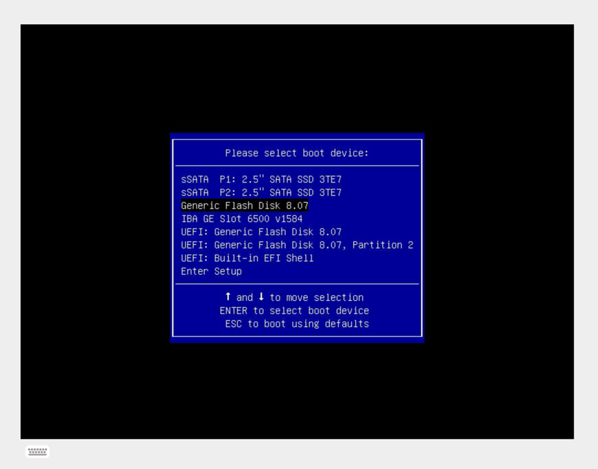

# {{ .machine.hostname }} <!-- omit in toc -->

[comment]: <> (**Machine functional description goes here**)

Machine `{{ .machine.hostname }}` is deployed from template {{ ._tpldescription }} version {{ ._tplversion }}.

- [Prerequisites](#prerequisites)
  - [Hardware requirements](#hardware-requirements)
  - [Network assignements](#network-assignements)
- [How-to guides](#how-to-guides)
  - [Setup from bare metal (SuperMicro example)](#setup-from-bare-metal-supermicro-example)
    - [IPMI Initial settings](#ipmi-initial-settings)
    - [Bios configuration](#bios-configuration)
    - [Ubuntu 20.04 clean installation](#ubuntu-2004-clean-installation)
  - [Configure kvm hosts](#configure-kvm-hosts)
    - [Inject SSH keys and sudoers file](#inject-ssh-keys-and-sudoers-file)
    - [Network configuration](#network-configuration)
    - [3. Install packages, updates and configuration tasks](#3-install-packages-updates-and-configuration-tasks)
    - [4. Configuration tasks](#4-configuration-tasks)
    - [5. Connect and operate](#5-connect-and-operate)
    - [Inject kvm hosts ssh keys](#inject-kvm-hosts-ssh-keys)
    - [Create volgroup](#create-volgroup)
    - [Create LVM data services](#create-lvm-data-services)
    - [Backup & data protection](#backup--data-protection)
    - [Initialize USB Restic backup repository (Optional)](#initialize-usb-restic-backup-repository-optional)
    - [Create virtual bridges](#create-virtual-bridges)
    - [Create virtual storage pools](#create-virtual-storage-pools)
  - [Storage services](#storage-services)
    - [Manage disk volume groups](#manage-disk-volume-groups)
    - [Manage Thin Provisioning LVM data services](#manage-thin-provisioning-lvm-data-services)
    - [Rsync data replication](#rsync-data-replication)
    - [Restic data backup and restore](#restic-data-backup-and-restore)
  - [Virtualization services](#virtualization-services)
    - [Create virtual bridges from list](#create-virtual-bridges-from-list)
    - [Create directory services and storage pools](#create-directory-services-and-storage-pools)
    - [Create virtual machines](#create-virtual-machines)
    - [List all virtual machines](#list-all-virtual-machines)
    - [Start virtual machines](#start-virtual-machines)
    - [Stop virtual machines](#stop-virtual-machines)
    - [Delete virtual machines](#delete-virtual-machines)
    - [Dump virtual machines xml configuration](#dump-virtual-machines-xml-configuration)
    - [Define virtual machines](#define-virtual-machines)
    - [Undefine virtual machines](#undefine-virtual-machines)
  - [Utilities](#utilities)
    - [Passwords and secrets](#passwords-and-secrets)
    - [Abridged ‘find’ command examples](#abridged-find-command-examples)
    - [USB disk operations](#usb-disk-operations)
- [Reference](#reference)
  - [Scripts](#scripts)
    - [cs-kvmserv](#cs-kvmserv)
    - [cs-volgroup](#cs-volgroup)
    - [cs-lvmserv](#cs-lvmserv)
    - [cs-rsync](#cs-rsync)
    - [cs-restic](#cs-restic)
    - [cs-deploy](#cs-deploy)
    - [cs-inject](#cs-inject)
    - [cs-connect](#cs-connect)
    - [cs-helloworld](#cs-helloworld)
  - [Template values](#template-values)
- [License](#license)

---

## Prerequisites

### Hardware requirements

| Configuration   | Minimum    | Recommended   |
| --------------- | ---------- | ------------- |
| Processor       | 2 core cpu | 4+ core cpu   |
| Memory          | 16 GB      | 128+ GB       |
| Network         | 4x1Gb      | 4x10Gb+ 4x1Gb |
| Disk 1 (System) | 80 GB      | 80-120 GB     |
| Disk 2 (LVM)    | 250 GB     | 1+ TB         |

>**Note:** Additional disks can be added and managed by LVM.

### Network assignements

cSkyLab virtual networking model is defined in `01-netcfg.yaml` NetPlan configuration file in kvm machines. It includes the following networks:

| Network    | VLAN Id | Purpose                     | External NIC |
| ---------- | ------- | --------------------------- | ------------ |
| WAN        | 909     | OPNsense WAN Uplink         | yes          |
| sys        | 910     | System services             | yes          |
| sys_pfsync | 911     | OPNsense HA cluster         |              |
| mod_srv    | 912     | Model services              |              |
| pro_srv    | 913     | Production services         |              |
| usr        | 914     | Users local access          | optional     |
| SETUP      | 915     | OPNsense & kvm setup access | yes          |

All VLAN's are defined inside a unique uplink bond:

| Bond      | VLAN Id          | Purpose | External NIC |
| --------- | ---------------- | ------- | ------------ |
| bond_csky | All (Trunk mode) | Uplink  | yes          |

If external managed switches are used, it is recommended to bond 2 or 4 NIC's for the uplink, as defined in NetPlan configuration file `01-netcfg.yaml`.

If only two physical machines are used (`kvm-main` and `kvm-aux`), there is no need to deploy the networking model to external switches. You must then connect the bond between both machines in order to get the networking model up and running.

The physical machine hosting kvm services must have at least 4 NIC's (5 if users local access is needed) in order to provide external connections to the following networks:

- NIC 1: WAN
- NIC 2: sys
- NIC 3: SETUP
- NIC 4: bond_csky
- Optional NIC 5: usr

The recommended configuration is 4 10Gb NIC + 4 1Gb NIC connected as in the SuperMicro example provided.

>**Note:** Before deploying kvm, you should perform in your machine a basic installation of Ubuntu 20.04 server and get the interfaces names with `networkctl status --all`. Plan and modify your NetPlan configuration file `01-netcfg.yaml` according to your interfaces names.

## How-to guides

### Setup from bare metal (SuperMicro example)

These procedures are examples made for SuperMicro IPMI & BIOS setup. With other hardware, you should apply analog procedures according with the software provided by your manufacturer.

>**NOTE**: **Connect only IPMI network port**. To perform IPMI & Bios configuration connect only to IPMI service until OS installation is made to the physical machine.


**Supermicro network ports assignment**:

| Port | Type     | Network   | Interface |
| ---- | -------- | --------- | --------- |
| 1    |          | **IPMI**  |           |
| 2    |          |           |           |
| 3    |          |           |           |
| 4    | 1Gb      | sys       | eno2      |
| 5    | 1Gb      | setup     | eno1      |
| 6    | 1Gb      | wan       | eno4      |
| 7    | 1Gb      | usr       | eno3      |
| 8    | 10Gb     | bond_csky | eno6      |
| 9    | 10Gb     | bond_csky | eno5      |
| 10   | 10Gb SPF | bond_csky | eno8      |
| 11   | 10Gb SPF | bond_csky | eno7      |
| 12   |          |           |           |
|      |          |           |           |

#### IPMI Initial settings

- **Login**
  - Connect the IPMI port to your LAN. Take note of the IP address by your DHCP service.
  - Using **Firefox browser** navigate to "https://IPMI_IP_address". Accept the warning messages about self-signed certificate.
  - Login with `ADMIN` user and the unique password supplied in "PWD" label in the sticker located at the bottom of your machine. For more information about Supermicro IPMI see:
    - <https://www.supermicro.com/en/support/BMC_Unique_Password>
    - <https://www.supermicro.com/manuals/other/IPMI_Users_Guide.pdf>
- **Set hostname**
  - In **Configuration -> Network** configure the following settings:
    - Hostname: `ipmi-kvm-main` or `ipmi-kvm-aux`
    - Introduce a fixed IP Address (optional).
    - `Save`

#### Bios configuration

- Login to IPMI
- Start a remote console: In **Remote Control -> iKVM/HTML5** start a remote console
- Open virtual keyboard: If necessary, open a virtual keyboard pressing the button down left
- Start the machine: Execute **Power Control -> Set Power On** to start the machine
- Enter in BIOS Setup: Press **`<del>` to run Setup** when prompted.


- Load Optimized Defaults: Execute **Save & Exit -> Restore Optimized Defaults** and confirm selection.
- Set sSATA Configuration: Execute **Advanced -> PCH sSATA Configuration -> sSATA Device Type -> Solid State Drive** for detected SATA drives.
- Finish setup and restart the machine:
  - Execute **Save & Exit -> Save as User Defaults** and confirm selection.
  - Execute **Save & Exit -> Save Changes and Reset** and confirm selection.

#### Ubuntu 20.04 clean installation

>**NOTE**: **Connect IPMI & SETUP network ports**. To perform OS installation you must connect both network ports.


**Supermicro network ports assignment**:

| Port | Type     | Network   | Interface |
| ---- | -------- | --------- | --------- |
| 1    |          | **IPMI**  |           |
| 2    |          |           |           |
| 3    |          |           |           |
| 4    | 1Gb      | sys       | eno2      |
| 5    | 1Gb      | **SETUP** | eno1      |
| 6    | 1Gb      | wan       | eno4      |
| 7    | 1Gb      | usr       | eno3      |
| 8    | 10Gb     | bond_csky | eno6      |
| 9    | 10Gb     | bond_csky | eno5      |
| 10   | 10Gb SPF | bond_csky | eno8      |
| 11   | 10Gb SPF | bond_csky | eno7      |
| 12   |          |           |           |
|      |          |           |           |

>**Note:** In some machine models and BIOS versions it may be required to unplug all additional disks, except system disk(s), until first OS installation is completed.

- Prepare Ubuntu Server Setup USB flash disk
  - Download Ubuntu Server iso file from <https://ubuntu.com/download/server> using `Manual server installation`
  - Generate usb boot disk from iso file (Use balenaEtcher software in MacOS)
- Plug USB flash disk with .iso installation into the machine
- Login to IPMI
- Start a remote console: In **Remote Control -> iKVM/HTML5** start a remote console
- Open virtual keyboard: If necessary, open a virtual keyboard pressing the button down left
- Start the machine: Execute **Power Control -> Set Power On** to start the machine
- Enter in Boot Menu: Press **`<F11>` to invoke Boot Menu** when prompted

- Select Flash disk boot device and boot the machine
  
  

- Follow the procedure in [Ubuntu 20.04 server setup](./cs-ubt2004srv-setup-ubuntu-server.md) to perform a clean installation of Ubuntu server 20.04.

### Configure kvm hosts

- Clone your cSkyLab installation repository in your local machine if you haven't done before.
- Open terminal window in `kvm-main` or `kvm-aux` folder, depending on what machine you're configuring.
- Connect **only** the following NIC's
  - IPMI
  - SETUP

>**NOTE**: **Connect IPMI & SETUP network ports**. To perform kvm initial configuration you must connect **only** these network ports.


**Supermicro network ports assignment**:

| Port | Type     | Network   | Interface |
| ---- | -------- | --------- | --------- |
| 1    |          | **IPMI**  |           |
| 2    |          |           |           |
| 3    |          |           |           |
| 4    | 1Gb      | sys       | eno2      |
| 5    | 1Gb      | **SETUP** | eno1      |
| 6    | 1Gb      | wan       | eno4      |
| 7    | 1Gb      | usr       | eno3      |
| 8    | 10Gb     | bond_csky | eno6      |
| 9    | 10Gb     | bond_csky | eno5      |
| 10   | 10Gb SPF | bond_csky | eno8      |
| 11   | 10Gb SPF | bond_csky | eno7      |
| 12   |          |           |           |
|      |          |           |           |

- Boot the machine
- Get the IP Address assigned by your DHCP (You can get it by connecting to machine console through IPMI, or looking at your DHCP server leases).

> **NOTE:** kvm machines must be accessed by IP address when connecting from setup network. You must use always the option `-r IPaddress` in csinject.sh configuration scripts.

#### Inject SSH keys and sudoers file

- Inject SSH keys and sudoers files by executing:

```bash
# Run csinject.sh in [ssh-sudoers] execution mode
./csinject.sh -k -r IPaddress
```

This step injects ssh key and sudoers file into the machine.

If ssh key has not been injected before, you must provide the password for username `{{ .machine.localadminusername }}@{{ .machine.hostname }}` twice:

- First one to install ssh key (ssh-copy-id).
- Second one to deploy the sudoers file.

#### Network configuration

- Review NetPlan configuration file `01-netcfg.yaml`.
- Execute machine network configuration by running:

```bash
# Run csinject.sh to inject & deploy configuration in [net-config] deploy mode
./csinject.sh -qdm net-config
```

> **NOTE:** If configuration is wrong, you can loose network connection to your kvm machine. In this case, your must login via console and use the previous NetPlan yaml configuration file in directory `/etc/netplan`

This step deploys cSkyLab virtual network configuration. Cloud-init configuration will be disabled from the next start.

Reboot is automatically performed when finished.

#### 3. Install packages, updates and configuration tasks

```bash
# Run csinject.sh to inject & deploy configuration in [install] deploy mode
./csinject.sh -d -m install
```

This step performs:

- Package installation
- Updates
- Configuration files deployment
- Configuration tasks

Required to run at least once in order to complete proper configuration. Reboot is recommended when finished.

#### 4. Configuration tasks

```bash
# Run csinject.sh to inject & deploy configuration in [config] deploy mode (default)
./csinject.sh -d
```

When configuration needs to be changed, this mode redeploys all configuration files into the machine, executing again all configuration tasks.

#### 5. Connect and operate

```bash
# Run csconnect.sh to establish a ssh session with sudoer (admin) user
./csconnect.sh
```

To run scripts and operate from inside the machine, establish an ssh connection with administrator (sudoer) user name `{{ .machine.localadminusername }}@{{ .machine.hostname }}`.

#### Inject kvm hosts ssh keys

From every kvm host, inject ssh keys to allow scp operations:

```bash
# Connect to the machine
./csconnect.sh

# From kvm-main
sudo ssh-copy-id kos@kvm-aux.cskylab.net
# From kvm-aux
sudo ssh-copy-id kos@kvm-main.cskylab.net
```

#### Create volgroup

To **create** Volgroup to support LVM data services, execute inside the host the following command:

```bash
# Connect to the machine
./csconnect.sh

# Create volgroup
sudo cs-volgroup.sh -m create -qd "/dev/sdb" -v "vgdata"
```

#### Create LVM data services

Four LVM data services are created with the following purposes:

| Data Service     | Purpose                                                                                              |
| ---------------- | ---------------------------------------------------------------------------------------------------- |
| `/srv/setup`     | Cloud images, .iso files and other setup resources exported from `kvm-main` to `kvm-aux`             |
| `/srv/vm-main`   | Resources of mirrored virtual machines, running on `kvm-main` and exported to `kvm-aux` (if present) |
| `/srv/vm-aux`    | Resources of mirrored virtual machines, running on `kvm-aux` (if present) and exported to `kvm-main` |
| `/srv/vmachines` | Local virtual machine resources not exported                                                         |

>**NOTE**: Resources of mirrored virtual machines will be regulary copied to its mirror host, accordingly to the schedule programmed on `cs-cron-scripts`.

To **create** the corresponding LVM data services, execute inside the host the following commands:

```bash
# Connect to the machine
./csconnect.sh

# Create data services
sudo cs-lvmserv.sh -m create -qd "/srv/setup" \
&& sudo cs-lvmserv.sh -m create -qd "/srv/vm-aux" \
&& sudo cs-lvmserv.sh -m create -qd "/srv/vm-main" \
&& sudo cs-lvmserv.sh -m create -qd "/srv/vmachines"
```

#### Backup & data protection

Backup & data protection must be configured in file `cs-cron_scripts` and must be injected and deployed into the machine by running `cs-inject.sh -d` script to redeploy all configuration files (See **Inject & Deploy configuration** section in this document).

**RSync:**

When kvm-main & kvm-aux machines are present, rsync cronjobs are used to achieve service HA for machines running in mirrored pools in the following way:

| Running mode          | Data service   | Defined in | Replicated to         |
| --------------------- | -------------- | ---------- | --------------------- |
| [kvm-main standalone] |                |            |                       |
|                       | `/srv/vm-main` | kvm-main   | kvm-aux (if present)  |
|                       | `/srv/vm-aux`  | kvm-main   | kvm-aux (if present)  |
| [kvm-main + kvm-aux]  |                |            |                       |
|                       | `/srv/vm-main` | kvm-main   | kvm-aux               |
|                       | `/srv/vm-aux`  | kvm-aux    | kvm-main              |
| [kvm-aux standalone]  |                |            |                       |
|                       | `/srv/vm-main` | kvm-aux    | kvm-main (if present) |
|                       | `/srv/vm-aux`  | kvm-aux    | kvm-main (if present) |

To dump virtual machines xml configurations and perform RSync manual copies on demand:

```bash
## RSync path:  /srv/vm-main/
## TO HOST:     kvm-aux.cskylab.com
sudo cs-kvmserv.sh -q -m vm-dumpcfg -p /srv/vm-main/ \
  && sudo cs-rsync.sh -q -m rsync-to -d /srv/vm-main/ -t kvm-aux.cskylab.com

## RSync path:  /srv/vm-aux/
## TO HOST:     kvm-main.cskylab.com
sudo cs-kvmserv.sh -q -m vm-dumpcfg -p /srv/vm-aux/ \
  && sudo cs-rsync.sh -q -m rsync-to -d /srv/vm-aux/ -t kvm-main.cskylab.com
```

**RSync cronjobs:**

The following cron jobs should be added to file `cs-cron-scripts` (Uncomment jobs and change time schedule as needed):

```bash
################################################################################
# (kvm-main) - RSync virtual machines
################################################################################
##
## Dump virtual machines xml configurations in path /srv/vm-main
## RSync path:  /srv/vm-main/
## TO HOST:     kvm-aux.cskylab.com
## At 03:00.
# 0 3 * * *      root     run-one cs-lvmserv.sh -q -m snap-remove -d /srv/vm-main/ >> /var/log/cs-rsync.log 2>&1 ; run-one cs-kvmserv.sh -q -m vm-dumpcfg -p /srv/vm-main/   >> /var/log/cs-rsync.log 2>&1 && run-one cs-rsync.sh -q -m rsync-to -d /srv/vm-main/  -t kvm-aux.cskylab.com  >> /var/log/cs-rsync.log 2>&1

## Running mode [kvm-main standalone]
##
## Dump virtual machines xml configurations in path /srv/vm-aux
## RSync path:  /srv/vm-aux/
## TO HOST:     kvm-main.cskylab.com

## At 03:00.
# 0 3 * * *      root     run-one cs-lvmserv.sh -q -m snap-remove -d /srv/vm-aux/ >> /var/log/cs-rsync.log 2>&1 ; run-one cs-kvmserv.sh -q -m vm-dumpcfg -p /srv/vm-aux/   >> /var/log/cs-rsync.log 2>&1 && run-one cs-rsync.sh -q -m rsync-to -d /srv/vm-aux/  -t kvm-main.cskylab.com  >> /var/log/cs-rsync.log 2>&1
```

**Restic:**

Restic is configured to perform data backups to local USB disks, remote disk via sftp or remote S3 storage.

Virtual machines running in storage pool `/srv/vmachines` (Kubernetes nodes) are not considered to perform restic backup of its storage disk files. Restic jobs must be scheduled for local storage services inside these virtual machines instead.

When kvm-main & kvm-aux machines are present, restic backups corresponding to mirrored pools are configured in the following way:

| Running mode          | Data service   | Backup performed by host | To restic repository in |
| --------------------- | -------------- | ------------------------ | ----------------------- |
| [kvm-main standalone] |                |                          |                         |
|                       | `/srv/vm-main` | kvm-main                 | local USB / S3          |
|                       | `/srv/vm-aux`  | kvm-main                 | local USB / S3          |
| [kvm-main + kvm-aux]  |                |                          |                         |
|                       | `/srv/vm-main` | kvm-main                 | local USB / S3          |
|                       | `/srv/vm-aux`  | kvm-aux                  | remote USB / S3         |
| [kvm-aux standalone]  |                |                          |                         |
|                       | `/srv/vm-main` | kvm-aux                  | local USB / S3          |
|                       | `/srv/vm-aux`  | kvm-aux                  | local USB / S3          |

To perform on-demand restic backups:

```bash
## Running mode [kvm-main standalone] or [kvm-main + kvm-aux]
## Data service:      /srv/vm-main/
sudo cs-restic.sh -q -m restic-bck -d /srv/vm-main/ -r {{ .restic.repo }} -t vm-main 

## Data service:      /srv/setup/
sudo cs-restic.sh -q -m restic-bck -d /srv/setup/ -r {{ .restic.repo }} -t kvm-setup

## Data service:      /srv/vm-aux/
sudo cs-restic.sh -q -m restic-bck -d /srv/vm-aux/ -r {{ .restic.repo }} -t vm-aux
```

To view available backups:

```bash
## All snapshots
sudo cs-restic.sh -q -m restic-list -r {{ .restic.repo }}

## Specific tag
## Data service:      /srv/setup/
sudo cs-restic.sh -q -m restic-list -r {{ .restic.repo }} -t kvm-setup
```

**Restic cronjobs:**

The following cron jobs should be added to file `cs-cron-scripts` ((Uncomment jobs and change time schedule as needed)):

```bash
################################################################################
# (kvm-main) Restic backups
################################################################################
##
## Data service:      /srv/vm-main/
## At 03:30.
## Local restic repo
# 30 3 * * *    root run-one cs-lvmserv.sh -q -m snap-remove -d /srv/vm-main/ >> /var/log/cs-restic.log 2>&1 ; run-one cs-restic.sh -q -m restic-bck -d /srv/vm-main/ -r {{ .restic.repo }} -t vm-main  >> /var/log/cs-restic.log 2>&1 && run-one cs-restic.sh -q -m restic-forget -r {{ .restic.repo }} -t vm-main  -f "--keep-last 10 --prune" >> /var/log/cs-restic.log 2>&1

##
## Data service:      /srv/setup/
## At 03:30.
# 30 3 * * *    root run-one cs-lvmserv.sh -q -m snap-remove -d /srv/setup/ >> /var/log/cs-restic.log 2>&1 ; run-one cs-restic.sh -q -m restic-bck -d /srv/setup/ -r {{ .restic.repo }} -t kvm-setup  >> /var/log/cs-restic.log 2>&1 && run-one cs-restic.sh -q -m restic-forget -r {{ .restic.repo }} -t kvm-setup  -f "--keep-daily 31 --keep-weekly 5 --keep-monthly 13 --keep-yearly 10" >> /var/log/cs-restic.log 2>&1

##
## Data service:      /srv/vm-aux/
## At 03:30.
# 30 3 * * *    root run-one cs-lvmserv.sh -q -m snap-remove -d /srv/vm-aux/ >> /var/log/cs-restic.log 2>&1 ; run-one cs-restic.sh -q -m restic-bck -d /srv/vm-aux/ -r {{ .restic.repo }} -t vm-aux  >> /var/log/cs-restic.log 2>&1 && run-one cs-restic.sh -q -m restic-forget -r {{ .restic.repo }} -t vm-aux  -f "--keep-last 10 --prune" >> /var/log/cs-restic.log 2>&1
```

#### Initialize USB Restic backup repository (Optional)

If you want to perform Restic backups in SFTP mode into USB removable disks, you must plug and mount a USB disk following the procedures in section **Utilities > USB disk operations** in this document.

>**Note**: It is recommended to use at least 3 different backup USB disks and rotate them daily before backup time (Typically scheduled at night, between 0:00 and 6:00 hours). Every disk will contain the same backup retention and forget policy.

- Create a directory for restic repository under /mnt/data:

```bash
  # Create directory for restic repository
  # (Don't use sudo option here)
  mkdir /media/data/restic
```

- Initialize local Restic repository running:

```bash
  # Initialize /srv/restic repository 
  # (Change password in cs-restic.sh if needed and keep it safe)
  sudo cs-restic.sh -m repo-init -r /media/data/restic
```

#### Create virtual bridges

Update the file `brvlan_list.txt` with virtual bridges list and inject configuration into the machine:

```txt
br_wan
br_sys
br_sys_pfsync
br_mod_srv
br_pro_srv
br_usr
br_setup
```

```bash
# Inject and deploy machine configuration files
./csinject.sh -qd
```

To **create** virtual briges, execute inside the host the following command:

```bash
# Connect to the machine
./csconnect.sh

# Apply virtual bridges:
  sudo cs-kvmserv.sh -m set-bridges
```

#### Create virtual storage pools

Update the file `dirpool_list.txt` with virtual storage pools and inject configuration into the machine:

```txt
setup
vm-main
vm-aux
vmachines
```

```bash
# Inject and deploy machine configuration files
./csinject.sh -qd
```

To **create** virtual storage pools, execute inside the host the following command:

```bash
# Connect to the machine
./csconnect.sh

# Apply storage pools:
  sudo cs-kvmserv.sh -m set-stpools
```


### Storage services

#### Manage disk volume groups

Usage:

```bash
  sudo cs-volgroup.sh -h
```

List status:

```bash
  sudo cs-volgroup.sh -l
```

Create volume group + LVM thin pool:

```bash
# Create volume group with default variable values
  sudo cs-volgroup.sh -m create
```

If only one volume group is going to be created, you can edit the script and update in section `Variable initialization` the values for volume group name `vg_name` and block device names `block_dev_names`.

Otherwise, you can specify these values in the following way:

```bash
  # Create volume group with name "ssd"
  # from disk devices "/dev/sdb /dev/sdc /dev/sdd"
    sudo cs-volgroup.sh -m create -d "/dev/sdb /dev/sdc /dev/sdd" -v ssd
```

Delete volume group + LVM thin pool:

```bash
# Delete volume group with default variable values
  sudo cs-volgroup.sh -m delete

  # Delete volume group with name "ssd"
  # from disk devices "/dev/sdb /dev/sdc /dev/sdd"
    sudo cs-volgroup.sh -m delete -d "/dev/sdb /dev/sdc /dev/sdd" -v ssd
```

Before deleting volume groups, you must delete the LV's inside.

#### Manage Thin Provisioning LVM data services

Usage:

```bash
  sudo cs-lvmserv.sh -h
```

List status:

```bash
  sudo cs-lvmserv.sh -l
```

Create LV data service (Thin logical volume + directory mount):

```bash
  # Create thin logical volume data service "/srv/mydir"
  # in default volume group.
    sudo cs-lvmserv.sh -m create -d /srv/mydir
```

Create snapshot:

```bash
# Create snapshot of data service "/srv/mydir"
# in default volume group.
# Snapshot will be mounted read-only in /tmp/mydir_snap
  sudo cs-lvmserv.sh -m snap-create -d /srv/mydir
```

Remove snapshot:

```bash
# Remove snapshot of data service "/srv/mydir"
# in default volume group
  sudo cs-lvmserv.sh -m snap-remove -d /srv/mydir
```

Merge snapshot (Rollback to snapshot status):

```bash
# Merge snapshot of data service "/srv/mydir"
# in default volume group
  sudo cs-lvmserv.sh -m snap-merge -d /srv/mydir
```

Delete LV data service:

```bash
# Delete thin logical volume data service "/srv/mydir"
# in default volume group.
  sudo cs-lvmserv.sh -m delete -d /srv/mydir
```

Free space of unused blocks inside thin-pools:

```bash
# Free space inside thin-pools
  sudo cs-lvmserv.sh -m trim-space

```

#### Rsync data replication

> **Note:** Prior to operate rsync with a remote host, you must insert the root public key for ssh authentication and passwordless login as sudoer user in the remote host. From a console inside the machine you must run `sudo ssh-copy-id {{ .machine.localadminusername }}@hostname.domain.com`

Usage:

```bash
  sudo cs-rsync.sh -h
```

RSync data from local directory TO remote directory (snapshot automatically created and removed):

```bash
# RSync data service "/srv/mydir"
# TO same remote directory at host "hostname.cskylab.net"
  sudo cs-rsync.sh -m rsync-to -d /srv/mydir \
  -t hostname.cskylab.net
```

RSync data FROM remote directory to local directory:

```bash
# RSync data service "/srv/mydir"
# FROM remote directory "/srv/mydir" at host "hostname.cskylab.net"
  sudo cs-rsync.sh -m rsync-from -d /srv/mydir \
  -t hostname.cskylab.net
```

#### Restic data backup and restore

The script `cs-restic.sh` is designed as a wrapper to execute restic in LVM data services with snapshot operations.

Usage:

```bash
  sudo cs-restic.sh -h
```

Credentials for default Restic environment and S3 bucket if used, are stored in the following variables:

```bash
# restic-environment
export RESTIC_REPOSITORY="{{ .restic.repo }}"
export RESTIC_PASSWORD="{{ .restic.password }}"
export AWS_ACCESS_KEY_ID="{{ .restic.aws_access }}"
export AWS_SECRET_ACCESS_KEY="{{ .restic.aws_secret }}"
```

> **Note:** Prior to operate restic with a remote host in sftp mode, you must insert the root public key for ssh authentication and passwordless login as sudoer user in the remote host. From a console inside the machine you must run `sudo ssh-copy-id {{ .machine.localadminusername }}@hostname.domain.com`

**Create repository**:

To create Restic repository (Directory must exist):

```bash
  # Create repository
    sudo cs-restic.sh -m repo-init -r "{{ .restic.repo }}"
```

**Backup LVM data service**:

Data services must have been previously created with `cs-lvmserv.sh`. When making backup of a data service, the script automatically creates a snapshot and removes it when finished.

To backup a data service directory:

```bash
  # Backup data service /srv/mydir
    sudo cs-restic.sh -m restic-bck -d /srv/mydir \
      -r "{{ .restic.repo }}"
```

**List snapshots in repository**:

To list snapshots in a repository:

```bash
  # List snapshots in repository
    sudo cs-restic.sh -m restic-list -r "{{ .restic.repo }}"
```

**Restore snapshot**:

Data service directory must be empty. Otherwise you should use restic-mount and rsync data from mount point.

Restic restore does not show progress information in console. To see progress, open another terminal and run `sudo du -sh /srv/mydir`

To restore from specific snapshot E.G.:(2a3dff53):

```bash
  # Restore from specific snapshot
    sudo cs-restic.sh -m restic-res 2a3dff53 -d /srv/mydir \
      -r "{{ .restic.repo }}"
```

**Mount restic repository snapshot**:

Restic repository can be locally mounted, by default in `/tmp/restic` directory, in order to manually explore and copy files or to use the script `cs-rsync.sh -m rsync-from` to synchronize data from any snapshot in the repository to local data service directory.

To mount restic repository:

```bash
  # Mount repository in local directory /tmp/restic
    sudo cs-restic.sh -m restic-mount -r "{{ .restic.repo }}"
```

After a restic-mount operation, console will be freezed while repository is mounted. To access the contents of the repository, open another terminal and refer to the locally mounted directory `/tmp/restic`

**Use of cs-rsync from mount point**:

You can use the script `cs-rsync.sh` to restore a complete snapshot from mount point. 

Examples:

```bash
  # RSync data service "/srv/mydir"
  # FROM Restic snapshot /tmp/restic/snapshots/latest
    sudo cs-rsync.sh -m rsync-from -r "/tmp/restic/snapshots/latest" \
      -d /srv/mydir
  # RSync data service "/srv/mydir"
  # FROM Restic snapshot /tmp/restic/snapshots/2021-04-03T21\:39\:08+02\:00
    sudo cs-rsync.sh -m rsync-from -r "/tmp/restic/snapshots/2021-04-03T21\:39\:08+02\:00" \
      -d /srv/mydir
```

**Maintain Restic repository with forget option**:

The default forget option provided in the script is `--keep-hourly 6 --keep-daily 31 --keep-weekly 5 --keep-monthly 13 --keep-yearly 10`. You can provide a specific forget option (-f) with an specific tag (-t).

It's not recommended to run restic prune with regular backups, since it can be a time-consuming process and it should be planned in a way that it doesn’t interfere with regular backups.

```bash
  # Forget snapshots in repository with default forget option and tag mydir
    sudo cs-restic.sh -m restic-forget -t "mydir" -r "{{ .restic.repo }}"
```

### Virtualization services

#### Create virtual bridges from list

Before applying virtual bridges, you must check Netplan network definition `01-netcfg.yaml` and have prepared the desired bridges there.

The virtual networks to apply are listed in file `brvlan-list.txt` and names must match with the bridges defined in Netplan.

To apply network bridges and create virtual networks run:

```bash
# Apply virtual bridges:
sudo cs-kvmserv.sh -m set-bridges
```

#### Create directory services and storage pools

Local directory based storage pools must be created before defining pools. They should be created using the script `cs-lvmserv.sh` that handles management for local data services.

For future replication purposes, it is recommended to create a directory data service for clones, dvd iso, and cloud image files, and at least one directory for virtual machines. Example:

```bash
# Create local directories data services:
sudo cs-lvmserv.sh -m create -qd "/srv/setup" \
&& sudo cs-lvmserv.sh -m create -qd "/srv/vmachines" \
&& sudo cs-lvmserv.sh -m create -qd "/srv/vm-main" \
&& sudo cs-lvmserv.sh -m create -qd "/srv/vm-aux"
```

You can manage directory replication to or from other servers using the script `cs-rsync.sh` that handles replication for local data services. To backup local directory data services use the script `cs-restic.sh`.

Once the directory data services have been created, to apply storage pools check the file `dirpool_list.txt` and run:

```bash
# Apply storage pools:
sudo cs-kvmserv.sh -m set-stpools
```

#### Create virtual machines

You can create virtual machines with generic settings from a list (batch mode), or create a single machine with specific settings (single mode).

**Create virtual machines in batch mode**:

Batch mode allows creating vm's from a list `vmachines_list.txt`. Each record must contain the following information (space separated values):

```bash
vm_name         # Virtual machine hostname
vm_ipaddress    # IPAddress
vm_network      # Virtual network interface
vm_memory       # Memory in MiB
vm_vcpus        # Number of virtual CPU’s
vm_disk_size    # Disk size
vm_disk_path    # Virtual machine disk path.
vm_osvariant    # OS optimization. Use “osinfo-query os” to see options available
wm_cloud_image  # Cloud image full path name
```

Additionally to the specific values provided in the list, all virtual machines created will take values from the following templates:

- `cloud_init.0000.yaml`: Cloud-init template file.
- `cloud_netcfg.000.yaml`: Network configuration template file used when `vm_ipaddress` contains a specific address.
- `cloud_netcfg.DHCP.yaml`: Network configuration template file used when `vm_ipaddress` contains the value "DHCP".

You can customize these templates if needed.

To create virtual machines in batch mode, execute:

```bash
# Create virtual machines in batch mode:
sudo cs-kvmserv.sh -m vm-create
```

**Create virtual machines in single mode**:

To create a specific virtual machine from default cloud image, execute:

```bash
# Create virtual machine "srvtest" in single mode from default cloud image. 
# Directory "srvtest" must exist in setup containing cloud values files):
sudo cs-kvmserv.sh -m vm-create -n srvtest
```

Default cloud image can be changed specifying option [-i <cloud_image>] or changing the value for variable `cloud_image` in variable initialization section.

When creating a specific virtual machine, you must provide a directory named after the virtual machine in setup config, containing these three files:

- `cloud_init.yaml`: Cloud-init configuration file.
- `cloud_netcfg.yaml`: Network configuration file.
- `cloud-virt-install.sh`: Sourced script to execute `virt-install` command.

An example is provided with values to create virtual machine `srvtest.cskylab.com`.

**Create virtual machine from blank disk & DVD installation**:

To create a specific virtual machine from a blank disk and DVD installation, execute:

```bash
  # Create virtual machine "srvtest" in single mode from blank disk and DVD setup. 
  # Directory "srvtest" must exist in setup containing cloud values files):
    sudo cs-kvmserv.sh -m vm-create -n srvtest -i NONE \
      -r /srv/setup/OPNsense-20.7-OpenSSL-dvd-amd64.iso
```

When creating a virtual machine with blank disk and DVD installation, you still must provide a directory named after the virtual machine in setup config containing these three files with the following information:

- `cloud_init.yaml`: Not used. Must exist only for validation purposes.
- `cloud_netcfg.yaml`: Not used. Must exist only for validation purposes.
- `cloud-virt-install.sh`: Sourced script to execute `virt-install` command.

#### List all virtual machines

To list all virtual machines with its status, execute:

```bash
  # List all virtual machines
    virsh list --all
```

#### Start virtual machines

To start a specific virtual machine:

```bash
  # Start a virtual machine (domain in libvirt terminology)
    virsh start <machine_name>
```

To enable autostarting (configure a virtual machine to be automatically started at boot):

```bash
  # Autostart a virtual machine (domain in libvirt terminology)
    virsh autostart <machine_name>
```

To disable autostarting:

```bash
  # Disable autostarting for a virtual machine (domain in libvirt terminology)
    virsh autostart <machine_name> --disable
```

To start all virtual machines with --autostart option defined, execute:

```bash
  # Start all virtual machines with --autostart option defined
    sudo cs-kvmserv.sh -m vm-startall
```

#### Stop virtual machines

To shutdown gracefully a specific virtual machine:

```bash
  # Shutdown a virtual machine (domain in libvirt terminology)
    virsh shutdown <machine_name>
```

To force a virtual machine to stop:

```bash
  # Stop a virtual machine (destroy domain in libvirt terminology)
    virsh destroy <machine_name>
```

>Note: Destroy command only force to stop a virtual machine. It remains defined in the virtualization host and can be started again by running `virsh start <machine_name>`

To shutdown gracefully all running virtual machines:

```bash
  # Shutdown all running virtual machines
    sudo cs-kvmserv.sh -m vm-stopall
```

#### Delete virtual machines

Delete mode can be executed in batch or single mode.

**Delete virtual machines in batch mode**:

To delete virtual machines in batch mode, execute:

```bash
  # Delete virtual machines in batch mode:
    sudo cs-kvmserv.sh -m vm-delete
```

Batch mode allows to delete vm's from a list `vmachines_list.txt`. The file and format is the same as explained previously in batch mode create section.

**Delete virtual machine in single mode**:

To delete a specific virtual machine, execute:

```bash
  # Delete virtual machine "srvtest" in single mode:
    sudo cs-kvmserv.sh -m vm-delete -n srvtest
```

#### Dump virtual machines xml configuration

You can dump xml configuration files for all machines in a directory (path mode) or for a specific machine (single mode).

**Dump virtual machines xml configuration in path mode**:

This is used to update all xml configuration files in a path. It's useful when preparing to export a whole data service directory to another KVM server.

To update and dump all configuration files in a path, execute:

```bash
  # Update xml dump of virtual machines in a path:
    sudo cs-kvmserv.sh -m vm-dumpcfg -p /srv/vmachines
```

**Dump xml configuration for a single machine**:

To dump a specific virtual machine xml configuration file, execute:

```bash
  # Dump xml configuration file of virtual machine "srvtest" in path /srv/vmachines
    sudo cs-kvmserv.sh -m vm-dumpcfg -n srvtest -p /srv/vmachines
```

In this case, xml configuration file `/srv/vmnodexx/srvtest-dump.xml` will be generated.

#### Define virtual machines

This execution mode defines in kvm servers virtual machines from xml configuration files generated previously when virtual machine was created. The files must be named consistently in the folowing way: `vmachine_name-dump.xml`.

**Define virtual machines in path mode**:

In this mode, all xml configuration files in a path will be used to define virtual machines. It's useful when importing a whole data service directory from another KVM server.

To define all virtual machines from xml configuration files in a path, execute:

```bash
  # Define virtual machines in a path from xml config files:
    sudo cs-kvmserv.sh -m vm-define -p /srv/vmachines
```

**Define a single virtual machine**:

In this mode, an specific xml configuration file will be used to define a virtual machine.

To define a virtual machine from xml configuration file, execute:

```bash
  # Define virtual machine srvtest from xml config file:
    sudo cs-kvmserv.sh -m vm-define -p /srv/vmachines -n srvtest
```

In this case, file `/srv/vmnodexx/srvtest-dump.xml` will be used to define the virtual machine.

#### Undefine virtual machines

**Undefine virtual machines in path mode**:

In this mode, all xml configuration files in a path will be used to undefine virtual machines. It's useful when exporting a whole data service directory to another KVM server.

To undefine all virtual machines from xml configuration files in a path, execute:

```bash
  # Undefine virtual machines in a path from xml config files:
    sudo cs-kvmserv.sh -m vm-undefine -p /srv/vmachines
```

**Undefine a single virtual machine**:

To undefine a virtual machine from xml configuration file, execute:

```bash
  # Undefine virtual machine srvtest:
    sudo cs-kvmserv.sh -m vm-undefine  -n srvtest
```

### Utilities

#### Passwords and secrets

Generate passwords and secrets with:

```bash
# Screen
echo $(head -c 512 /dev/urandom | LC_ALL=C tr -cd 'a-zA-Z0-9' | head -c 16)

# File (without newline)
printf $(head -c 512 /dev/urandom | LC_ALL=C tr -cd 'a-zA-Z0-9' | head -c 16) > RESTIC-PASS.txt
```

Change the parameter `head -c 16` according with the desired length of the secret.

#### Abridged ‘find’ command examples

When looking for files or directories, you can use the `find` command like in the following examples:

```bash
# Basic case-insensitive commands
# -------------------------------
find /tmp/restic/snapshots/latest/ -type f -iname "*foo*"   # find files under latest snapshot
find /tmp/restic/snapshots/latest/ -type d -iname "*foo*"   # find directories under latest snapshot
find /tmp/restic/snapshots/ -type f -name "foo.txt"         # find a specific file in all snapshots

# find files with different extensions
# ------------------------------------
find . -type f \( -name "*.c" -o -name "*.sh" \)                       # *.c and *.sh files
find . -type f \( -name "*cache" -o -name "*xml" -o -name "*html" \)   # three patterns

# find files that don't match a pattern (-not)
# --------------------------------------------
find . -type f -not -name "*.html"    # find all files not ending in ".html"

# Execute ls -lah with files found
# --------------------------------
find $PWD -type f -iname "*foo*" -exec ls -lah {} \;

# find files bigger than a size
# -----------------------------
find $PWD -type f -size +4G -exec ls -lah {} \;  # find all files bigger than 4GB
```

#### USB disk operations

**Disk formatting and partitioning**:

- Plug USB disk and find the block device:

```bash
  # List all disk devices and partitions
  sudo fdisk -l
```

- Execute fdisk in interactive mode:

```bash
  # fdisk interactive mode (Example for device /dev/sdc)
  sudo fdisk /dev/sdc
  
  Welcome to fdisk (util-linux 2.34).
  Changes will remain in memory only, until you decide to write them.
  Be careful before using the write command.


  Command (m for help): 
```

- **Enter `m`** to get a list of all available commands:

```console
  Command (m for help): m

  Help:

    GPT
    M   enter protective/hybrid MBR

    Generic
    d   delete a partition
    F   list free unpartitioned space
    l   list known partition types
    n   add a new partition
    p   print the partition table
    t   change a partition type
    v   verify the partition table
    i   print information about a partition

    Misc
    m   print this menu
    x   extra functionality (experts only)

    Script
    I   load disk layout from sfdisk script file
    O   dump disk layout to sfdisk script file

    Save & Exit
    w   write table to disk and exit
    q   quit without saving changes

    Create a new label
    g   create a new empty GPT partition table
    G   create a new empty SGI (IRIX) partition table
    o   create a new empty DOS partition table
    s   create a new empty Sun partition table


  Command (m for help): 
```

- **Enter `g`** to create a new empty GPT partition table:

```console
  Command (m for help): g
  Created a new GPT disklabel (GUID: FB0E06DB-479A-C842-A775-657D4D52BA41).

  Command (m for help): 
```

- **Enter `n`** to create a new partition and accept default values:

```console
  Command (m for help): n
  Partition number (1-128, default 1): 
  First sector (2048-62545886, default 2048): 
  Last sector, +/-sectors or +/-size{K,M,G,T,P} (2048-62545886, default 62545886): 

  Created a new partition 1 of type 'Linux filesystem' and of size 29.8 GiB.

  Command (m for help): 
```
  
  > **Note**: You can change the partition type if needed, using option `t change a partition type`. (Example: `11 Microsoft basic data` to support `exfat` file system.)

- **Enter `p`** to display the new partition table:

```console
  Command (m for help): p
  Disk /dev/sdc: 29.84 GiB, 32023511040 bytes, 62545920 sectors
  Disk model: USB Flash Drive 
  Units: sectors of 1 * 512 = 512 bytes
  Sector size (logical/physical): 512 bytes / 512 bytes
  I/O size (minimum/optimal): 512 bytes / 512 bytes
  Disklabel type: gpt
  Disk identifier: FB0E06DB-479A-C842-A775-657D4D52BA41

  Device     Start      End  Sectors  Size Type
  /dev/sdc1   2048 62545886 62543839 29.8G Linux filesystem

  Command (m for help):   
```

- **Enter `w`** to save the changes:

```console
  Command (m for help): w
  The partition table has been altered.
  Calling ioctl() to re-read partition table.
  Syncing disks.
```

**Format partition & create file system:**

- To format partition and create the file system, run:

```bash
  # Format partition & create file system (Example for partition /dev/sdc1)
  sudo mkfs.ext4 -L USBDisk /dev/sdc1
```

  > **Note**: You can use analog commands (i.e., mkfs.exfat or mkfs.ntfs) to create other types of file systems.

**Repair file system:**

You can use the `fsck` command to repair corrupted file systems.

- To check and repair the filesystem, unmount the partition and run:

```bash
  # Check and repair the file system (Example for partition /dev/sdc1)
  sudo fsck.ext4 /dev/sdc1
```
  
  > **Note**: You can use analog commands (i.e., fsck.exfat or fsck.ntfs) to check or repair other types of file systems.

**USB Disk mount**:

Disk must be previously partitioned and file system created.

To mount a USB disk in `/media` directory:

- Find the disk and its UUID
  
```bash
  # List all disk devices and partitions
  sudo fdisk -l
  
  # Find disk UUID
  sudo blkid
```

  Output example for /dev/sdc1:

```console
  Output
  /dev/XXX: xxxxxxxxxxxxxxxxxxxxxxxxx
  /dev/sdc1: UUID="74530e5a-836c-4cf1-963a-2743b296349b" TYPE="ext4" PARTUUID="e7d880eb-f6a6-8648-bb80-21d8dc72b6e0"
```

- To mount interactively for the current session use the mount command (Example for /dev/sdc1):
  
```bash
  # Mount disk interactively
  sudo mount /dev/sdc1 /media
```

- To mount at system startup if present, you must update /etc/fstab in the following way (Example for UUID=...):

```bash
  # Update fstab to mount disk at startup
  sudo echo "UUID=74530e5a-836c-4cf1-963a-2743b296349b  /media  auto nosuid,nodev,nofail 0 0" | sudo tee -a /etc/fstab
  
  # Mount interactively if not mounted at startup
  sudo mount -a
```

**Create data directory**:

>**Note**: As a best practice, you should create a data directory with sudoer user ownership for remote access, in the mounted file system to be referenced in scripts instead of the mounting point. (i.e. You should reference `/media/data` instead of `/media`).

- To create data directory and set ownership:

```bash
  # Create data directory
  sudo mkdir /media/data
  sudo chown -R {{ .machine.localadminusername }}:{{ .machine.localadminusername }} /media/data
```

**USB Disk unmount**:

- To unmount from `/media`and get the disk ready to unplug:

```bash
  # Unmount disk interactively
  sudo umount /media
```

## Reference

### Scripts

#### cs-kvmserv

```console
Purpose:
  KVM Services.

Usage:
  sudo cs-kvmserv.sh  [-l] [-m <execution_mode>] [-n <vmachine_name>]
                      [-p <vmachines_path>] [-i <cloud_image>]
                      [-s <vmachine_hd_size>] [-r <dvd_iso_file>] [-h] [-q]

Execution modes:
  -l  [list-status]       - List virtual machines and kvm server status.
  -m  <execution_mode>    - Valid modes are:
  
      [set-bridges]       - Create virtual bridges from brvlan file list.
                            Netplan bridges must have been created before.
      [set-stpools]       - Create storage pools from dirpool file list.
                            LVM Data service directory must have been created before.
      [vm-create]         - Create virtual machines from file list
                            or single machine if [-n ] is specified.
      [vm-delete]         - Delete virtual machines from file list
                            or single machine if [-n ] is specified.
      [vm-define]         - Define virtual machines in path [-p] 
                            or single machine if [-n ] is specified.
      [vm-undefine]       - Undefine virtual machines in path [-p] 
                            or single machine if [-n ] is specified.
      [vm-dumpcfg]        - Dump virtual machines xml configurations in path [-p] 
                            or single machine if [-n ] is specified.
      [vm-startall]       - Start all virtual machines with --autostart option defined.
      [vm-stopall]        - Stops all running virtual machines.

Options and arguments:
  -n  <vmachine_name>     - Virtual machine name. If set, single machine mode is used. If not, batch mode.

Options and arguments (Single machine creation mode):
  -p  <vmachines_path>    - Virtual machine path. Optional. If not set, default value in variable is used.
  -i  <cloud_image>       - Cloud image full path name Optional. Use "NONE" for no image (boot with blank disk. 
                            If not set, default value in variable is used.
  -s  <vmachine_hd_size>  - Virtual machine system HD size Optional. Use "NONE" for direct copy without resizing. 
                            If not set, default value in variable is used.
  -r  <dvd_iso_file>      - DVD iso file at startup. Required when booting from blank disk.

Options and arguments (General):
  -h  Help
  -q  Quiet (Nonstop) execution.

Examples:
  # Apply virtual bridges:
    sudo cs-kvmserv.sh -m set-bridges
  
  # Apply storage pools:
    sudo cs-kvmserv.sh -m set-stpools

  # Create virtual machines in batch mode:
    sudo cs-kvmserv.sh -m vm-create 

  # Create virtual machine "srvtest" in single mode from default cloud image. 
  # Directory "srvtest" must exist in setup containing cloud values files):
    sudo cs-kvmserv.sh -m vm-create -n srvtest

  # Create virtual machine "srvtest" in single mode from blank disk and DVD setup. 
  # Directory "srvtest" must exist in setup containing cloud values files):
    sudo cs-kvmserv.sh -m vm-create -n srvtest -i NONE \
      -r /srv/setup/OPNsense-20.7-OpenSSL-dvd-amd64.iso

  # Delete virtual machines in batch mode:
    sudo cs-kvmserv.sh -m vm-delete

  # Delete virtual machine "srvtest" in single mode:
    sudo cs-kvmserv.sh -m vm-delete -n srvtest

  # Define virtual machines in a path from xml config files:
    sudo cs-kvmserv.sh -m vm-define -p /srv/vmachines

  # Define virtual machine srvtest from xml config file:
    sudo cs-kvmserv.sh -m vm-define -p /srv/vmachines -n srvtest

  # Undefine virtual machines in a path from xml config files:
    sudo cs-kvmserv.sh -m vm-undefine -p /srv/vmachines

  # Undefine virtual machine srvtest:
    sudo cs-kvmserv.sh -m vm-undefine  -n srvtest

  # Update xml dump of virtual machines in a path:
    sudo cs-kvmserv.sh -m vm-dumpcfg -p /srv/vmachines

  # Dump xml configuration file of virtual machine "srvtest" in path /srv/vmachines
    sudo cs-kvmserv.sh -m vm-dumpcfg -n srvtest -p /srv/vmachines

  # Start all virtual machines with --autostart option defined
    sudo cs-kvmserv.sh -m vm-startall

  # Stop all running virtual machines
    sudo cs-kvmserv.sh -m vm-stopall
```

**Tasks performed:**

| ${execution_mode} | Tasks                        | Block / Description                                                                             |
| ----------------- | ---------------------------- | ----------------------------------------------------------------------------------------------- |
| [set-bridges]     |                              | **Set virtual network bridges**                                                                 |
|                   | Remove virtual bridges       | Remove existing virtual bridges. Netplan bridges are not affected.                              |
|                   | Create virtual bridges       | Create virtual network bridges from bridge list file `${br_list_file}`                          |
| [set-stpools]     |                              | **Set virtual storage pools**                                                                   |
|                   | Remove storage pools         | Remove existing virtual storage pools. Contents are not affected.                               |
|                   | Create virtual storage pools | Create virtual storage pools from list file `${dir_pool_list_file}`                             |
| [vm-create]       |                              | **Create virtual machines**                                                                     |
|                   | Batch or single mode         | Check if single (vmachine_name not empty) of batch mode (vmachine_name empty)                   |
|                   | Prepare system disk          | Copy from cloud image and resize if specified or prepare blank disk for manual OS installation. |
|                   | Prepare setup iso dvd        | Generate iso seed for cloud-init or copy `${dvd_iso_file}` iso disk for manual OS installation. |
|                   | Execute virtinstall          | Execute virtinstall to create the virtual machine (domain) in KVM server.                       |
|                   | Dump xml config file         | Export xml config to file `${vm_disk_path}/${vm_name}-dump.xml`                                 |
| [vm-delete]       |                              | **Delete virtual machines**                                                                     |
|                   | Batch or single mode         | Check if single (vmachine_name not empty) of batch mode (vmachine_name empty)                   |
|                   | Delete virtual machine       | Delete virtual machine and its storage files.                                                   |
|                   | Delete xml config file       | Delete xml config file `${vm_disk_path}/${vm_name}-dump.xml`                                    |
| [vm-define]       |                              | **Define virtual machines from config files**                                                   |
|                   | Path or single mode          | Check if single (vmachine_name not empty) of path mode (vmachine_name empty)                    |
|                   | Define virtual machine       | Define virtual machine from xml config file `${vm_disk_path}/${vm_name}-dump.xml`               |
| [vm-undefine]     |                              | **Undefine virtual machines from config files**                                                 |
|                   | Path or single mode          | Check if single (vmachine_name not empty) of path mode (vmachine_name empty)                    |
|                   | Undefine virtual machine     | Undefine virtual machine.                                                                       |
| [vm-dumpcfg]      |                              | **Dump virtual machine configuration files**                                                    |
|                   | Path or single mode          | Check if single (vmachine_name not empty) of path mode (vmachine_name empty)                    |
|                   | Dump xml config file         | Export xml config to file `${vm_disk_path}/${vm_name}-dump.xml`                                 |
| [vm-startall]     |                              | **Start virtual machines**                                                                      |
|                   | Start all virtual machines   | Start all virtual machines with `--autostart` option defined.                                   |
| [vm-stopall]      |                              | **Stop virtual machines**                                                                       |
|                   | Stop all virtual machines    | Stops all running virtual machines.                                                             |
| [list-status]     |                              | **Display KVM server status**                                                                   |
|                   | Display status               | Storage pools, virtual networks and virtual machines status.                                    |

#### cs-volgroup

```console
Purpose:
  Disk volume group management.
  Use this script to create and delete volume groups
  from one or several disk devices.
  Each volume group will have a thin-pool associated to hold
  data services that will be created with the script "cs-lvmserv.sh".

Usage:
  sudo cs-volgroup.sh [-l] [-m <execution_mode>] [-d  <block_dev_names>]
                      [-v <vg_name>] [-h] [-q]

Execution modes:
  -l  [list-status]     - List volume group and disk status.
  -m  <execution_mode>  - Valid modes are:
  
      [create]          - Create volume group and thin pool.
      [delete]          - Delete volume group and erase disks.

Options and arguments:  
  -d  <block_dev_names> - Disk device names to be added into volume group.
                          (Array quoted list and space separated values)
                          (Optional. Default value)
  -v  <vg_name>         - Volume group name. (Optional. Default value)
  -h  Help
  -q  Quiet (Nonstop) execution.

Examples:
  # List current status
    sudo cs-volgroup.sh -l

  # Create volume group with default variable values 
    sudo cs-volgroup.sh -m create

  # create volume group with name "ssd"
  # from disk devices "/dev/sdb /dev/sdc /dev/sdd"
    sudo cs-volgroup.sh -m create -d "/dev/sdb /dev/sdc /dev/sdd" -v ssd
```

**Tasks performed:**

| ${execution_mode} | Tasks                   | Block / Description                                                   |
| ----------------- | ----------------------- | --------------------------------------------------------------------- |
| [create]          |                         | **Create volume group**                                               |
|                   | Prepare devices         | Wipe signatures and erase partition tables for all specified devices. |
|                   | Create physical volumes | Create physical volumes for all specified devices.                    |
|                   | Create volume group     | Create volume group with all specified devices.                       |
|                   | Create thin-pool        | Create a unique thin-pool in volume group to hold thin volumes.       |
| [delete]          |                         | **Delete volume group**                                               |
|                   | Delete Volume Group     | Delete volume group and all logical volumes inside.                   |
|                   | Wipe devices            | Wipe signatures and erase partition tables for all specified devices. |
|                   | Update `/etc/fstab`     | Remove mounts for all logical volumes in volume group.                |
| [list-status]     |                         | **Display disk and volume group status**                              |
|                   | Display status          | Disks, physical volumes (PV's) and volume groups (VG's) status.       |

#### cs-lvmserv

```console
Purpose:
  LVM data services.
  Use this script to create or delete directory data services with independent 
  thin logical volumes suitable for snapshot operations.
  A volume group and thin-pool must have been created before using the 
  script "cs-volgroup.sh".

Usage:
  sudo cs-lvmserv.sh  [-l] [-m <execution_mode>]
                      [-d <data_path>] [-v <vg_name>] [-h] [-q]

Execution modes:
  -l  [list-status]     - List status of existing logical volumes.
  -m  <execution_mode>  - Valid modes are:
  
      [create]          - Create data service.
                          (Thin logical volume + directory mount)
      [delete]          - Delete data service.
                          (Thin logical volume + directory mount)
      [snap-create]     - Create snapshot and mount to read-only directory.
      [snap-remove]     - Remove snapshot and unmount from read-only directory.
      [snap-merge]      - Roll back logical volume to snapshot status
                           and discard all changes.
      [trim-space]      - Free space inside thin-pools
                          discarding unused blocks on all mounted filesystems.

Options and arguments:  
  -d  <data_path>       - Data service directory path.
                          (Thin LV will be mounted on it)
  -v  <vg_name>         - Volume group name. (Default value)
  -h  Help
  -q  Quiet (Nonstop) execution.

Examples:
  # List logical volume status
    sudo cs-lvmserv.sh -l

  # Create thin logical volume data service "/srv/gitlab-postgresql"
  # in default volume group.
    sudo cs-lvmserv.sh -m create -d /srv/gitlab-postgresql

  # Create snapshot of data service "/srv/gitlab-postgresql"
  # in default volume group.
  # Snapshot will be mounted read-only in /tmp/gitlab-postgresql_snap
    sudo cs-lvmserv.sh -m snap-create -d /srv/gitlab-postgresql

  # Remove snapshot of data service "/srv/gitlab-postgresql"
  # in default volume group
    sudo cs-lvmserv.sh -m snap-remove -d /srv/gitlab-postgresql

  # Merge snapshot of data service "/srv/gitlab-postgresql"
  # in default volume group
    sudo cs-lvmserv.sh -m snap-merge -d /srv/gitlab-postgresql

  # Delete thin logical volume data service "/srv/gitlab-postgresql"
  # in default volume group
    sudo cs-lvmserv.sh -m delete -d /srv/gitlab-postgresql

  # Free space inside thin-pools
    sudo cs-lvmserv.sh -m trim-space
```

**Tasks performed:**

| ${execution_mode} | Tasks                                  | Block / Description                                                                               |
| ----------------- | -------------------------------------- | ------------------------------------------------------------------------------------------------- |
| [create]          |                                        | **Create LVM data service**                                                                       |
|                   | Preserve original `/etc/fstab`         | File `/etc/fstab` is copied to `/etc/fstab.naked` if not exist.                                   |
|                   | Create thin logical volume             | Create thin logical volume in volume group exclusive for the data service.                        |
|                   |                                        | The whole thin pool volume size will be assigned for every thin LV data service.                  |
|                   | Create filesystem                      | Format the filesystem as specified in `command_to_format`data_path` option.                       |
|                   | Mount logical volume                   | Create directory and mount data service as specified in `data_path` option. (Typically /srv/xxx). |
|                   |                                        | If directory exists previously, the content will be copied to LVM before mount operation.         |
|                   | Update `/etc/fstab`                    | Add mount line to file /etc/fstab and mount all.                                                  |
|                   | Set directory ownership                | Change ownership as specified by `user_owner` and `group_owner` variables.                        |
|                   |                                        | If directory exists previously, ownership will be preserved.                                      |
| [delete]          |                                        | **Delete LVM data service**                                                                       |
|                   | Unmount logical volume                 | If mounted, unmount logical volume from directory specified in `data_path` option.                |
|                   | Delete thin logical volume             | Delete thin logical volume from volume group.                                                     |
|                   | Update `/etc/fstab`                    | Remove mount line in file `/etc/fstab` .                                                          |
|                   | Delete service directory               | If empty, remove directory specified in `data_path` option.                                       |
| [snap-create]     |                                        | **Create snapshot**                                                                               |
|                   | Create snapshot                        | Create and activate thin snapshot.                                                                |
|                   | Mount snapshot                         | Mount snapshot read-only mode in directory `/mnt/<dataservice>_snap`.                             |
| [snap-remove]     |                                        | **Remove snapshot**                                                                               |
|                   | Unmount snapshot                       | If mounted, unmount snapshot from `/mnt/<dataservice>_snap`.                                      |
|                   | Remove snapshot                        | Delete thin snapshot from volume group.                                                           |
|                   | Delete snapshot directory              | If empty, remove `/mnt/<dataservice>_snap` directory                                              |
| [snap-merge]      |                                        | **Merge snapshot**                                                                                |
|                   | Merge Snapshot                         | Roll back logical volume to snapshot status.                                                      |
|                   |                                        | Merge will be delayed until next volume activation.                                               |
|                   | Unmount snapshot                       | If mounted, unmount snapshot from `/mnt/<dataservice>_snap`.                                      |
|                   | Unmount logical volume                 | If mounted, unmount logical volume from `data_path` (Typically /srv/xxx).                         |
|                   | Deactivate and activate logical volume | Reactivate logical volume to complete merge and remove snapshot.                                  |
|                   | Mount `/etc/fstab` volumes             | Mount all `/etc/fstab` volumes.                                                                   |
|                   | Delete snapshot directory              | If empty, remove `/mnt/<dataservice>_snap` .                                                      |
| [trim-space]      |                                        | **Trim filesystem**                                                                               |
|                   | Trim all filesystems                   | Discard unused blocks on all mounted filesystems (fstrim -a).                                     |
| [list-status]     |                                        | **Display LVM and filesystem status**                                                             |
| [ListStatus]      | List Status                            | List logical volumes and filesystems status.                                                      |

#### cs-rsync

> **Note:** Prior to operate rsync with a remote host, you must insert the root public key for ssh authentication and passwordless login as sudoer user in the remote host. From a console inside the machine you must run `sudo ssh-copy-id {{ .machine.localadminusername }}@hostname.domain.com`

```console
Purpose:
  RSync copies for LVM data services.
  Use this script to perform RSync operations with data services supported by
  thin-logical volumes created with the script "cs-lvmserv.sh".
  Snapshots will be created automatically for rsync-to copies 
  and removed when finished.

Usage:
  sudo cs-rsync.sh  [-m <execution_mode>] [-d <data_path>] [-v <vg_name>] 
                    [-r <remote_data_path>] [-t <hostname.domain.com>] [-h] [-q]

Execution modes:
  -m  <execution_mode>  - Valid modes are:

      [rsync-to]        - RSync data from local directory TO remote directory.
      [rsync-from]      - RSync data FROM remote directory to local directory.

Options and arguments:  
  -d  <data_path>           - Local data service directory path.
  -v  <vg_name>             - Volume group name. (Default value)
  -r  <remote_data_path>    - Remote directory path. (Default is same as local)
  -t  <hostname.domain.com> - Backup host (Default value)
  -h  Help
  -q  Quiet (Nonstop) execution.

Examples:
  # RSync data service "/srv/gitlab-postgresql"
  # TO same remote directory at host "bckpoint.cskylab.com"
    sudo cs-rsync.sh -m rsync-to -d /srv/gitlab-postgresql \
    -t bckpoint.cskylab.com

  # RSync data service "/srv/gitlab-postgresql"
  # FROM remote directory "/srv/gitlab-postgresql" at host "bckpoint.cskylab.com"
    sudo cs-rsync.sh -m rsync-from -d /srv/gitlab-postgresql \
    -t bckpoint.cskylab.com
```

**Tasks performed:**

| ${execution_mode} | Tasks              | Block / Description                                                            |
| ----------------- | ------------------ | ------------------------------------------------------------------------------ |
| [rsync-to]        |                    | **RSync data TO remote directory**                                             |
|                   | Create Snapshot    | Create snapshot from data service LV and mount it in `/mnt/<dataservice>_snap` |
|                   | Execute rsync TO   | RSync data from snapshot TO directory specified in `remote_data_path` option.  |
|                   | Remove Snapshot    | Remove snapshot and mount directory when rsync has finished.                   |
| [rsync-from]      |                    | **RSync data FROM remote directory**                                           |
|                   | Execute rsync FROM | RSync data FROM directory specified in `remote_data_path` option.              |

#### cs-restic

```console
Purpose:
  Restic backup for LVM data services.
  Use this script to perform Restic operations with data services supported by
  thin-logical volumes created with the script "cs-lvmserv.sh".
  Snapshots will be created automatically for backups and removed when finished.

Usage:
  sudo cs-restic.sh [-m <execution_mode>] [-d <data_path>] [-v <vg_name>] [-t <tag_name>] 
                    [-r <RESTIC_REPOSITORY>] [-i <restic_snap_id>]
                    [-p <RESTIC_PASSWORD>] [-a <AWS_ACCESS_KEY_ID>]
                    [-k <AWS_SECRET_ACCESS_KEY>] [-f <forget_options>] [-h] [-q]

Execution modes:
  -m  <execution_mode>   - Valid modes are:
  
      [restic-bck]       - Backup to local or remote repository.
      [restic-list]      - List snapshots in repository.
      [restic-mount]     - Mount repository to /mnt directory.
      [restic-res]       - Restore from repository to directory data service.
                           (Directory must be empty).
      [repo-init]        - Initialize repository (Directory or bucket must exist).
      [restic-forget]    - Maintain repository and remove snapshots with forget option.

Options and arguments:  
  -d  <data_path>             - Local data service directory path. (Mandatory)
  -v  <vg_name>               - Volume group name. (Default value)
  -t  <tag_name>              - Tag name for the snapshot. (Default value)
  -r  <RESTIC_REPOSITORY>     - Restic repository (Default value)
  -i  <restic_snap_id>        - Snapshot ID to restore (Default latest)
  -p  <RESTIC_PASSWORD>       - Restic password (Default value)
  -a  <AWS_ACCESS_KEY_ID>     - S3 access key (Default value)
  -k  <AWS_SECRET_ACCESS_KEY> - S3 secret key (Default value)
  -f  <forget_options>        - Options to execute (Default value)
  -h  Help
  -q  Quiet (Nonstop) execution.

Examples:
  # Backup data service "/srv/gitlab-postgresql"
  # TO local repository "/srv/restic/gitlab-postgresql/" 
    sudo cs-restic.sh -m restic-bck -d /srv/gitlab-postgresql \
                                  -r "/srv/restic/gitlab-postgresql/"

  # Backup data service "/srv/gitlab-postgresql"
  # TO remote sftp repository "sftp:kos@backup.cskylab.com:/srv/restic/gitlab-postgresql/" 
    sudo cs-restic.sh -m restic-bck -d /srv/gitlab-postgresql \
                                  -r "sftp:kos@backup.cskylab.com:/srv/restic/gitlab-postgresql/"

  # Backup data service "/srv/gitlab-postgresql" tagged "gitlab-postgresql"
  # TO shared repository in MinIO bucket "s3:https://minio-standalone.cskylab.com/restic-test/" 
    sudo cs-restic.sh -m restic-bck -d /srv/gitlab-postgresql \
                                  -t gitlab-postgresql -r "s3:https://minio-standalone.cskylab.com/restic-test/"

  # List snapshots in repository "s3:https://minio-standalone.cskylab.com/restic-test/" 
    sudo cs-restic.sh -m restic-list -r "s3:https://minio-standalone.cskylab.com/restic-test/"

  # Restore data service "/srv/gitlab-postgresql"
  # FROM latest snapshot in repository "/srv/restic/gitlab-postgresql" 
    sudo cs-restic.sh -m restic-res -d /srv/gitlab-postgresql \
                                  -r "/srv/restic/gitlab-postgresql"

  # Create repository in directory "/srv/restic/gitlab-postgresql"
    sudo cs-restic.sh -m repo-init -r "/srv/restic/gitlab-postgresql"

  # Maintain repository "/srv/restic/gitlab-postgresql" applying host, tag and forget options
    sudo cs-restic.sh -m restic-forget -r "/srv/bck/gitlab-postgresql" \
              -t "gitlab-postgresql" -f "--keep-hourly 6 --keep-daily 31 --keep-weekly 5 --keep-monthly 13 --keep-yearly 10"

  # Mount repository "/srv/bck/gitlab-postgresql"   
  # in /mnt directory
    sudo cs-restic.sh -m restic-mount -r "s3:https://minio-standalone.cskylab.com/restic-test/"
```

**Tasks performed:**

| ${execution_mode}                          | Tasks                         | Block / Description                                                                                      |
| ------------------------------------------ | ----------------------------- | -------------------------------------------------------------------------------------------------------- |
| [restic-bck] [restic-res]                  |                               | **Set restic ssh config parameters**                                                                     |
|                                            | Prepare ssh config parameters | Generate file /root/.ssh/config with appropriate parameters for restic sftp connections.                 |
| [restic-bck]                               |                               | **Restic backup**                                                                                        |
|                                            | Create Snapshot               | Create snapshot from data service LV and mount it to `/mnt/<dataservice>_snap`                           |
|                                            | Execute Restic backup         | Backup data from snapshot to restic repository specified in `RESTIC_REPOSITORY` variable.                |
|                                            | Remove Snapshot               | Unmount and remove snapshot when Restic backup is finished.                                              |
| [restic-forget]                            |                               | **Restic repository maintenance**                                                                        |
|                                            | Maintain Restic repository    | Maintain Restic repository with policy defined in `forget_options` variable.                             |
| [restic-list] [restic-bck] [restic-forget] |                               | **Display snapshots in Restic repository**                                                               |
|                                            | List snapshots in repository  | List snapshots and display statistics for the repository.                                                |
| [restic-res]                               |                               | **Restic restore**                                                                                       |
|                                            | Execute Restic restore        | Restore data from snapshot to data service directory (must be empty) specified in `data_path` option.    |
| [repo-init]                                |                               | **Create Restic repository**                                                                             |
|                                            | Initialize Restic repository  | Initialize Restic repository in directory (Must be empty) specified in `RESTIC_REPOSITORY` variable.     |
| [restic-bck] [restic-forget] [repo-init]   |                               | **Change ownership of local restic repository**                                                          |
|                                            | Change repository ownership   | If `RESTIC_REPOSITORY` is a local directory, change ownership to local sudoer.                           |
| [restic-mount]                             |                               | **Restic repository maintenance**                                                                        |
|                                            | Mount Restic repository       | Mount Restic repository via FUSE in directory specified in `restic_mount_point` (Default `/tmp/restic`). |

#### cs-deploy

```console
Purpose:
  Machine installation and configuration deployment.
  This script is usually called by csinject.sh when executing Inject & Deploy
  operations. Exceptionally, it can also be run manually from inside the machine.

Usage:
  sudo cs-deploy.sh [-m <execution_mode>] [-h] [-q]

Execution modes:
  -m  <execution_mode>  - Valid modes are:
  
      [net-config]      - Network configuration. (Reboot when finished).
      [install]         - Package installation, updates and configuration tasks (Reboot when finished).
      [config]          - Redeploy config files and perform configuration tasks (Default mode).

Options and arguments:  
  -h  Help
  -q  Quiet (Nonstop) execution.

Examples:
  # Deploy configuration in [net-config] mode:
    sudo cs-deploy.sh -m net-config

  # Deploy configuration in [install] mode:
    sudo cs-deploy.sh -m install

  # Deploy configuration in [config] mode:
    sudo cs-deploy.sh -m config
```

**Tasks performed:**

| ${execution_mode}  | Tasks                              | Block / Description                                                                                    |
| ------------------ | ---------------------------------- | ------------------------------------------------------------------------------------------------------ |
| [net-config]       |                                    | **Network configuration**                                                                              |
|                    | Deploy /etc/hostname               | Configuration file `hostname` must exist in setup directory.                                           |
|                    | Deploy /etc/hosts                  | Configuration file `hosts` must exist in setup directory.                                              |
|                    | Deploy /etc/netplan/01-netcfg.yaml | Configuration file `01-netcfg.yaml` must exist in setup directory.                                     |
|                    | Disable cloud-init                 | Flag that signals that cloud-init should not run.                                                      |
|                    | Change systemd-resolved            | Change configuration of file `/etc/resolv.conf`.                                                       |
|                    | Try Netplan configuration          | Execute `netplan try` to test new network configuration.                                               |
|                    | Reboot                             | Reboot with confirmation message.                                                                      |
| [install]          |                                    | **Install and update packages**                                                                        |
|                    | Update installed packages          | Update package repositories, perform `dist-upgrade` and `autoremove`                                   |
|                    | Generate locales                   | Deploy file `locale.gen` if present in setup directory and execute `locale-gen`.                       |
|                    | Install chrony time sync           | Chrony time synchronization (https://chrony.tuxfamily.org)                                             |
|                    | Install restic backup              | Restic restic is a fast, efficient and secure backup program.(<https://restic.net/>)                   |
|                    | Install kvm packages               | Install virtualization packages and utilities.                                                         |
| [install] [config] |                                    | **Deploy config files and execute configuration tasks**                                                |
|                    | Set timezone                       | Set time zone from `time_zone` variable.                                                               |
|                    | Set locale                         | Set locale from `system_locale` variable.                                                              |
|                    | Set keyboard                       | Set keyboard layout from `system_keyboard` variable.                                                   |
|                    | Deploy sudoers file                | Deploy sudoers configuration file `domadminsudo` (Must be present in setup directory).                 |
|                    | UFW firewall configuration         | UFW enabled with ssh allowed.                                                                          |
|                    | Change local passwords             | If file `kos-pass`is present in setup directory. (Template `tpl-kos-pass` provided).                   |
|                    | Deploy ssh authorized_keys         | If file `authorized_keys`is present in setup directory. (Template `tpl-authorized_keys` provided).     |
|                    | Deploy ssh id_rsa keys             | If files `id_rsa` and `id_rsa.pub` are present in setup directory. (Templates `tpl-id_rsa*` provided). |
|                    | Generate id_rsa                    | If doesn't exist for root and sudoer user.                                                             |
|                    | Deploy ca-certificates             | If files with name pattern `ca-*.crt` are present.                                                     |
|                    | Deploy machine certificate         | If files with name pattern `hostname.crt` and `hostname.key`are present.                               |
|                    | Deploy crontab files               | If files with name pattern `cron-cs-*` are present in setup directory.                                 |
| [install]          |                                    | **Reboot after install**                                                                               |
|                    | Reboot                             | Reboot with confirmation message.                                                                      |

#### cs-inject

> **Note:** This script runs from the "DevOps Computer", opening a terminal from the machine configuration directory in the management repository,.

```console
Purpose:
  Inject & Deploy configuration files into remote machine.
  This script runs from the management (DevOps) computer, copying all configuration
  files to the remote machine, and calling the script 'cs-deploy.sh' to run from
  inside the remote machine if 'deploy' mode [-d] is selected.

Usage:
  ./csinject.sh [-k] [-i] [-d] [-m <deploy_mode>] [-u <sudo_username>] [-r <remote_machine>] [-h] [-q]

Execution modes:
  -k  [ssh-sudoers] - install ssh key and sudoers file into the machine. Required before other actions.
  -i  [inject]      - Inject only. Inject configuration files into the machine for manual deployment.
  -d  [deploy]      - Inject & Deploy configuration. Calls 'cs-deploy.sh' to run from inside the machine.

Options and arguments:  
  -m  <deploy_mode>       - Deploy mode passed to 'cs-deploy.sh'. Valid modes are:

      [net-config]        - Network configuration. (Reboot when finished).
      [install]           - Package installation, updates and configuration tasks (Reboot when finished).
      [config]            - Redeploy config files and perform configuration tasks (Default mode).
  
  -u  <sudo_username>     - Remote administrator (sudoer) user name (Default value).
  -r  <remote_machine>    - Machine hostname or IPAddress (Default value).
  -h  Help
  -q  Quiet (Nonstop) execution.

Examples:
  # Copy ssh key and sudoers file into the machine:
    ./csinject.sh -k

  # Inject & Deploy configuration in [net-config] mode:
    ./csinject.sh -dm net-config

  # Inject & Deploy configuration in [install] mode:
    ./csinject.sh -dm install

  # Inject & Deploy configuration in [config] mode (default):
    ./csinject.sh -d
```

**Tasks performed:**

| ${execution_mode} | Tasks                                     | Block / Description                                                                           |
| ----------------- | ----------------------------------------- | --------------------------------------------------------------------------------------------- |
| [ssh-sudoers]     |                                           | **Inject ssh key and sudoers file**                                                           |
|                   | Perform ssh-copy-id                       | Insert your public key to be authorized in ssh authentication.                                |
|                   | Deploy sudoers file                       | Deploy sudoers configuration file `domadminsudo` (Must be present in setup directory).        |
|                   |                                           |                                                                                               |
| [inject] [deploy] |                                           | **Copy config files and deploy scripts**                                                      |
|                   | Prepare setup directory in remote machine | Remove setup directory if exist and create empty new one with permissions.                    |
|                   | Inject configuration files                | SCP configuration files from configuration management into machine setup directory.           |
|                   | Deploy scripts to `/usr/local/sbin`       | Delete old `cs-*.sh` scripts inside `/usr/local/sbin` and copy new ones from setup directory. |
|                   |                                           |                                                                                               |
| [deploy]          |                                           | **Run cs-deploy from inside the machine**                                                     |
|                   | Execute `cs-deploy.sh` inside the machine | Run `cs-deploy.sh` script inside the machine in mode specified by `deploy-mode` variable`.    |
|                   |                                           |                                                                                               |

#### cs-connect

> **Note:** This script runs from the "DevOps Computer", opening a terminal from the machine configuration directory in the management repository,.

```console
Purpose:
  SSH remote connection.
  Use this script to remote login into the machine and establish a ssh session.

Usage:
  csconnect.sh [-u <sudo_username>] [-r <remote_machine>] [-h]

Options and arguments:  
  -u  <sudo_username>   - Remote user name (Default value).
  -r  <remote_machine>  - Machine hostname or IPAddress (Default value).
  -h  Help

Examples:
  # Connect to the machine with default values
    ./csconnect.sh

  # Connect to IPAddress with specific user
    ./csconnect.sh -u sudo_username -r 192.168.2.99
```

**Tasks performed:**

| Tasks                  | Description                               |
| ---------------------- | ----------------------------------------- |
| Perform ssh connection | Passwordless ssh connection with timeout. |

#### cs-helloworld

```console
Purpose:
  Sequential block script model.
  Use this script as a model or skeleton to write other configuration scripts.

Usage:
  sudo cs-helloworld.sh [-l] [-m <execution_mode>] [-n <name>] [-h] [-q]

Execution modes:
  -l  [list-status]     - List current status.
  -m  <execution_mode>  - Valid modes are:

      [install]         - Install.
      [remove]          - Remove.
      [update]          - Update and reconfigure.

Options and arguments:  
  -n <name>             - Name of the person to report status.
                          (Optional in list-status. Default value) 
  -h  Help
  -q  Quiet (Nonstop) execution.

Examples:
  # Mode "install":
    sudo cs-helloworld.sh -m install

  # Mode "remove":
    sudo cs-helloworld.sh -m remove

  # Mode "list-status":
    sudo cs-helloworld.sh -l

  # Mode "list-status" with special name to report:
    sudo cs-helloworld.sh -l -n Bond
```

**Tasks performed:**

| ${execution_mode}                         | Tasks                          | Block / Description                                      |
| ----------------------------------------- | ------------------------------ | -------------------------------------------------------- |
| [install]                                 |                                | **Install apps and services**                            |
|                                           | Task 1                         | Task 1 description as commented in code.                 |
|                                           | Task 2                         | Task 2 description as commented in code.                 |
|                                           | Task n                         | Task n description as commented in code.                 |
| [remove]                                  |                                | **Remove apps and services**                             |
|                                           | Task 1                         | Task 1 description as commented in code.                 |
|                                           | Task 2                         | Task 2 description as commented in code.                 |
|                                           | Task n                         | Task n description as commented in code.                 |
| [update] [install]                        |                                | **Update and reconfigure apps and services**             |
|                                           | Task 1                         | Task 1 description as commented in code.                 |
|                                           | Task 2                         | Task 2 description as commented in code.                 |
|                                           | Task n                         | Task n description as commented in code.                 |
| [list-status] [install] [update] [remove] |                                | **Display status information**                           |
|                                           | Display hostname and variables | Show hostame and content of variables used in the script |
|                                           | Display report message         | Display report message with "some surprise"              |

### Template values

The following table lists template configuration parameters and their specified values, when machine configuration files were created from the template:

| Parameter                    | Description                                      | Values                                                     |
| ---------------------------- | ------------------------------------------------ | ---------------------------------------------------------- |
| `_tplname`                   | template name                                    | `{{ ._tplname }}`                                          |
| `_tpldescription`            | template description                             | `{{ ._tpldescription }}`                                   |
| `_tplversion`                | template version                                 | `{{ ._tplversion }}`                                       |
| `machine.hostname`           | hostname                                         | `{{ .machine.hostname }}`                                  |
| `machine.domainname`         | domain name                                      | `{{ .machine.domainname }}`                                |
| `machine.localadminusername` | local admin username                             | `{{ .machine.localadminusername }}`                        |
| `machine.localadminpassword` | local admin password                             | `{{ .machine.localadminpassword }}`                        |
| `machine.timezone`           | timezone                                         | `{{ .machine.timezone }}`                                  |
| `machine.networkinterface`   | main network interface name                      | `{{ .machine.networkinterface }}`                          |
| `machine.ipaddress`          | main IP address                                  | `{{ .machine.ipaddress }}`                                 |
| `machine.netmask`            | netmask                                          | `{{ .machine.netmask }}`                                   |
| `machine.gateway4`           | default gateway                                  | `{{ .machine.gateway4 }}`                                  |
| `machine.searchdomainnames`  | search domain names                              | `{{ range .machine.searchdomainnames }}{{ . }}, {{ end }}` |
| `machine.nameservers`        | name servers IP addresses                        | `{{ range .machine.nameservers }}{{ . }}, {{ end }}`       |
| `machine.setupdir`           | inject directory for setup and config files      | `{{ .machine.setupdir }}`                                  |
| `machine.systemlocale`       | language configuration                           | `{{ .machine.systemlocale }}`                              |
| `machine.systemkeyboard`     | keyboard layout configuration                    | `{{ .machine.systemkeyboard }}`                            |
| `restic.password`            | password to access restic repository (mandatory) | `{{ .restic.password }}`                                   |
| `restic.repo`                | restic repository (mandatory)                    | `{{ .restic.repo }}`                                       |
| `restic.aws_access`          | S3 bucket access key (if used)                   | `{{ .restic.aws_access }}`                                 |
| `restic.aws_secret`          | S3 bucket secret key (if used)                   | `{{ .restic.aws_secret }}`                                 |

## License

Copyright © 2021 cSkyLab.com ™

Licensed under the Apache License, Version 2.0 (the "License");
you may not use this file except in compliance with the License.
You may obtain a copy of the License at

http://www.apache.org/licenses/LICENSE-2.0

Unless required by applicable law or agreed to in writing, software
distributed under the License is distributed on an "AS IS" BASIS,
WITHOUT WARRANTIES OR CONDITIONS OF ANY KIND, either express or implied.
See the License for the specific language governing permissions and
limitations under the License.
