# Setup Ubuntu server 20.04 LTS <!-- omit in toc -->

## `cs-ubt2004srv` v21.12.15 <!-- omit in toc -->

## Manual setup procedure <!-- omit in toc -->

This procedure installs a basic Ubuntu Server 20.04 machine with openssh-server ready to be used by other cskylab deployment procedures.

It´s intended to be used in bare metal machines.

- [Prerequisites](#prerequisites)
- [Installation](#installation)
  - [Language and keyboard](#language-and-keyboard)
  - [Network](#network)
  - [Disk](#disk)
  - [OpenSSH server](#openssh-server)
  - [Complete and reboot](#complete-and-reboot)

---

## Prerequisites

The following task must be completed before installation:

- Static IP Address assignment.
- Name assigned and DNS registered.
- Generate configuration directory from template.

## Installation

Boot the machine from .iso installation file and connect to the console.

### Language and keyboard

Select **English** as language:

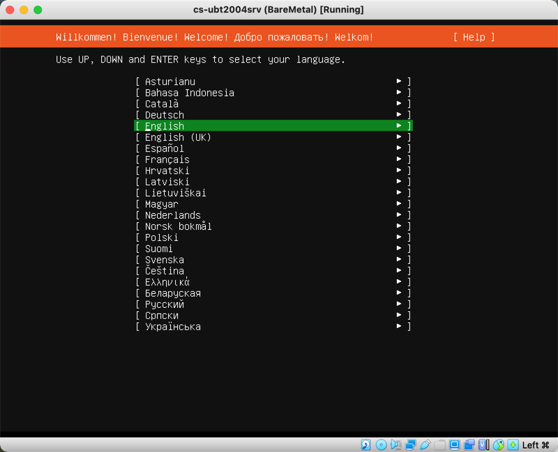

Select your keyboard:

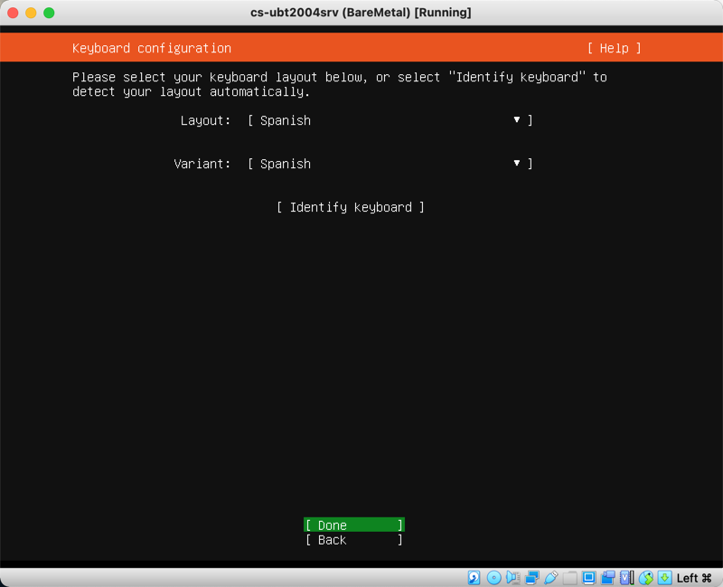

### Network

Be sure the network interface is  `eno1` and take note of DHCPv4 address assigned:

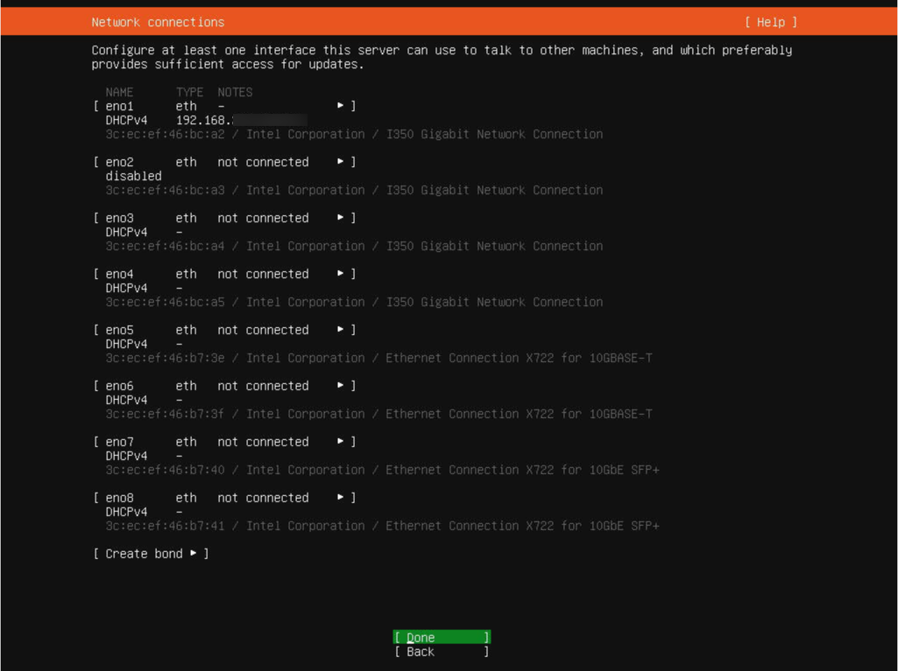

Leave empty Proxy address:

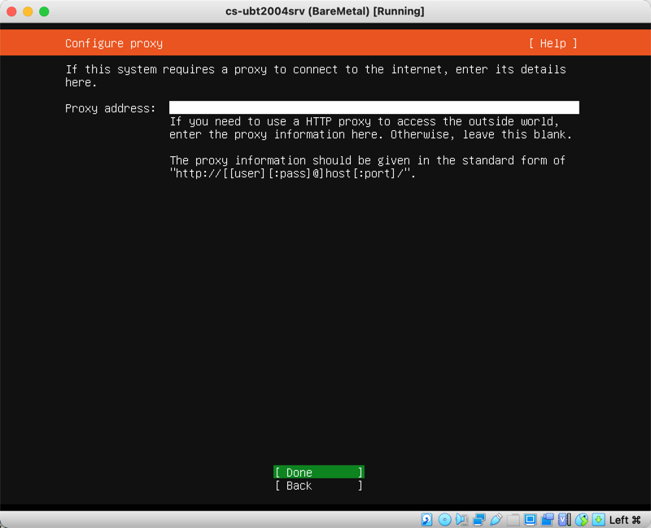

Accept default mirror settings:

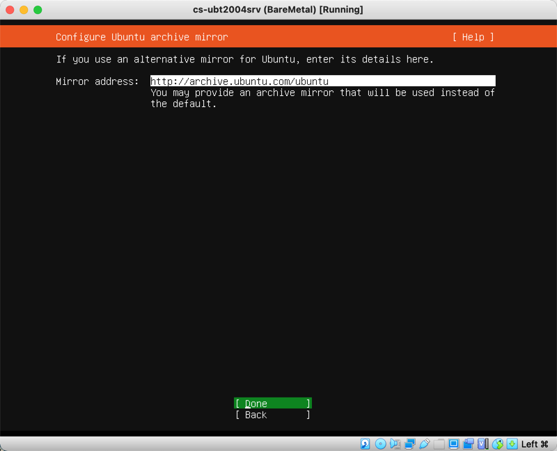

### Disk

Select the appropriate disk for OS installation:

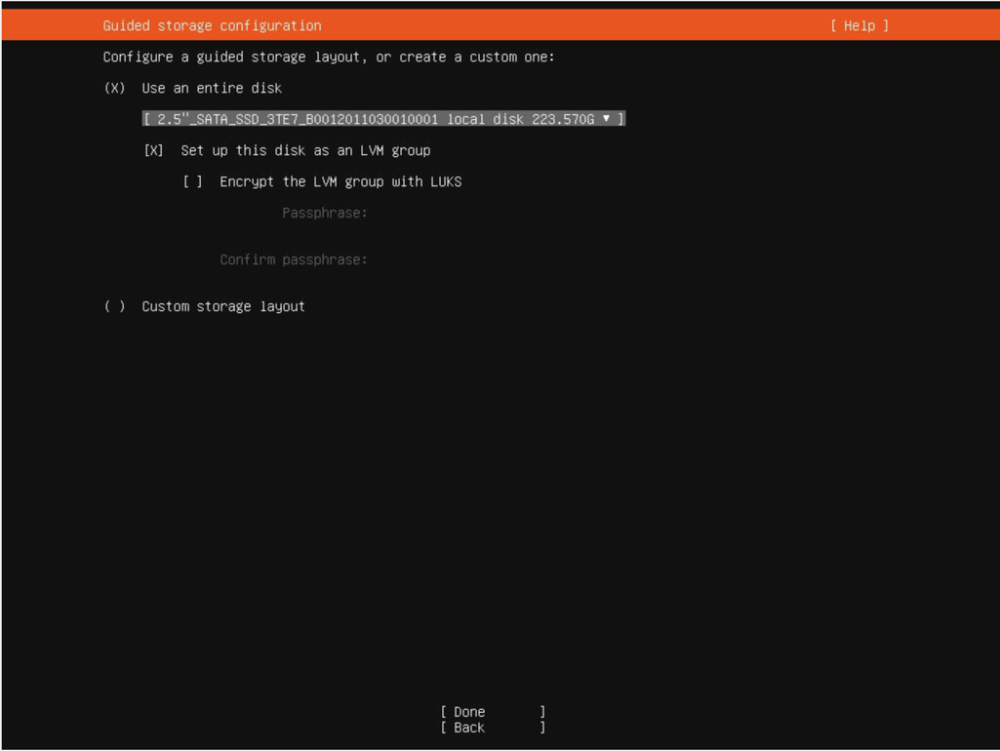

Change the root device to its maximum size as following:

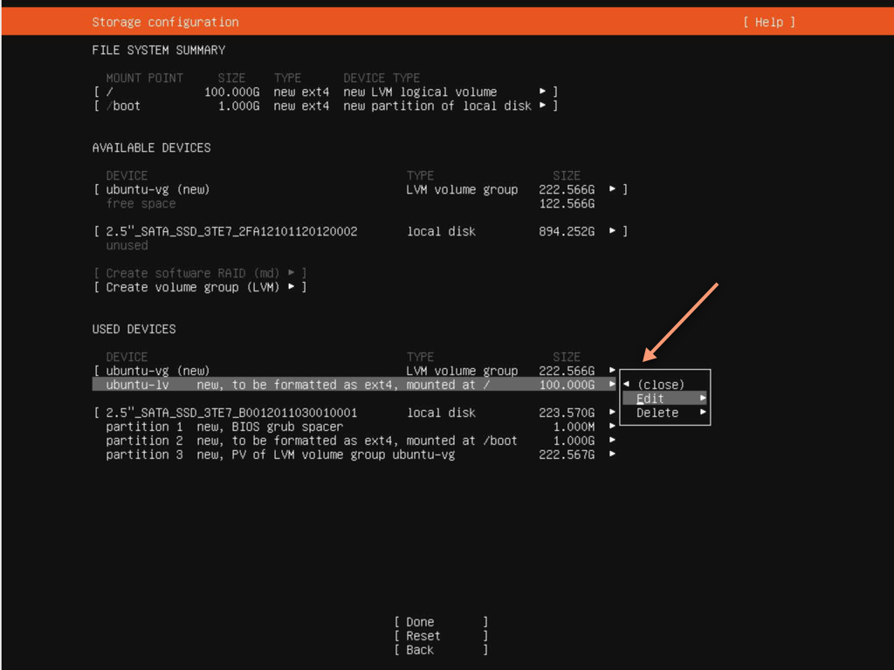

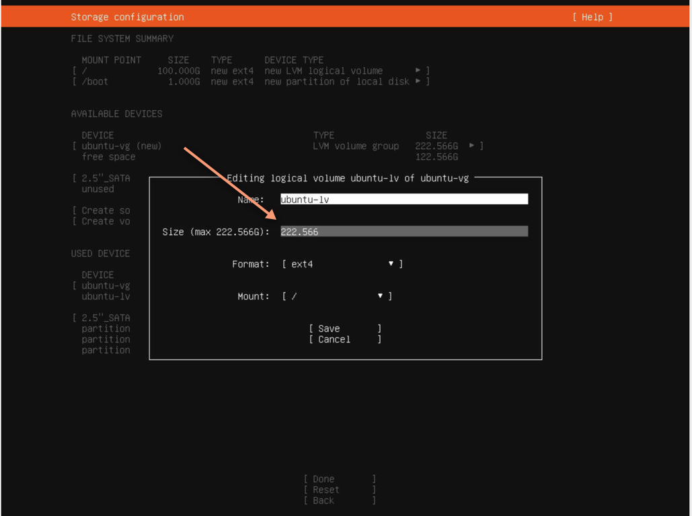

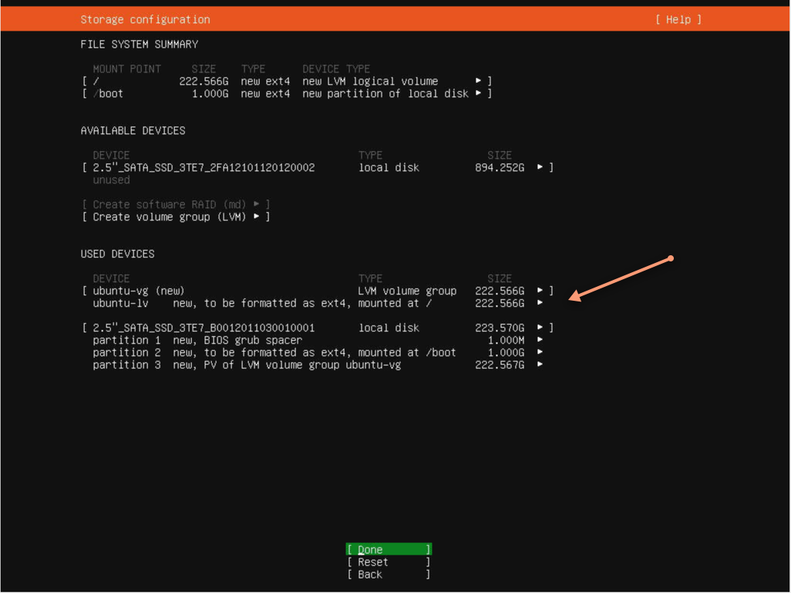

Confirm disk formatting:

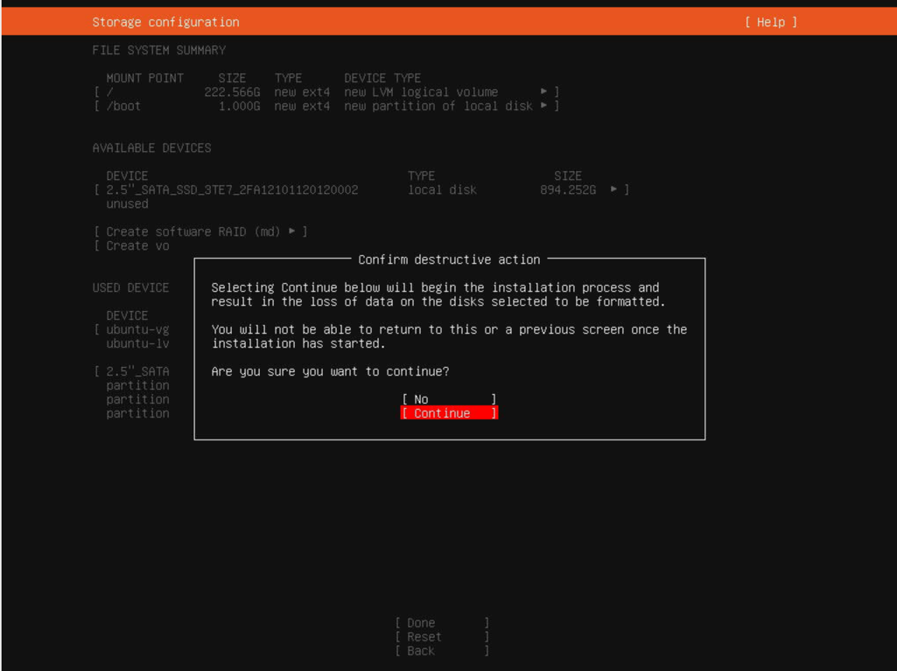

Introduce server name (`kvm-main` or `kvm-aux`), username and password:

### OpenSSH server

Check **Install OpenSSH server** and optionally import SSH identity:

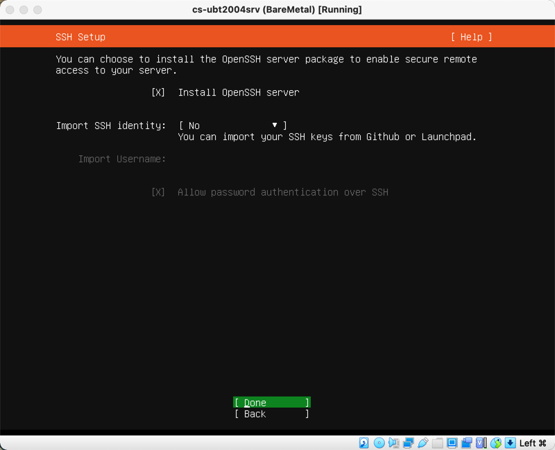

### Complete and reboot

Wait for installation to complete and reboot the machine

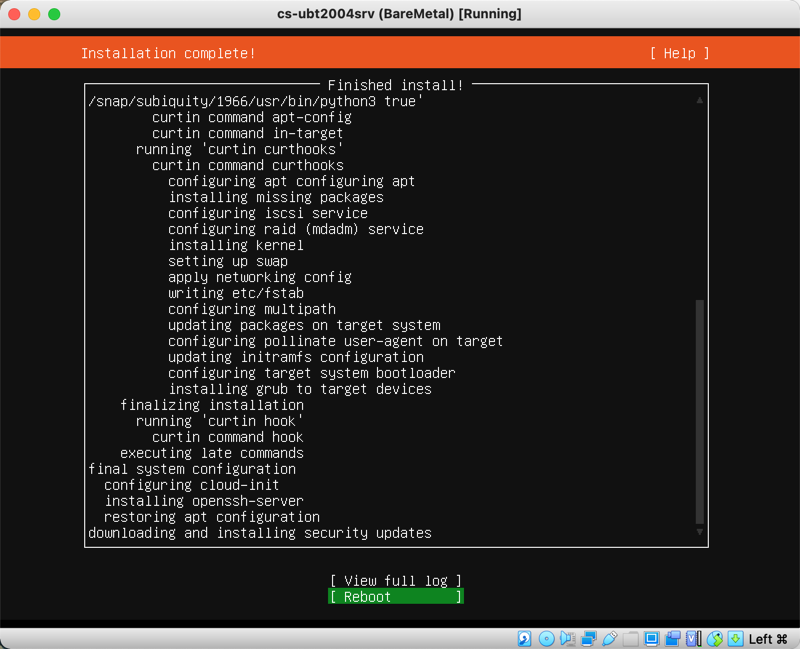

>Note: You can safely ignore cloud-init messages at first boot.
